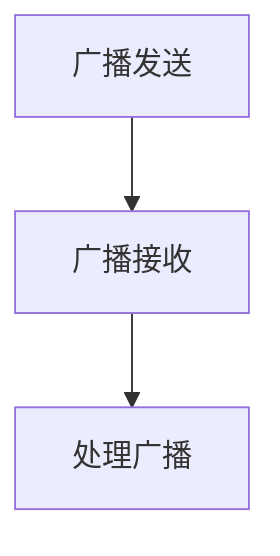

# Android广播接收器

## 介绍

在Android开发中，**广播接收器（Broadcast Receiver）** 是一种用于接收系统或应用发出的广播消息的组件。广播可以是系统事件（如电池电量低、网络状态变化）或自定义事件（如应用内部的通知）。广播接收器允许应用在特定事件发生时执行某些操作，而无需保持持续运行。

广播接收器是Android四大组件之一（其他三个是Activity、Service和ContentProvider），它通过监听广播事件来实现应用的响应式行为。

## 广播接收器的工作原理

广播接收器的工作原理可以简单概括为以下几个步骤：

1. **广播发送**：系统或应用发送一个广播消息。
2. **广播接收**：注册的广播接收器接收到该广播。
3. **处理广播**：广播接收器执行相应的操作。



## 创建广播接收器

要创建一个广播接收器，你需要继承 `BroadcastReceiver` 类并重写 `onReceive()` 方法。`onReceive()` 方法是广播接收器的核心，当接收到广播时，系统会调用该方法。

以下是一个简单的广播接收器示例：

```java
public class MyBroadcastReceiver extends BroadcastReceiver {
    @Override
    public void onReceive(Context context, Intent intent) {
        // 处理接收到的广播
        String action = intent.getAction();
        if (action != null && action.equals("com.example.MY_CUSTOM_ACTION")) {
            Toast.makeText(context, "自定义广播已接收", Toast.LENGTH_SHORT).show();
        }
    }
}
```

在这个示例中，`MyBroadcastReceiver` 类继承自 `BroadcastReceiver`，并重写了 `onReceive()` 方法。当接收到 `com.example.MY_CUSTOM_ACTION` 广播时，会显示一个Toast消息。

## 注册广播接收器

广播接收器可以通过两种方式注册：**静态注册** 和 **动态注册**。

### 静态注册

静态注册是在 `AndroidManifest.xml` 文件中声明广播接收器。这种方式适用于需要在应用未运行时接收广播的场景。

```xml
<receiver android:name=".MyBroadcastReceiver">
    <intent-filter>
        <action android:name="com.example.MY_CUSTOM_ACTION" />
    </intent-filter>
</receiver>
```

### 动态注册

动态注册是在代码中通过 `registerReceiver()` 方法注册广播接收器。这种方式适用于需要在应用运行时接收广播的场景。

```java
MyBroadcastReceiver receiver = new MyBroadcastReceiver();
IntentFilter filter = new IntentFilter("com.example.MY_CUSTOM_ACTION");
registerReceiver(receiver, filter);
```

:::note
动态注册的广播接收器在组件销毁时需要手动注销，否则会导致内存泄漏。
:::

## 实际应用场景

### 监听网络状态变化

一个常见的应用场景是监听网络状态的变化。以下是一个监听网络连接状态的广播接收器示例：

```java
public class NetworkChangeReceiver extends BroadcastReceiver {
    @Override
    public void onReceive(Context context, Intent intent) {
        ConnectivityManager cm = (ConnectivityManager) context.getSystemService(Context.CONNECTIVITY_SERVICE);
        NetworkInfo activeNetwork = cm.getActiveNetworkInfo();
        boolean isConnected = activeNetwork != null && activeNetwork.isConnectedOrConnecting();

        if (isConnected) {
            Toast.makeText(context, "网络已连接", Toast.LENGTH_SHORT).show();
        } else {
            Toast.makeText(context, "网络已断开", Toast.LENGTH_SHORT).show();
        }
    }
}
```

在 `AndroidManifest.xml` 中注册该接收器：

```xml
<receiver android:name=".NetworkChangeReceiver">
    <intent-filter>
        <action android:name="android.net.conn.CONNECTIVITY_CHANGE" />
    </intent-filter>
</receiver>
```

:::caution
从Android 7.0（API 24）开始，`CONNECTIVITY_CHANGE` 广播不再支持静态注册。建议使用 `JobScheduler` 或 `WorkManager` 来监听网络状态变化。
:::

### 自定义广播

你还可以在应用内部发送自定义广播。以下是一个发送和接收自定义广播的示例：

```java
// 发送广播
Intent intent = new Intent("com.example.MY_CUSTOM_ACTION");
sendBroadcast(intent);

// 接收广播
public class MyBroadcastReceiver extends BroadcastReceiver {
    @Override
    public void onReceive(Context context, Intent intent) {
        Toast.makeText(context, "自定义广播已接收", Toast.LENGTH_SHORT).show();
    }
}
```

## 总结

广播接收器是Android开发中非常重要的组件，它允许应用响应系统或应用内部的广播事件。通过静态注册或动态注册，你可以灵活地控制广播接收器的行为。在实际开发中，广播接收器常用于监听系统事件（如网络状态变化）或实现应用内部的通知机制。

:::tip
为了确保应用的性能和安全性，建议尽量减少广播接收器的使用，尤其是在高频率事件的场景下。可以考虑使用 `JobScheduler`、`WorkManager` 或其他替代方案。
:::

## 附加资源与练习

- **官方文档**：[BroadcastReceiver](https://developer.android.com/reference/android/content/BroadcastReceiver)
- **练习**：创建一个广播接收器，监听设备的充电状态变化，并在状态变化时显示Toast消息。
- **进阶学习**：了解 `LocalBroadcastManager` 的使用场景及其与全局广播的区别。

通过本文的学习，你应该已经掌握了Android广播接收器的基本概念和使用方法。继续实践和探索，你将能够更好地应用广播接收器来构建功能丰富的Android应用。