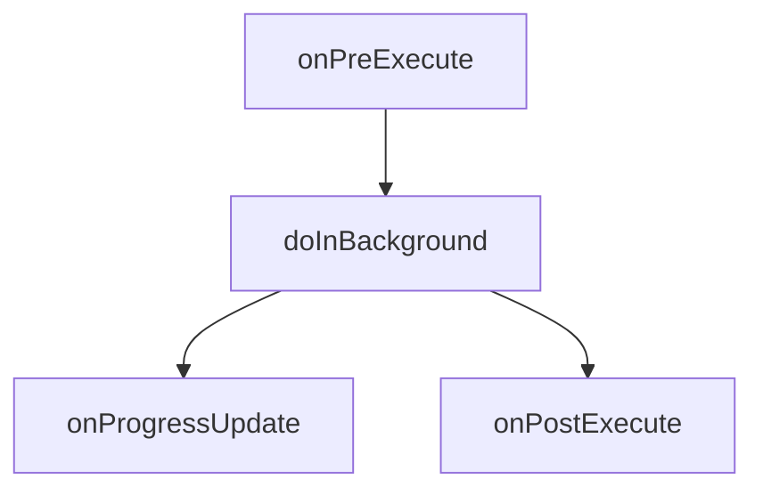

# Android AsyncTask

在 Android 开发中，处理耗时任务（如网络请求、数据库操作等）时，为了避免阻塞主线程（UI 线程），我们需要将这些任务放在后台线程中执行。`AsyncTask` 是 Android 提供的一个简单工具，用于在后台线程中执行任务，并在任务完成后更新 UI。

## 什么是 AsyncTask？

`AsyncTask` 是一个抽象类，它允许你在后台线程中执行耗时操作，并在主线程中更新 UI。它封装了线程管理和消息处理的复杂性，使得开发者可以更轻松地处理异步任务。

:::note
`AsyncTask` 在 Android 11（API 级别 30）中已被弃用。建议使用 `java.util.concurrent` 包中的工具类（如 `ExecutorService`）或 Kotlin 协程来替代。
:::

## AsyncTask 的工作原理

`AsyncTask` 通过以下四个步骤来执行任务：

1. **onPreExecute()**: 在后台任务开始之前调用，通常用于初始化 UI（如显示进度条）。
2. **doInBackground(Params...)**: 在后台线程中执行耗时操作。此方法不能直接更新 UI。
3. **onProgressUpdate(Progress...)**: 在 `doInBackground()` 中调用 `publishProgress()` 时触发，用于更新 UI 中的进度。
4. **onPostExecute(Result)**: 在后台任务完成后调用，通常用于更新 UI（如隐藏进度条并显示结果）。



## 使用 AsyncTask 的示例

以下是一个简单的 `AsyncTask` 示例，用于在后台下载文件并更新 UI 中的进度条。

```java
public class DownloadTask extends AsyncTask<String, Integer, String> {

    @Override
    protected void onPreExecute() {
        // 在任务开始前显示进度条
        progressBar.setVisibility(View.VISIBLE);
    }

    @Override
    protected String doInBackground(String... urls) {
        String fileUrl = urls[0];
        int totalSize = downloadFile(fileUrl); // 模拟下载文件
        return "Download complete";
    }

    @Override
    protected void onProgressUpdate(Integer... progress) {
        // 更新进度条
        progressBar.setProgress(progress[0]);
    }

    @Override
    protected void onPostExecute(String result) {
        // 隐藏进度条并显示结果
        progressBar.setVisibility(View.GONE);
        textView.setText(result);
    }

    private int downloadFile(String url) {
        int totalSize = 100; // 模拟文件总大小
        for (int i = 0; i <= totalSize; i++) {
            publishProgress(i); // 更新进度
            try {
                Thread.sleep(100); // 模拟下载延迟
            } catch (InterruptedException e) {
                e.printStackTrace();
            }
        }
        return totalSize;
    }
}
```

### 代码解释

1. **onPreExecute()**: 在任务开始前显示进度条。
2. **doInBackground(String... urls)**: 在后台线程中下载文件，并通过 `publishProgress()` 更新进度。
3. **onProgressUpdate(Integer... progress)**: 在主线程中更新进度条。
4. **onPostExecute(String result)**: 在任务完成后隐藏进度条并显示结果。

## 实际应用场景

`AsyncTask` 适用于以下场景：

- **网络请求**: 从服务器下载数据并在 UI 中显示。
- **数据库操作**: 在后台执行数据库查询并更新 UI。
- **文件处理**: 在后台读取或写入文件并更新 UI。

:::caution
`AsyncTask` 不适用于长时间运行的任务，因为它可能会导致内存泄漏或应用崩溃。对于长时间运行的任务，建议使用 `Service` 或 `WorkManager`。
:::

## 总结

`AsyncTask` 是 Android 中处理异步任务的一个简单工具，适合初学者使用。它通过封装线程管理和消息处理的复杂性，使得开发者可以更轻松地在后台执行任务并更新 UI。然而，由于 `AsyncTask` 已被弃用，建议在新项目中使用更现代的并发工具。

## 附加资源

- [Android 官方文档：AsyncTask](https://developer.android.com/reference/android/os/AsyncTask)
- [Java 并发编程指南](https://docs.oracle.com/javase/tutorial/essential/concurrency/)
- [Kotlin 协程指南](https://kotlinlang.org/docs/coroutines-guide.html)

## 练习

1. 修改上面的示例代码，使其能够下载多个文件并显示每个文件的下载进度。
2. 尝试使用 `ExecutorService` 或 Kotlin 协程来实现相同的功能，并比较它们的优缺点。

通过以上内容，你应该对 `AsyncTask` 有了全面的了解，并能够在实际项目中应用它。继续练习和探索，你将掌握更多 Android 开发的技巧！