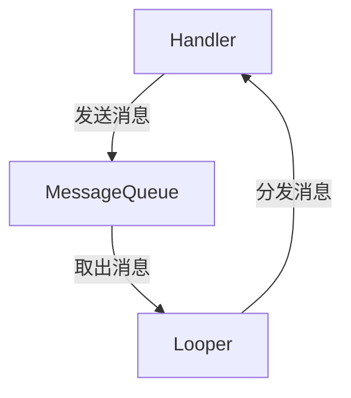

## 介绍

在 Android 开发中，`Handler` 是一个非常重要的工具，用于在不同线程之间传递和处理消息。它通常用于将后台线程的任务结果传递到主线程（UI 线程），以便更新用户界面。由于 Android 的 UI 操作必须在主线程中执行，因此 `Handler` 在后台处理中扮演了关键角色。

### 什么是 Handler？

`Handler` 是 Android 提供的一个类，它允许你发送和处理与线程关联的 `Message` 或 `Runnable` 对象。每个 `Handler` 都与一个特定的线程（通常是主线程）绑定，并且可以在该线程中执行任务。

:::note
**注意**：`Handler` 通常与 `Looper` 和 `MessageQueue` 一起使用。`Looper` 负责从 `MessageQueue` 中取出消息并分发给 `Handler` 处理。
:::

## Handler 的工作原理

为了更好地理解 `Handler` 的工作原理，我们可以将其分为以下几个部分：

1. **MessageQueue**：这是一个消息队列，用于存储待处理的消息。
2. **Looper**：`Looper` 是一个循环器，它会不断地从 `MessageQueue` 中取出消息并分发给对应的 `Handler`。
3. **Handler**：`Handler` 负责发送和处理消息。



### 创建和使用 Handler

要使用 `Handler`，首先需要创建一个 `Handler` 实例。通常情况下，`Handler` 会与主线程的 `Looper` 关联。

```java
Handler handler = new Handler(Looper.getMainLooper());
```

### 发送消息

你可以通过 `Handler` 发送 `Message` 或 `Runnable` 对象。以下是一个简单的示例，展示了如何使用 `Handler` 发送消息：

```java
// 创建一个 Handler
Handler handler = new Handler(Looper.getMainLooper());

// 发送一个 Runnable 对象
handler.post(new Runnable() {
    @Override
    public void run() {
        // 在主线程中执行的任务
        textView.setText("Hello, Handler!");
    }
});
```

### 处理消息

`Handler` 还可以处理 `Message` 对象。你可以通过重写 `handleMessage` 方法来处理消息：

```java
Handler handler = new Handler(Looper.getMainLooper()) {
    @Override
    public void handleMessage(Message msg) {
        // 处理消息
        switch (msg.what) {
            case 1:
                textView.setText("Message received: " + msg.obj);
                break;
        }
    }
};

// 发送消息
Message message = handler.obtainMessage();
message.what = 1;
message.obj = "Hello, Handler!";
handler.sendMessage(message);
```

## 实际应用场景

### 后台任务与 UI 更新

一个常见的应用场景是在后台线程中执行耗时任务（如网络请求或数据库操作），然后将结果传递到主线程以更新 UI。

```java
// 在后台线程中执行任务
new Thread(new Runnable() {
    @Override
    public void run() {
        // 模拟耗时任务
        try {
            Thread.sleep(2000);
        } catch (InterruptedException e) {
            e.printStackTrace();
        }

        // 任务完成后，通过 Handler 更新 UI
        handler.post(new Runnable() {
            @Override
            public void run() {
                textView.setText("Task completed!");
            }
        });
    }
}).start();
```

### 定时任务

`Handler` 还可以用于执行定时任务。你可以使用 `postDelayed` 方法来延迟执行任务。

```java
// 延迟 2 秒后执行任务
handler.postDelayed(new Runnable() {
    @Override
    public void run() {
        textView.setText("Delayed task executed!");
    }
}, 2000);
```

## 总结

`Handler` 是 Android 开发中用于线程间通信的重要工具。它允许你将任务从后台线程传递到主线程，以便安全地更新 UI。通过 `Handler`，你可以发送 `Message` 或 `Runnable` 对象，并在主线程中处理它们。

:::tip
**提示**：在实际开发中，`Handler` 通常与 `AsyncTask`、`ThreadPoolExecutor` 或 `Coroutine` 等工具结合使用，以简化后台任务的执行和 UI 更新。
:::

## 附加资源与练习

- **官方文档**：[Handler](https://developer.android.com/reference/android/os/Handler)
- **练习**：尝试创建一个后台线程，执行一个耗时任务，并使用 `Handler` 将结果传递到主线程以更新 UI。

通过掌握 `Handler`，你将能够更好地处理 Android 应用中的多线程任务，并确保 UI 的流畅性和响应性。