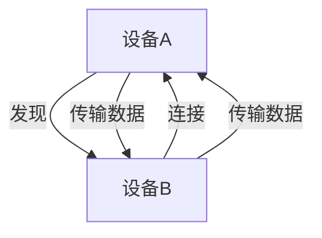

# Android Wi-Fi Direct

## 介绍

Wi-Fi Direct 是一种允许设备在没有传统 Wi-Fi 网络或互联网连接的情况下，直接相互通信的技术。它基于 Wi-Fi 标准，但不需要接入点（如路由器）。Android 从 Android 4.0（API 级别 14）开始支持 Wi-Fi Direct，这使得开发者可以在应用中实现设备之间的高速数据传输。

与蓝牙相比，Wi-Fi Direct 提供了更高的传输速度和更远的通信距离。它非常适合需要快速传输大量数据的场景，例如文件共享、多人游戏或屏幕镜像。

## Wi-Fi Direct 的工作原理

Wi-Fi Direct 使用点对点（P2P）连接，允许设备直接通信。以下是其工作原理的简要概述：

1. **设备发现**：设备通过扫描附近的 Wi-Fi Direct 设备来发现对方。
2. **连接建立**：设备之间通过协商建立连接。
3. **数据传输**：连接建立后，设备可以直接交换数据。



## 实现 Wi-Fi Direct

要在 Android 应用中使用 Wi-Fi Direct，您需要使用 `WifiP2pManager` 类。以下是实现 Wi-Fi Direct 的基本步骤：

### 1. 添加权限

首先，在 `AndroidManifest.xml` 中添加以下权限：

```xml
<uses-permission android:name="android.permission.ACCESS_WIFI_STATE" />
<uses-permission android:name="android.permission.CHANGE_WIFI_STATE" />
<uses-permission android:name="android.permission.ACCESS_FINE_LOCATION" />
<uses-permission android:name="android.permission.INTERNET" />
```

:::caution
从 Android 6.0（API 级别 23）开始，访问位置信息需要动态权限请求。确保在运行时请求 `ACCESS_FINE_LOCATION` 权限。
:::

### 2. 初始化 WifiP2pManager

在您的 Activity 或 Fragment 中，初始化 `WifiP2pManager`：

```java
WifiP2pManager manager = (WifiP2pManager) getSystemService(Context.WIFI_P2P_SERVICE);
WifiP2pManager.Channel channel = manager.initialize(this, getMainLooper(), null);
```

### 3. 发现设备

使用 `discoverPeers()` 方法扫描附近的 Wi-Fi Direct 设备：

```java
manager.discoverPeers(channel, new WifiP2pManager.ActionListener() {
    @Override
    public void onSuccess() {
        // 设备发现成功
    }

    @Override
    public void onFailure(int reasonCode) {
        // 设备发现失败
    }
});
```

### 4. 连接设备

发现设备后，使用 `connect()` 方法建立连接：

```java
WifiP2pConfig config = new WifiP2pConfig();
config.deviceAddress = deviceAddress; // 目标设备的地址

manager.connect(channel, config, new WifiP2pManager.ActionListener() {
    @Override
    public void onSuccess() {
        // 连接成功
    }

    @Override
    public void onFailure(int reasonCode) {
        // 连接失败
    }
});
```

### 5. 传输数据

连接建立后，您可以使用套接字（Socket）在设备之间传输数据。以下是一个简单的示例：

```java
// 在设备A上创建服务器套接字
ServerSocket serverSocket = new ServerSocket(8888);
Socket clientSocket = serverSocket.accept();

// 在设备B上创建客户端套接字
Socket socket = new Socket(serverIpAddress, 8888);

// 通过 InputStream 和 OutputStream 传输数据
```

## 实际应用场景

Wi-Fi Direct 在许多场景中都非常有用，例如：

1. **文件共享**：用户可以直接在设备之间传输大文件，而无需互联网连接。
2. **多人游戏**：玩家可以在没有网络的情况下进行本地多人游戏。
3. **屏幕镜像**：将手机屏幕投射到电视或其他设备上。

:::tip
Wi-Fi Direct 的传输速度通常比蓝牙快得多，适合需要高带宽的应用场景。
:::

## 总结

Wi-Fi Direct 是一种强大的技术，允许 Android 设备在没有传统 Wi-Fi 网络的情况下直接通信。通过 `WifiP2pManager`，您可以轻松实现设备发现、连接和数据传输。尽管实现过程可能稍显复杂，但其高速度和灵活性使其成为许多应用的理想选择。

## 附加资源

- [Android 官方文档：Wi-Fi Direct](https://developer.android.com/guide/topics/connectivity/wifip2p)
- [GitHub 示例代码](https://github.com/android/connectivity-samples/tree/main/WifiDirect)

## 练习

1. 尝试在您的 Android 设备上实现一个简单的文件共享应用，使用 Wi-Fi Direct 传输文件。
2. 修改代码，使其支持多个设备之间的连接和数据传输。
3. 探索如何在 Wi-Fi Direct 连接中实现加密，以确保数据安全。
