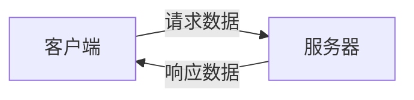

# Android低功耗蓝牙

低功耗蓝牙（Bluetooth Low Energy，简称BLE）是一种专为低功耗设备设计的无线通信技术。它广泛应用于物联网（IoT）、健康监测设备、智能家居等领域。在Android开发中，BLE提供了一种高效的方式来与这些设备进行通信。

## 什么是低功耗蓝牙？

低功耗蓝牙是蓝牙4.0引入的一种技术，旨在减少传统蓝牙的功耗，同时保持较短的通信距离。BLE设备通常用于传输少量数据，例如传感器数据或控制命令。与经典蓝牙相比，BLE在功耗上具有显著优势，适合电池供电的设备。

### BLE的工作原理

BLE通信基于客户端-服务器模型。设备可以充当**GATT服务器**（提供数据）或**GATT客户端**（请求数据）。GATT（通用属性协议）定义了BLE设备之间的通信方式。



在BLE通信中，数据以**特征值（Characteristic）**的形式存储和传输。每个特征值都有一个唯一的UUID（通用唯一标识符），用于标识和访问。

## Android中的BLE API

Android提供了`BluetoothGatt`、`BluetoothGattService`、`BluetoothGattCharacteristic`等类来支持BLE通信。以下是一个简单的BLE通信流程：

1. **扫描设备**：使用`BluetoothLeScanner`扫描附近的BLE设备。
2. **连接设备**：通过`BluetoothDevice.connectGatt()`方法连接到目标设备。
3. **发现服务**：连接成功后，使用`BluetoothGatt.discoverServices()`方法发现设备提供的服务。
4. **读写数据**：通过`BluetoothGattCharacteristic`读写特征值。

### 代码示例：扫描BLE设备

以下代码展示了如何在Android中扫描附近的BLE设备：

```java
BluetoothLeScanner scanner = bluetoothAdapter.getBluetoothLeScanner();
ScanCallback scanCallback = new ScanCallback() {
    @Override
    public void onScanResult(int callbackType, ScanResult result) {
        BluetoothDevice device = result.getDevice();
        Log.d("BLE", "发现设备: " + device.getName() + " - " + device.getAddress());
    }
};
scanner.startScan(scanCallback);
```

:::note
确保在`AndroidManifest.xml`中添加`BLUETOOTH`和`BLUETOOTH_ADMIN`权限，并在运行时请求位置权限，因为BLE扫描需要访问位置服务。
:::

### 代码示例：连接并读取特征值

以下代码展示了如何连接到BLE设备并读取特征值：

```java
BluetoothGattCallback gattCallback = new BluetoothGattCallback() {
    @Override
    public void onConnectionStateChange(BluetoothGatt gatt, int status, int newState) {
        if (newState == BluetoothProfile.STATE_CONNECTED) {
            gatt.discoverServices();
        }
    }

    @Override
    public void onServicesDiscovered(BluetoothGatt gatt, int status) {
        BluetoothGattService service = gatt.getService(UUID.fromString("服务UUID"));
        BluetoothGattCharacteristic characteristic = service.getCharacteristic(UUID.fromString("特征UUID"));
        gatt.readCharacteristic(characteristic);
    }

    @Override
    public void onCharacteristicRead(BluetoothGatt gatt, BluetoothGattCharacteristic characteristic, int status) {
        byte[] data = characteristic.getValue();
        Log.d("BLE", "读取到的数据: " + Arrays.toString(data));
    }
};
BluetoothDevice device = bluetoothAdapter.getRemoteDevice("设备地址");
BluetoothGatt gatt = device.connectGatt(context, false, gattCallback);
```

:::caution
在读取或写入特征值时，确保特征值支持相应的操作（例如`PROPERTY_READ`或`PROPERTY_WRITE`）。
:::

## 实际应用场景

### 健康监测设备

许多健康监测设备（如心率监测器、血压计）使用BLE与手机应用通信。通过BLE，设备可以实时传输健康数据，用户可以在手机上查看和分析这些数据。

### 智能家居

智能家居设备（如智能灯泡、智能插座）通常使用BLE进行控制。用户可以通过手机应用远程控制这些设备，例如开关灯或调节亮度。

## 总结

低功耗蓝牙（BLE）是一种高效、低功耗的无线通信技术，适用于多种物联网和智能设备场景。通过Android的BLE API，开发者可以轻松实现与BLE设备的通信。本文介绍了BLE的基本概念、API使用方法以及实际应用场景，希望能帮助你快速上手BLE开发。

## 附加资源

- [Android官方BLE文档](https://developer.android.com/guide/topics/connectivity/bluetooth/ble)
- [BLE协议规范](https://www.bluetooth.com/specifications/bluetooth-core-specification/)
- [GitHub上的BLE示例项目](https://github.com/android/connectivity-samples/tree/main/BluetoothLeGatt)

## 练习

1. 编写一个Android应用，扫描并列出附近的BLE设备。
2. 修改代码，使其能够连接到特定设备并读取其特征值。
3. 尝试实现一个简单的BLE控制应用，例如通过BLE控制LED灯的开关。

祝你学习愉快！