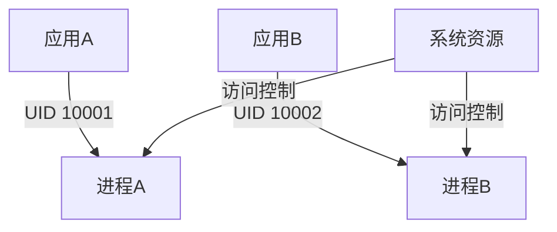

# Android应用沙箱

## 介绍

Android应用沙箱是Android操作系统中的一个核心安全机制，旨在隔离每个应用程序的运行环境，防止恶意应用访问其他应用的数据或系统资源。通过沙箱机制，Android确保了应用之间的独立性和安全性，从而保护用户隐私和设备安全。

### 什么是沙箱？

沙箱是一种隔离技术，它将应用程序的运行环境限制在一个封闭的空间中。在这个空间中，应用程序只能访问其被授权的资源，无法直接访问其他应用或系统的敏感数据。这种隔离机制类似于将每个应用放在一个独立的“沙箱”中，彼此之间互不干扰。

## Android应用沙箱的工作原理

### 1. 用户ID和进程隔离

在Android中，每个应用在安装时都会被分配一个唯一的用户ID（UID）。这个UID用于标识应用，并决定了应用可以访问哪些资源。每个应用在自己的进程中运行，进程之间是相互隔离的。



如上图所示，应用A和应用B分别运行在不同的进程中，并且拥有不同的UID。系统资源通过UID进行访问控制，确保应用A无法访问应用B的资源。

### 2. 文件系统隔离

Android还为每个应用提供了独立的文件存储空间。应用只能访问自己的文件目录，无法直接访问其他应用的文件。例如，应用A的文件存储在 `/data/data/com.example.appA` 目录下，而应用B的文件存储在 `/data/data/com.example.appB` 目录下。

```bash
/data/data/com.example.appA
/data/data/com.example.appB
```

### 3. 权限管理

Android通过权限机制进一步增强了沙箱的安全性。应用在访问敏感资源（如摄像头、位置信息等）时，必须向用户请求相应的权限。用户可以选择授予或拒绝这些权限，从而控制应用对资源的访问。

```java
// 请求访问摄像头权限
if (ContextCompat.checkSelfPermission(this, Manifest.permission.CAMERA)
        != PackageManager.PERMISSION_GRANTED) {
    ActivityCompat.requestPermissions(this, new String[]{Manifest.permission.CAMERA}, 1);
}
```

## 实际案例

### 案例1：恶意应用防护

假设有一个恶意应用试图访问用户的联系人信息。由于Android的沙箱机制，该应用无法直接访问其他应用的数据。即使它尝试通过漏洞绕过权限检查，系统也会阻止其访问未授权的资源。

### 案例2：多用户环境

在Android的多用户环境中，每个用户都有自己的应用沙箱。用户A安装的应用无法访问用户B的应用数据，即使它们在同一个设备上运行。这种隔离机制确保了多用户环境下的数据安全。

## 总结

Android应用沙箱是Android安全架构的核心组成部分，它通过用户ID隔离、文件系统隔离和权限管理等多种机制，确保了应用之间的独立性和安全性。对于开发者来说，理解沙箱的工作原理有助于编写更安全的应用程序；对于用户来说，沙箱机制保护了他们的隐私和数据安全。

## 附加资源与练习

### 资源
- [Android官方文档 - 应用沙箱](https://developer.android.com/guide/topics/security/permissions)
- [Android安全架构详解](https://source.android.com/security)

### 练习
1. 尝试编写一个Android应用，请求访问摄像头权限，并观察系统如何处理权限请求。
2. 在模拟器中安装两个应用，分别访问不同的文件目录，验证文件系统隔离的效果。

:::tip
提示：在开发过程中，始终遵循最小权限原则，只请求应用真正需要的权限，以增强应用的安全性。
:::