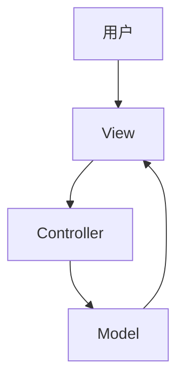

## 什么是 Android MVC？

MVC（Model-View-Controller）是一种经典的软件设计模式，广泛用于构建用户界面应用程序。它将应用程序的逻辑分为三个主要部分：**Model（模型）**、**View（视图）** 和 **Controller（控制器）**。在 Android 开发中，MVC 模式帮助开发者将代码分离为不同的职责，从而提高代码的可维护性和可扩展性。

### MVC 的核心组件

1. **Model（模型）**  
   模型负责管理应用程序的核心数据和业务逻辑。它不直接与用户界面交互，而是通过控制器与视图通信。

2. **View（视图）**  
   视图是用户界面的表示层，负责展示数据和接收用户输入。它从模型中获取数据，但不直接修改数据。

3. **Controller（控制器）**  
   控制器充当模型和视图之间的桥梁。它接收用户输入，更新模型，并通知视图更新显示。



## Android 中的 MVC 实现

在 Android 中，MVC 模式可以通过以下方式实现：

- **View**：通常由 XML 布局文件定义，例如 `activity_main.xml`。
- **Controller**：通常由 Activity 或 Fragment 实现，负责处理用户输入和更新视图。
- **Model**：由 Java/Kotlin 类实现，负责管理数据和业务逻辑。

### 代码示例

以下是一个简单的 Android MVC 示例，展示如何通过 MVC 模式实现一个计数器应用。

#### 1. 定义 Model

```kotlin
// CounterModel.kt
class CounterModel {
    private var count = 0

    fun getCount(): Int {
        return count
    }

    fun increment() {
        count++
    }
}
```

#### 2. 定义 View

```xml
<!-- activity_main.xml -->
<LinearLayout xmlns:android="http://schemas.android.com/apk/res/android"
    android:layout_width="match_parent"
    android:layout_height="match_parent"
    android:orientation="vertical"
    android:padding="16dp">

    <TextView
        android:id="@+id/countTextView"
        android:layout_width="wrap_content"
        android:layout_height="wrap_content"
        android:text="Count: 0"
        android:textSize="24sp" />

    <Button
        android:id="@+id/incrementButton"
        android:layout_width="wrap_content"
        android:layout_height="wrap_content"
        android:text="Increment" />
</LinearLayout>
```

#### 3. 实现 Controller

```kotlin
// MainActivity.kt
class MainActivity : AppCompatActivity() {

    private lateinit var counterModel: CounterModel
    private lateinit var countTextView: TextView

    override fun onCreate(savedInstanceState: Bundle?) {
        super.onCreate(savedInstanceState)
        setContentView(R.layout.activity_main)

        counterModel = CounterModel()
        countTextView = findViewById(R.id.countTextView)
        val incrementButton = findViewById<Button>(R.id.incrementButton)

        incrementButton.setOnClickListener {
            counterModel.increment()
            updateView()
        }

        updateView()
    }

    private fun updateView() {
        countTextView.text = "Count: ${counterModel.getCount()}"
    }
}
```

:::tip
在这个示例中，`CounterModel` 是模型，`activity_main.xml` 是视图，`MainActivity` 是控制器。控制器负责处理按钮点击事件并更新视图。
:::

## 实际应用场景

MVC 模式在 Android 开发中非常常见，特别是在以下场景中：

1. **表单处理**  
   用户输入数据后，控制器验证数据并更新模型，视图根据模型更新显示。

2. **数据展示**  
   从服务器或本地数据库加载数据，控制器将数据传递给视图进行展示。

3. **用户交互**  
   处理按钮点击、滑动等用户操作，控制器更新模型并刷新视图。

## 总结

MVC 是一种简单而强大的设计模式，适用于 Android 应用程序的开发。通过将应用程序分为模型、视图和控制器，开发者可以更好地组织代码，提高代码的可读性和可维护性。

:::note
虽然 MVC 模式在 Android 开发中非常有用，但在复杂的应用程序中，可能会遇到控制器（如 Activity 或 Fragment）变得过于臃肿的问题。这时可以考虑使用更高级的架构模式，如 MVP 或 MVVM。
:::

## 附加资源与练习

- **练习**：尝试扩展上面的计数器应用，添加一个“重置”按钮，将计数器重置为 0。
- **资源**：
  - [Android 官方文档](https://developer.android.com/)
  - [MVC 模式详解](https://en.wikipedia.org/wiki/Model%E2%80%93view%E2%80%93controller)

通过学习和实践，你将能够更好地掌握 Android MVC 模式，并应用于实际开发中！