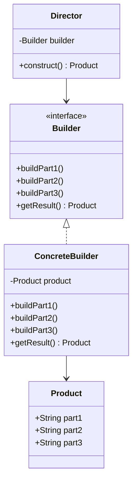

# Android建造者模式

## 介绍

建造者模式（Builder Pattern）是一种创建型设计模式，旨在通过将对象的构建过程与其表示分离，来简化复杂对象的创建。在Android开发中，建造者模式常用于创建复杂的对象，尤其是当对象的构造过程涉及多个步骤或参数时。

建造者模式的核心思想是将对象的构建过程封装在一个独立的“建造者”类中，客户端代码只需调用建造者的方法即可完成对象的构建，而无需关心具体的构建细节。

## 建造者模式的结构

建造者模式通常包含以下几个角色：

1. **产品（Product）**：最终要构建的复杂对象。
2. **建造者（Builder）**：定义构建产品的各个步骤的接口。
3. **具体建造者（Concrete Builder）**：实现建造者接口，负责实际构建产品的各个部分。
4. **指挥者（Director）**：负责调用建造者的方法来构建产品。



## 代码示例

以下是一个简单的Android建造者模式示例，展示了如何使用建造者模式构建一个`User`对象。

```kotlin
// 产品类
data class User(
    val firstName: String,
    val lastName: String,
    val age: Int,
    val email: String
)

// 建造者接口
interface UserBuilder {
    fun setFirstName(firstName: String): UserBuilder
    fun setLastName(lastName: String): UserBuilder
    fun setAge(age: Int): UserBuilder
    fun setEmail(email: String): UserBuilder
    fun build(): User
}

// 具体建造者
class UserBuilderImpl : UserBuilder {
    private var firstName: String = ""
    private var lastName: String = ""
    private var age: Int = 0
    private var email: String = ""

    override fun setFirstName(firstName: String): UserBuilder {
        this.firstName = firstName
        return this
    }

    override fun setLastName(lastName: String): UserBuilder {
        this.lastName = lastName
        return this
    }

    override fun setAge(age: Int): UserBuilder {
        this.age = age
        return this
    }

    override fun setEmail(email: String): UserBuilder {
        this.email = email
        return this
    }

    override fun build(): User {
        return User(firstName, lastName, age, email)
    }
}

// 指挥者
class UserDirector(private val builder: UserBuilder) {
    fun construct(): User {
        return builder
            .setFirstName("John")
            .setLastName("Doe")
            .setAge(30)
            .setEmail("john.doe@example.com")
            .build()
    }
}

// 使用示例
fun main() {
    val builder = UserBuilderImpl()
    val director = UserDirector(builder)
    val user = director.construct()

    println(user) // 输出: User(firstName=John, lastName=Doe, age=30, email=john.doe@example.com)
}
```

## 实际应用场景

建造者模式在Android开发中有广泛的应用，尤其是在构建复杂对象时。以下是一些常见的应用场景：

1. **AlertDialog.Builder**：Android中的`AlertDialog.Builder`是建造者模式的经典应用。通过链式调用，开发者可以逐步设置对话框的标题、消息、按钮等属性，最后调用`show()`方法显示对话框。

2. **Retrofit.Builder**：在Retrofit库中，`Retrofit.Builder`用于构建Retrofit实例。开发者可以通过设置不同的参数（如baseUrl、converterFactory等）来定制Retrofit实例。

3. **自定义View的构建**：在自定义View的开发中，建造者模式可以用于简化复杂View的构建过程，尤其是在View的初始化涉及多个参数时。

## 总结

建造者模式通过将对象的构建过程与其表示分离，简化了复杂对象的创建。它特别适用于需要逐步构建对象的场景，并且可以避免构造函数参数过多的问题。在Android开发中，建造者模式被广泛应用于构建对话框、网络请求库等复杂对象。

:::tip
**提示**：建造者模式不仅可以简化代码，还可以提高代码的可读性和可维护性。如果你发现某个类的构造函数参数过多，考虑使用建造者模式来优化代码结构。
:::

## 附加资源与练习

1. **练习**：尝试使用建造者模式构建一个`Car`对象，包含品牌、型号、颜色、价格等属性。
2. **进一步阅读**：阅读Android源码中的`AlertDialog.Builder`实现，理解其内部工作原理。
3. **扩展学习**：了解其他创建型设计模式，如工厂模式、单例模式等，比较它们与建造者模式的异同。

通过本文的学习，你应该已经掌握了Android建造者模式的基本概念和应用场景。希望你能在实际开发中灵活运用这一设计模式，提升代码质量。