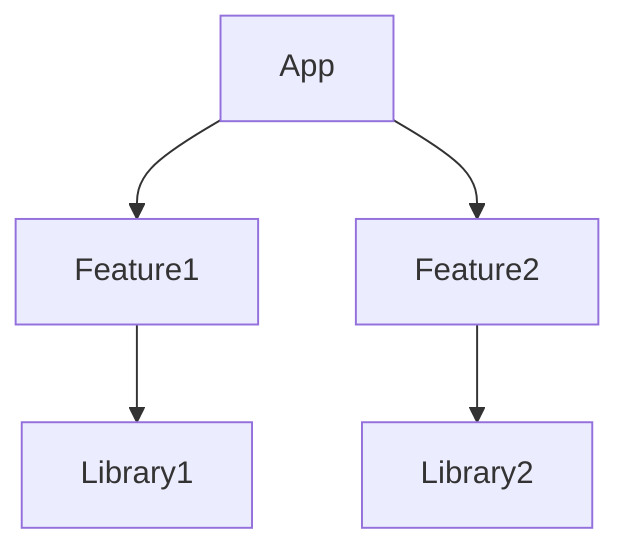
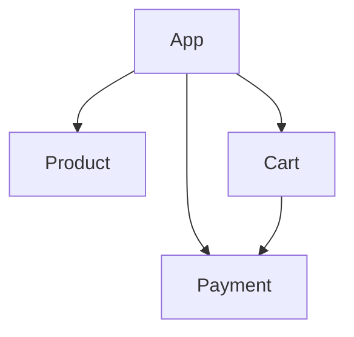

# Android模块化设计

## 介绍

在现代Android应用开发中，随着应用功能的不断增加，代码库变得越来越庞大和复杂。为了应对这种复杂性，模块化设计应运而生。模块化设计是一种将应用程序分解为多个独立模块的架构方法，每个模块负责特定的功能或业务逻辑。通过模块化设计，开发者可以更好地管理代码、提高开发效率，并支持团队协作。

模块化设计的核心思想是**高内聚、低耦合**，即每个模块内部功能高度相关，而模块之间的依赖关系尽可能减少。这种设计方式不仅有助于代码的维护和扩展，还能提高应用的构建速度和测试效率。

## 模块化设计的优势

1. **代码复用**：模块可以被多个项目或应用共享，减少重复代码。
2. **独立开发**：每个模块可以独立开发、测试和部署，提高开发效率。
3. **易于维护**：模块化设计使得代码结构更清晰，便于定位和修复问题。
4. **动态加载**：某些模块可以按需加载，减少应用的初始启动时间。
5. **团队协作**：不同团队可以并行开发不同的模块，减少冲突。

## 模块化设计的基本概念

### 1. 模块的类型

在Android模块化设计中，通常将模块分为以下几种类型：

- **App模块**：主应用模块，负责应用的入口和整体逻辑。
- **Library模块**：功能模块，提供特定的功能或服务，可以被其他模块依赖。
- **Feature模块**：业务模块，负责特定的业务逻辑，通常是可插拔的。

### 2. 模块的依赖关系

模块之间通过依赖关系进行通信。为了避免循环依赖，通常采用单向依赖的方式。例如，App模块依赖Feature模块，而Feature模块依赖Library模块。



### 3. 模块的通信方式

模块之间的通信可以通过以下几种方式实现：

- **接口暴露**：通过定义接口，模块之间可以通过接口进行通信。
- **依赖注入**：使用依赖注入框架（如Dagger或Hilt）来管理模块之间的依赖关系。
- **事件总线**：通过事件总线（如LiveData或RxJava）在模块之间传递消息。

## 实际案例：模块化电商应用

假设我们正在开发一个电商应用，该应用包含以下模块：

- **App模块**：主应用模块，负责应用的启动和整体逻辑。
- **Product模块**：负责商品展示和搜索功能。
- **Cart模块**：负责购物车功能。
- **Payment模块**：负责支付功能。

### 1. 模块的依赖关系



### 2. 模块的通信

在`Product`模块中，用户点击商品后需要跳转到`Cart`模块。我们可以通过接口暴露的方式实现模块之间的通信。

首先，在`Cart`模块中定义一个接口：

```kotlin
interface CartNavigation {
    fun navigateToCart(productId: String)
}
```

然后，在`App`模块中实现该接口：

```kotlin
class AppCartNavigation : CartNavigation {
    override fun navigateToCart(productId: String) {
        val intent = Intent(context, CartActivity::class.java)
        intent.putExtra("productId", productId)
        context.startActivity(intent)
    }
}
```

最后，在`Product`模块中使用该接口：

```kotlin
class ProductActivity : AppCompatActivity() {
    private lateinit var cartNavigation: CartNavigation

    override fun onCreate(savedInstanceState: Bundle?) {
        super.onCreate(savedInstanceState)
        cartNavigation = (application as MyApplication).cartNavigation

        // 用户点击商品时调用
        cartNavigation.navigateToCart("123")
    }
}
```

### 3. 依赖注入

为了进一步解耦模块之间的依赖关系，我们可以使用依赖注入框架（如Dagger或Hilt）来管理模块之间的依赖关系。

```kotlin
@Module
@InstallIn(SingletonComponent::class)
object AppModule {
    @Provides
    @Singleton
    fun provideCartNavigation(): CartNavigation {
        return AppCartNavigation()
    }
}
```

在`Product`模块中，我们可以通过依赖注入获取`CartNavigation`实例：

```kotlin
class ProductActivity : AppCompatActivity() {
    @Inject
    lateinit var cartNavigation: CartNavigation

    override fun onCreate(savedInstanceState: Bundle?) {
        super.onCreate(savedInstanceState)
        (application as MyApplication).appComponent.inject(this)

        // 用户点击商品时调用
        cartNavigation.navigateToCart("123")
    }
}
```

## 总结

Android模块化设计是一种强大的架构方法，能够有效应对复杂应用的开发需求。通过将应用分解为多个独立的模块，开发者可以更好地管理代码、提高开发效率，并支持团队协作。在实际项目中，模块化设计可以通过接口暴露、依赖注入等方式实现模块之间的通信，从而保持模块之间的低耦合性。

## 附加资源与练习

- **资源**：
  - [Android官方文档：模块化应用](https://developer.android.com/topic/modularization)
  - [Dagger官方文档](https://dagger.dev/)
  - [Hilt官方文档](https://developer.android.com/training/dependency-injection/hilt-android)

- **练习**：
  1. 尝试将一个简单的Android应用拆分为多个模块，并实现模块之间的通信。
  2. 使用Dagger或Hilt实现模块之间的依赖注入。
  3. 探索如何在模块化应用中实现动态加载模块。

通过不断实践和探索，你将能够掌握Android模块化设计的精髓，并在实际项目中灵活应用。