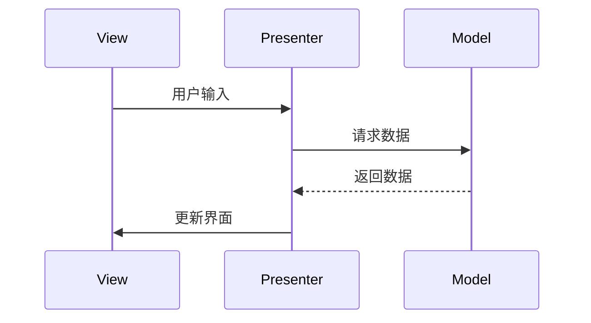

## 什么是 Android MVP？

MVP（Model-View-Presenter）是一种用于构建 Android 应用程序的架构模式。它将应用程序的逻辑分为三个主要部分：**Model**、**View** 和 **Presenter**。这种分离使得代码更易于维护、测试和扩展。

- **Model**：负责管理应用程序的数据和业务逻辑。
- **View**：负责显示数据和与用户交互。
- **Presenter**：作为 View 和 Model 之间的桥梁，处理用户输入并更新 View。

MVP 的核心思想是将业务逻辑从 View 中分离出来，使得 View 只负责显示数据，而 Presenter 负责处理用户交互和更新 Model。

## MVP 的核心组件

### 1. Model
Model 是应用程序的数据层。它负责从数据库、网络或其他数据源获取数据，并将数据提供给 Presenter。

```java
public class UserModel {
    private String name;
    private int age;

    public UserModel(String name, int age) {
        this.name = name;
        this.age = age;
    }

    public String getName() {
        return name;
    }

    public int getAge() {
        return age;
    }
}
```

### 2. View
View 是用户界面的表示层。它负责显示数据并将用户输入传递给 Presenter。

```java
public interface UserView {
    void showUserName(String name);
    void showUserAge(int age);
}
```

### 3. Presenter
Presenter 是 View 和 Model 之间的中介。它从 View 接收用户输入，处理业务逻辑，并更新 View。

```java
public class UserPresenter {
    private UserView view;
    private UserModel model;

    public UserPresenter(UserView view, UserModel model) {
        this.view = view;
        this.model = model;
    }

    public void updateView() {
        view.showUserName(model.getName());
        view.showUserAge(model.getAge());
    }
}
```

## MVP 的工作流程



1. **用户输入**：用户在 View 中执行操作（例如点击按钮）。
2. **Presenter 处理**：View 将用户输入传递给 Presenter。
3. **Model 更新**：Presenter 从 Model 获取数据。
4. **View 更新**：Presenter 将数据传递给 View，View 更新界面。

## 实际案例：用户信息展示

假设我们有一个简单的应用程序，用于显示用户的基本信息。以下是使用 MVP 模式的实现。

### Model
```java
public class UserModel {
    private String name;
    private int age;

    public UserModel(String name, int age) {
        this.name = name;
        this.age = age;
    }

    public String getName() {
        return name;
    }

    public int getAge() {
        return age;
    }
}
```

### View
```java
public interface UserView {
    void showUserName(String name);
    void showUserAge(int age);
}
```

### Presenter
```java
public class UserPresenter {
    private UserView view;
    private UserModel model;

    public UserPresenter(UserView view, UserModel model) {
        this.view = view;
        this.model = model;
    }

    public void updateView() {
        view.showUserName(model.getName());
        view.showUserAge(model.getAge());
    }
}
```

### Activity（View 的实现）
```java
public class UserActivity extends AppCompatActivity implements UserView {
    private UserPresenter presenter;

    @Override
    protected void onCreate(Bundle savedInstanceState) {
        super.onCreate(savedInstanceState);
        setContentView(R.layout.activity_user);

        UserModel model = new UserModel("John Doe", 30);
        presenter = new UserPresenter(this, model);
        presenter.updateView();
    }

    @Override
    public void showUserName(String name) {
        TextView nameTextView = findViewById(R.id.nameTextView);
        nameTextView.setText(name);
    }

    @Override
    public void showUserAge(int age) {
        TextView ageTextView = findViewById(R.id.ageTextView);
        ageTextView.setText(String.valueOf(age));
    }
}
```

## 总结

MVP 是一种强大的架构模式，能够有效地分离应用程序的各个部分，使得代码更易于维护和测试。通过将业务逻辑从 View 中分离出来，MVP 使得开发者能够更专注于每个组件的职责，从而提高代码的可读性和可维护性。

:::tip
**提示**：在实际开发中，MVP 可以与依赖注入框架（如 Dagger）结合使用，以进一步简化代码和提高可测试性。
:::

## 附加资源与练习

- **练习**：尝试将 MVP 模式应用到一个新的 Android 项目中，例如一个简单的待办事项应用。
- **资源**：
  - [Android Architecture Blueprints](https://github.com/android/architecture-samples)
  - [MVP Pattern in Android](https://www.raywenderlich.com/7026-getting-started-with-mvp-model-view-presenter-on-android)

通过不断实践和探索，你将能够更好地理解和应用 MVP 模式，从而构建出更高质量的 Android 应用程序。