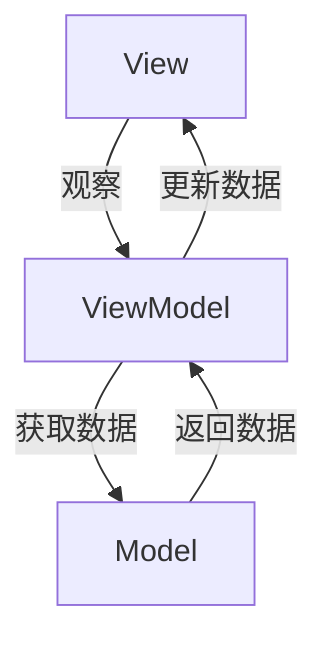

# Android MVVM

## 什么是 MVVM？

MVVM（Model-View-ViewModel）是一种软件架构模式，广泛用于 Android 开发中。它的主要目标是将用户界面（UI）逻辑与业务逻辑分离，从而提高代码的可维护性和可测试性。MVVM 模式由以下三个核心组件组成：

1. **Model**：负责管理应用程序的数据和业务逻辑。
2. **View**：负责显示 UI 并与用户交互。
3. **ViewModel**：作为 View 和 Model 之间的桥梁，负责处理 UI 逻辑并将数据从 Model 传递到 View。

MVVM 模式通过数据绑定（Data Binding）实现 View 和 ViewModel 之间的通信，从而减少了对传统回调或接口的依赖。

:::tip
MVVM 是 Google 推荐的 Android 架构模式之一，特别适合与 Jetpack 组件（如 LiveData 和 ViewModel）结合使用。
:::

---

## MVVM 的核心组件

### 1. Model
Model 是应用程序的数据层，负责管理数据源（如数据库、网络请求等）和业务逻辑。它不直接与 View 交互，而是通过 ViewModel 提供数据。

### 2. View
View 是用户界面的表示层，负责显示数据和接收用户输入。在 Android 中，View 通常是 Activity 或 Fragment。

### 3. ViewModel
ViewModel 是 View 和 Model 之间的中介。它从 Model 获取数据，并将其转换为 View 可以使用的格式。ViewModel 还负责处理 UI 逻辑，例如数据格式化或验证。

---

## MVVM 的工作原理

以下是一个简单的 MVVM 工作流程图：



1. **View 观察 ViewModel**：View 通过数据绑定或观察者模式（如 LiveData）监听 ViewModel 中的数据变化。
2. **ViewModel 获取数据**：ViewModel 从 Model 中获取数据，并根据需要对其进行处理。
3. **Model 返回数据**：Model 将数据返回给 ViewModel。
4. **ViewModel 更新 View**：ViewModel 将处理后的数据传递给 View，View 根据新数据更新 UI。

---

## 实现 MVVM 的步骤

### 1. 创建 Model
Model 通常是一个数据类或一个负责数据管理的类。例如：

```kotlin
data class User(val id: Int, val name: String, val email: String)
```

### 2. 创建 ViewModel
ViewModel 负责从 Model 获取数据并将其暴露给 View。以下是一个简单的 ViewModel 示例：

```kotlin
import androidx.lifecycle.LiveData
import androidx.lifecycle.MutableLiveData
import androidx.lifecycle.ViewModel

class UserViewModel : ViewModel() {
    private val _user = MutableLiveData<User>()
    val user: LiveData<User> get() = _user

    fun loadUser() {
        // 模拟从 Model 获取数据
        val user = User(1, "John Doe", "john.doe@example.com")
        _user.value = user
    }
}
```

### 3. 创建 View
View 通常是 Activity 或 Fragment。以下是一个使用 ViewModel 的 Activity 示例：

```kotlin
import android.os.Bundle
import androidx.activity.viewModels
import androidx.appcompat.app.AppCompatActivity
import androidx.lifecycle.Observer

class UserActivity : AppCompatActivity() {

    private val userViewModel: UserViewModel by viewModels()

    override fun onCreate(savedInstanceState: Bundle?) {
        super.onCreate(savedInstanceState)
        setContentView(R.layout.activity_user)

        // 观察 ViewModel 中的数据
        userViewModel.user.observe(this, Observer { user ->
            // 更新 UI
            updateUI(user)
        })

        // 加载用户数据
        userViewModel.loadUser()
    }

    private fun updateUI(user: User) {
        // 更新 UI 逻辑
    }
}
```

---

## 实际案例：用户信息展示

假设我们正在开发一个显示用户信息的应用程序。以下是 MVVM 模式的应用场景：

1. **Model**：从网络或本地数据库获取用户数据。
2. **ViewModel**：将用户数据转换为 UI 可以使用的格式。
3. **View**：显示用户信息并处理用户交互。

通过 MVVM 模式，我们可以轻松地将数据逻辑与 UI 逻辑分离，从而使代码更易于维护和测试。

---

## 总结

MVVM 是一种强大的架构模式，特别适合 Android 开发。它通过分离 UI 逻辑和业务逻辑，提高了代码的可维护性和可测试性。通过结合 Jetpack 组件（如 LiveData 和 ViewModel），开发者可以更轻松地实现 MVVM 模式。

:::note
如果你想深入学习 MVVM，可以参考以下资源：
- [Android 官方文档：ViewModel](https://developer.android.com/topic/libraries/architecture/viewmodel)
- [Android 官方文档：LiveData](https://developer.android.com/topic/libraries/architecture/livedata)
:::

---

## 练习

1. 尝试在现有项目中实现 MVVM 模式。
2. 使用 LiveData 和 ViewModel 创建一个简单的计数器应用程序。
3. 探索如何在 MVVM 中处理网络请求和错误处理。

通过实践，你将更好地理解 MVVM 模式的工作原理及其优势。