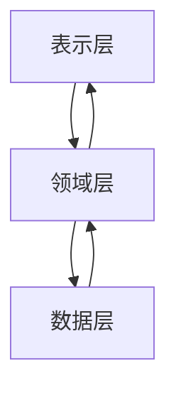

## 什么是 Android Clean Architecture？

Android Clean Architecture 是一种软件设计模式，旨在将应用程序的不同职责分离到不同的层中，以提高代码的可维护性、可测试性和可扩展性。它由 Robert C. Martin（又称 Uncle Bob）提出，核心思想是通过分层架构将业务逻辑与框架和 UI 解耦。

Clean Architecture 的核心原则是 **依赖规则**：内层（如业务逻辑）不应该依赖外层（如 UI 或框架），而外层可以依赖内层。这种设计使得应用程序的核心逻辑独立于具体的实现细节（如数据库、网络请求等），从而更容易进行测试和维护。

---

## Clean Architecture 的分层结构

Clean Architecture 通常分为以下几层：

1. **表示层（Presentation Layer）**：负责处理 UI 和用户交互。
2. **领域层（Domain Layer）**：包含核心业务逻辑和规则。
3. **数据层（Data Layer）**：负责数据的获取和存储。

这些层之间的关系可以通过以下 Mermaid 图表表示：



:::note
**注意**：领域层是核心，它不依赖任何其他层，而表示层和数据层都依赖领域层。
:::

---

## 逐步讲解 Clean Architecture

### 1. 表示层（Presentation Layer）

表示层负责处理用户界面和用户交互。在 Android 中，这通常包括 `Activity`、`Fragment` 和 `ViewModel`。表示层的主要职责是将用户输入传递给领域层，并将领域层的输出显示给用户。

#### 示例代码：ViewModel

```kotlin
class UserViewModel(
    private val getUserUseCase: GetUserUseCase
) : ViewModel() {

    private val _user = MutableLiveData<User>()
    val user: LiveData<User> get() = _user

    fun loadUser(userId: String) {
        viewModelScope.launch {
            val result = getUserUseCase(userId)
            _user.value = result
        }
    }
}
```

:::tip
**提示**：`ViewModel` 是表示层的一部分，它负责将 UI 逻辑与业务逻辑分离。
:::

---

### 2. 领域层（Domain Layer）

领域层是应用程序的核心，包含业务逻辑和规则。它独立于具体的实现细节（如数据库或网络请求），因此更容易进行单元测试。

#### 示例代码：UseCase

```kotlin
class GetUserUseCase(
    private val userRepository: UserRepository
) {
    suspend operator fun invoke(userId: String): User {
        return userRepository.getUser(userId)
    }
}
```

:::caution
**注意**：领域层不应该直接依赖 Android 框架或具体的实现细节。
:::

---

### 3. 数据层（Data Layer）

数据层负责数据的获取和存储。它通常包括本地数据库、网络请求等。数据层通过接口与领域层通信，从而隐藏具体的实现细节。

#### 示例代码：Repository

```kotlin
class UserRepositoryImpl(
    private val userRemoteDataSource: UserRemoteDataSource,
    private val userLocalDataSource: UserLocalDataSource
) : UserRepository {

    override suspend fun getUser(userId: String): User {
        val localUser = userLocalDataSource.getUser(userId)
        return if (localUser != null) {
            localUser
        } else {
            val remoteUser = userRemoteDataSource.getUser(userId)
            userLocalDataSource.saveUser(remoteUser)
            remoteUser
        }
    }
}
```

:::warning
**警告**：数据层应该通过接口与领域层通信，以避免直接依赖。
:::

---

## 实际案例：用户信息展示

假设我们正在开发一个应用程序，需要从远程服务器获取用户信息并显示在 UI 上。以下是 Clean Architecture 的应用步骤：

1. **表示层**：`UserViewModel` 调用 `GetUserUseCase` 获取用户信息。
2. **领域层**：`GetUserUseCase` 调用 `UserRepository` 获取数据。
3. **数据层**：`UserRepository` 从远程数据源或本地数据库获取用户信息。

---

## 总结

Android Clean Architecture 通过分层设计将业务逻辑与框架和 UI 解耦，使得应用程序更易于维护、测试和扩展。以下是 Clean Architecture 的主要优点：

- **可维护性**：清晰的职责分离使得代码更易于理解和修改。
- **可测试性**：领域层独立于具体实现，便于单元测试。
- **可扩展性**：通过接口和依赖注入，可以轻松替换或扩展功能。

---

## 附加资源与练习

- **资源**：
  - [Clean Architecture by Robert C. Martin](https://blog.cleancoder.com/uncle-bob/2012/08/13/the-clean-architecture.html)
  - [Android Architecture Guide](https://developer.android.com/jetpack/guide)

- **练习**：
  - 尝试将现有的 Android 项目重构为 Clean Architecture。
  - 为每个层编写单元测试，确保业务逻辑的正确性。

:::tip
**提示**：通过实践来巩固 Clean Architecture 的知识，尝试在小型项目中应用它。
:::