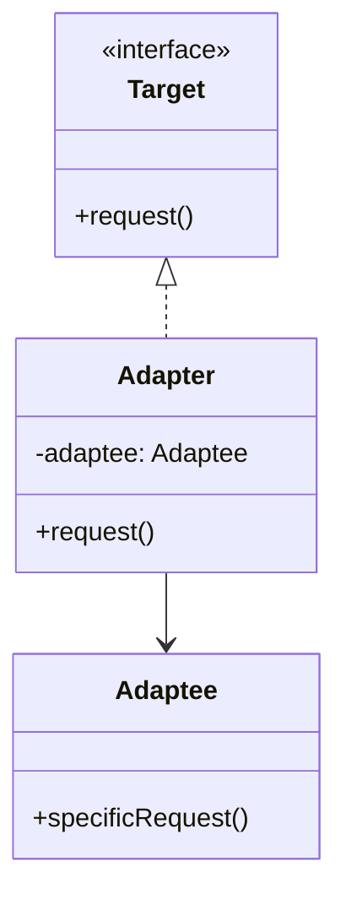

## 介绍

在Android开发中，适配器模式（Adapter Pattern）是一种结构型设计模式，它允许不兼容的接口之间进行协作。适配器模式的核心思想是将一个类的接口转换成客户端期望的另一个接口，从而使原本由于接口不兼容而无法一起工作的类能够协同工作。

在Android中，适配器模式最常见的应用场景是`ListView`、`RecyclerView`等列表控件的数据绑定。通过适配器，我们可以将数据源（如数组、列表）与UI组件（如列表项）进行绑定，从而实现数据的展示。

## 适配器模式的基本结构

适配器模式通常涉及以下三个角色：

1. **目标接口（Target Interface）**：客户端期望的接口。
2. **适配器（Adapter）**：将不兼容的接口转换为目标接口的类。
3. **被适配者（Adaptee）**：需要被适配的类或接口。



在上面的类图中，`Target`是客户端期望的接口，`Adapter`实现了`Target`接口，并在内部调用`Adaptee`的`specificRequest`方法来完成适配。

## Android中的适配器模式

在Android中，适配器模式最常见的实现是`Adapter`类。`Adapter`类用于将数据源与UI组件进行绑定。例如，`ListView`和`RecyclerView`都依赖于适配器来将数据源中的每一项数据映射到列表项视图中。

### 示例：ListView的适配器

假设我们有一个`ListView`，需要显示一组字符串数据。我们可以通过创建一个适配器来将字符串数组与`ListView`进行绑定。

```java
public class MyAdapter extends BaseAdapter {
    private Context context;
    private List<String> data;

    public MyAdapter(Context context, List<String> data) {
        this.context = context;
        this.data = data;
    }

    @Override
    public int getCount() {
        return data.size();
    }

    @Override
    public Object getItem(int position) {
        return data.get(position);
    }

    @Override
    public long getItemId(int position) {
        return position;
    }

    @Override
    public View getView(int position, View convertView, ViewGroup parent) {
        if (convertView == null) {
            convertView = LayoutInflater.from(context).inflate(android.R.layout.simple_list_item_1, parent, false);
        }
        TextView textView = convertView.findViewById(android.R.id.text1);
        textView.setText(data.get(position));
        return convertView;
    }
}
```

在这个示例中，`MyAdapter`继承自`BaseAdapter`，并实现了`getCount`、`getItem`、`getItemId`和`getView`方法。`getView`方法负责将数据源中的每一项数据绑定到`ListView`的每一项视图上。

### 使用适配器

接下来，我们可以在`Activity`中使用这个适配器：

```java
public class MainActivity extends AppCompatActivity {
    @Override
    protected void onCreate(Bundle savedInstanceState) {
        super.onCreate(savedInstanceState);
        setContentView(R.layout.activity_main);

        ListView listView = findViewById(R.id.listView);
        List<String> data = Arrays.asList("Item 1", "Item 2", "Item 3");
        MyAdapter adapter = new MyAdapter(this, data);
        listView.setAdapter(adapter);
    }
}
```

在这个例子中，`MyAdapter`将字符串数组`data`与`ListView`进行了绑定，从而实现了数据的展示。

## 实际应用场景

适配器模式在Android开发中的应用非常广泛，尤其是在处理列表数据时。以下是一些常见的应用场景：

1. **列表数据绑定**：如`ListView`、`RecyclerView`等列表控件的数据绑定。
2. **第三方库适配**：当使用第三方库时，可能需要将库的接口适配到应用程序的接口中。
3. **接口兼容性**：当需要将旧的接口适配到新的接口时，适配器模式可以很好地解决兼容性问题。

## 总结

适配器模式是一种非常有用的设计模式，它可以帮助我们将不兼容的接口转换为兼容的接口，从而使不同的类能够协同工作。在Android开发中，适配器模式广泛应用于列表数据绑定、第三方库适配等场景。

通过本文的学习，你应该已经掌握了适配器模式的基本概念及其在Android中的应用。接下来，你可以尝试在实际项目中应用适配器模式，或者进一步学习其他设计模式。

## 附加资源与练习

- **练习**：尝试为`RecyclerView`创建一个自定义适配器，并实现数据的绑定。
- **资源**：阅读Android官方文档中关于`RecyclerView.Adapter`的部分，了解更多高级用法。

:::tip
适配器模式不仅适用于Android开发，它在其他编程语言和框架中也有广泛的应用。掌握适配器模式将有助于你更好地理解和设计复杂的系统。
:::