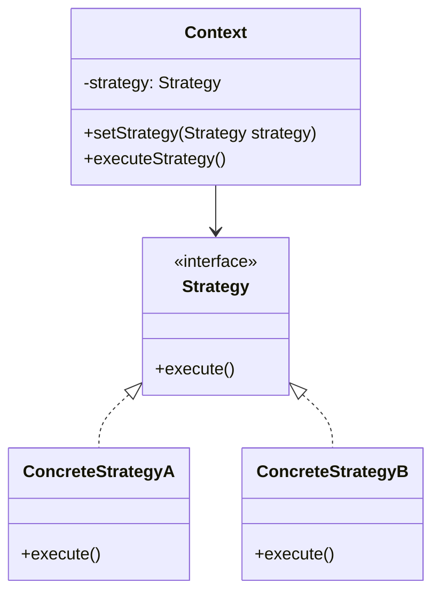

# Android策略模式

策略模式（Strategy Pattern）是一种行为设计模式，它允许在运行时选择算法的行为。通过将算法封装在独立的类中，策略模式使得算法可以独立于使用它的客户端而变化。这种模式非常适合用于需要动态切换算法的场景。

## 什么是策略模式？

策略模式的核心思想是将算法的定义与使用分离。通过定义一系列算法，并将它们封装在独立的类中，客户端可以在运行时根据需要选择不同的算法。这种模式避免了使用大量的条件语句，使得代码更加清晰和可维护。

在Android开发中，策略模式常用于处理不同的业务逻辑或UI行为。例如，根据用户的选择动态切换排序算法、支付方式或网络请求策略。

## 策略模式的结构

策略模式通常由以下几个部分组成：

1. **策略接口（Strategy Interface）**：定义所有支持的算法的公共接口。
2. **具体策略类（Concrete Strategies）**：实现策略接口的具体算法。
3. **上下文类（Context）**：持有一个策略对象的引用，并通过策略接口调用具体的算法。



## 实现策略模式

让我们通过一个简单的例子来理解如何在Android中实现策略模式。假设我们有一个应用，需要根据用户的选择动态切换排序算法。

### 1. 定义策略接口

首先，我们定义一个策略接口 `SortStrategy`，它包含一个 `sort` 方法。

```java
public interface SortStrategy {
    void sort(int[] data);
}
```

### 2. 实现具体策略类

接下来，我们实现两个具体的排序策略：`BubbleSortStrategy` 和 `QuickSortStrategy`。

```java
public class BubbleSortStrategy implements SortStrategy {
    @Override
    public void sort(int[] data) {
        // 实现冒泡排序算法
        System.out.println("Sorting using Bubble Sort");
    }
}

public class QuickSortStrategy implements SortStrategy {
    @Override
    public void sort(int[] data) {
        // 实现快速排序算法
        System.out.println("Sorting using Quick Sort");
    }
}
```

### 3. 创建上下文类

然后，我们创建一个上下文类 `SortContext`，它持有一个 `SortStrategy` 的引用，并提供一个方法来执行排序。

```java
public class SortContext {
    private SortStrategy strategy;

    public void setStrategy(SortStrategy strategy) {
        this.strategy = strategy;
    }

    public void executeSort(int[] data) {
        if (strategy != null) {
            strategy.sort(data);
        } else {
            System.out.println("No sorting strategy set.");
        }
    }
}
```

### 4. 使用策略模式

最后，我们可以在客户端代码中使用策略模式来动态切换排序算法。

```java
public class Main {
    public static void main(String[] args) {
        int[] data = {5, 2, 9, 1, 5, 6};

        SortContext context = new SortContext();

        // 使用冒泡排序
        context.setStrategy(new BubbleSortStrategy());
        context.executeSort(data);

        // 切换到快速排序
        context.setStrategy(new QuickSortStrategy());
        context.executeSort(data);
    }
}
```

:::note
**注意**：在实际的Android开发中，策略模式可以用于处理更复杂的业务逻辑，例如根据用户的选择动态切换网络请求策略或UI行为。
:::

## 实际应用场景

策略模式在Android开发中有广泛的应用场景。以下是一些常见的例子：

1. **支付方式选择**：根据用户的选择动态切换支付方式（如支付宝、微信支付、信用卡支付等）。
2. **网络请求策略**：根据网络状况动态切换网络请求策略（如优先使用缓存、优先使用网络请求等）。
3. **UI行为切换**：根据用户的操作动态切换UI行为（如不同的动画效果、不同的布局方式等）。

## 总结

策略模式是一种强大的设计模式，它允许在运行时动态切换算法或行为。通过将算法封装在独立的类中，策略模式使得代码更加清晰、可维护和可扩展。在Android开发中，策略模式可以用于处理各种动态切换的场景，如支付方式选择、网络请求策略和UI行为切换等。

:::tip
**提示**：如果你对策略模式感兴趣，可以尝试在实际项目中应用它，并观察它如何帮助你更好地组织代码。
:::

## 附加资源与练习

- **练习**：尝试在Android项目中实现一个策略模式，用于动态切换不同的网络请求策略。
- **资源**：阅读《设计模式：可复用面向对象软件的基础》一书，深入了解策略模式及其应用场景。