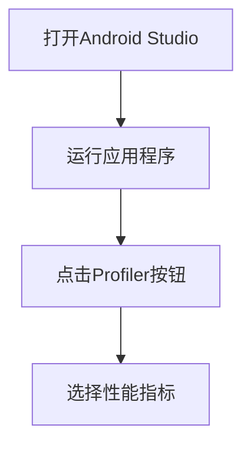

# Android性能分析工具

在开发Android应用程序时，性能优化是一个至关重要的环节。为了确保应用程序能够流畅运行并减少资源消耗，开发者需要借助各种性能分析工具来识别和解决潜在的性能问题。本文将介绍一些常用的Android性能分析工具，并通过实际案例展示如何使用这些工具来优化应用程序。

## 1. 什么是Android性能分析工具？

Android性能分析工具是一组用于监控、分析和优化Android应用程序性能的工具。这些工具可以帮助开发者识别内存泄漏、CPU使用率过高、UI卡顿等问题，从而提升应用程序的整体性能。

## 2. 常用的Android性能分析工具

### 2.1 Android Profiler

Android Profiler是Android Studio内置的一个强大的性能分析工具。它提供了实时监控应用程序的CPU、内存、网络和电池使用情况的功能。

#### 使用步骤：
1. 打开Android Studio并运行你的应用程序。
2. 点击工具栏中的“Profiler”按钮。
3. 在Profiler窗口中，选择你想要监控的性能指标（如CPU、内存等）。



### 2.2 Systrace

Systrace是一个用于分析应用程序性能的工具，它可以帮助开发者识别UI线程中的卡顿问题。

#### 使用步骤：
1. 在终端中运行以下命令以启动Systrace：
   ```bash
   python systrace.py -o my_trace.html sched freq idle am wm gfx view binder_driver hal dalvik camera input res
   ```
2. 在应用程序中执行你想要分析的操作。
3. 停止Systrace并打开生成的HTML文件以查看分析结果。

### 2.3 LeakCanary

LeakCanary是一个用于检测内存泄漏的工具。它可以帮助开发者快速识别和修复内存泄漏问题。

#### 使用步骤：
1. 在`build.gradle`文件中添加LeakCanary依赖：
   ```groovy
   dependencies {
       debugImplementation 'com.squareup.leakcanary:leakcanary-android:2.7'
   }
   ```
2. 在应用程序中初始化LeakCanary：
   ```java
   public class MyApplication extends Application {
       @Override
       public void onCreate() {
           super.onCreate();
           if (LeakCanary.isInAnalyzerProcess(this)) {
               return;
           }
           LeakCanary.install(this);
       }
   }
   ```
3. 运行应用程序，LeakCanary会自动检测内存泄漏并生成报告。

## 3. 实际案例

### 案例1：使用Android Profiler优化CPU使用率

假设你发现应用程序在某个操作中CPU使用率过高，你可以使用Android Profiler来识别问题。

1. 打开Android Profiler并选择CPU指标。
2. 执行导致CPU使用率过高的操作。
3. 分析Profiler中的CPU使用情况，找出占用CPU资源最多的方法。
4. 优化这些方法，例如通过减少循环次数或使用更高效的算法。

### 案例2：使用LeakCanary检测内存泄漏

假设你怀疑某个Activity存在内存泄漏，你可以使用LeakCanary来检测。

1. 在应用程序中初始化LeakCanary。
2. 运行应用程序并执行可能导致内存泄漏的操作。
3. 查看LeakCanary生成的报告，找出泄漏的对象和引用链。
4. 修复泄漏问题，例如通过释放资源或使用弱引用。

## 4. 总结

Android性能分析工具是开发者优化应用程序性能的得力助手。通过使用这些工具，开发者可以快速识别和解决性能问题，从而提升应用程序的用户体验。本文介绍了Android Profiler、Systrace和LeakCanary等常用工具，并通过实际案例展示了如何使用这些工具来优化应用程序。

## 5. 附加资源与练习

- **练习1**：使用Android Profiler监控你的应用程序的内存使用情况，并尝试优化内存占用。
- **练习2**：使用Systrace分析你的应用程序的UI线程性能，并尝试减少卡顿。
- **附加资源**：
  - [Android Profiler官方文档](https://developer.android.com/studio/profile/android-profiler)
  - [Systrace官方文档](https://developer.android.com/studio/profile/systrace)
  - [LeakCanary GitHub仓库](https://github.com/square/leakcanary)

:::tip
在使用性能分析工具时，建议在真实设备上进行测试，因为模拟器的性能可能与真实设备有所不同。
:::