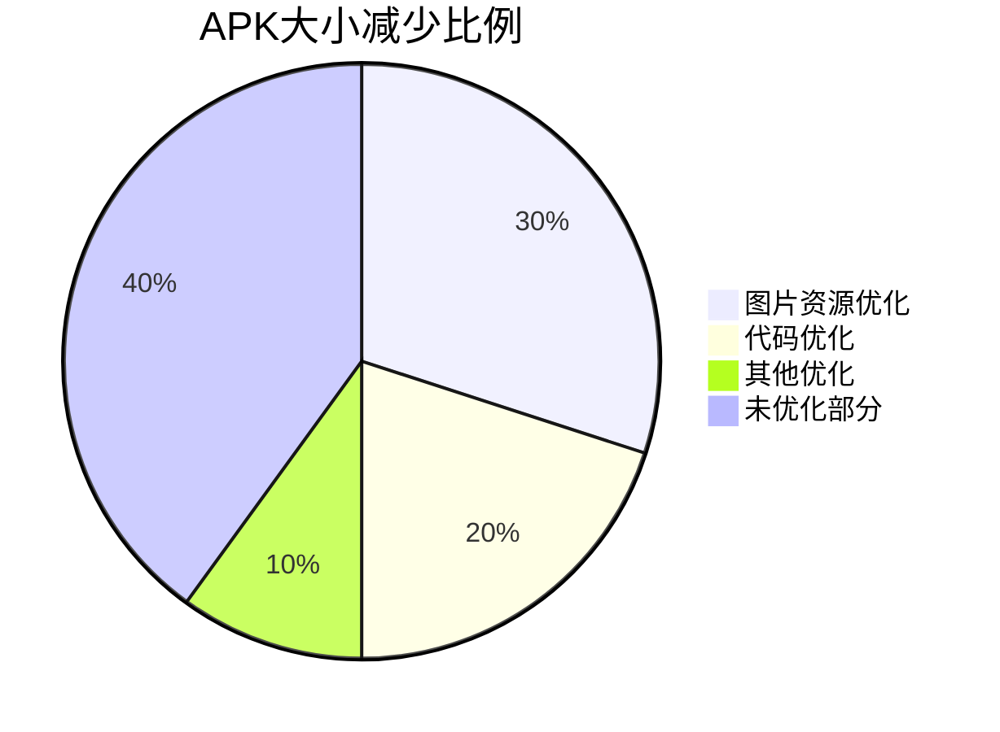

## 介绍

在开发Android应用时，包体积（APK大小）是一个重要的性能指标。较大的APK文件不仅会增加用户的下载时间，还可能影响应用的安装率和用户留存率。因此，优化包体积是提升应用性能的关键步骤之一。

本文将逐步介绍如何通过优化资源、代码和依赖项来减少Android应用的包体积，并提供实际案例和代码示例。

## 1. 优化资源文件

### 1.1 压缩图片资源

图片资源通常是APK中占用空间最大的部分。通过以下方法可以有效减少图片资源的大小：

- **使用WebP格式**：WebP是一种高效的图片格式，通常比PNG和JPEG更小。
- **压缩图片**：使用工具如TinyPNG或ImageOptim对图片进行压缩。

```xml
<!-- 在res/drawable目录下使用WebP格式的图片 -->
<ImageView
    android:layout_width="wrap_content"
    android:layout_height="wrap_content"
    android:src="@drawable/my_image_webp" />
```

### 1.2 移除未使用的资源

使用Android Studio的`Lint`工具可以检测并移除未使用的资源。

```bash
# 在终端运行以下命令
./gradlew lint
```

:::tip
在`build.gradle`中启用`shrinkResources`可以自动移除未使用的资源。
```gradle
android {
    buildTypes {
        release {
            shrinkResources true
            minifyEnabled true
        }
    }
}
```
:::

## 2. 优化代码

### 2.1 使用ProGuard或R8

ProGuard和R8是代码混淆和优化工具，可以移除未使用的代码并压缩类和方法名。

```gradle
android {
    buildTypes {
        release {
            minifyEnabled true
            proguardFiles getDefaultProguardFile('proguard-android-optimize.txt'), 'proguard-rules.pro'
        }
    }
}
```

### 2.2 移除未使用的依赖项

定期检查并移除未使用的依赖项，可以减少APK的大小。

```gradle
dependencies {
    implementation 'com.example:library:1.0.0' // 确保这是必要的依赖
}
```

## 3. 优化原生库

### 3.1 使用ABI拆分

如果你的应用使用了原生库（如C/C++代码），可以通过ABI拆分来减少APK的大小。

```gradle
android {
    splits {
        abi {
            enable true
            reset()
            include 'armeabi-v7a', 'arm64-v8a', 'x86', 'x86_64'
            universalApk false
        }
    }
}
```

## 4. 实际案例

### 案例：优化图片资源

假设我们有一个应用，其中包含大量高分辨率的PNG图片。通过将这些图片转换为WebP格式，并使用TinyPNG进行压缩，我们成功将APK大小减少了30%。



## 总结

通过优化资源文件、代码和依赖项，我们可以显著减少Android应用的包体积，从而提升用户体验和下载转化率。以下是一些额外的资源和建议：

- [Android官方文档：优化APK大小](https://developer.android.com/topic/performance/reduce-apk-size)
- [ProGuard官方文档](https://www.guardsquare.com/proguard)
- [WebP格式介绍](https://developers.google.com/speed/webp)

:::note
建议定期检查应用的包体积，并在每次发布新版本时进行优化。
:::

## 附加练习

1. 使用Android Studio的`Lint`工具检测并移除未使用的资源。
2. 将应用中的PNG图片转换为WebP格式，并比较APK大小的变化。
3. 启用ProGuard或R8，观察代码优化后的APK大小。

通过以上步骤，你将能够有效地优化Android应用的包体积，提升应用的整体性能。