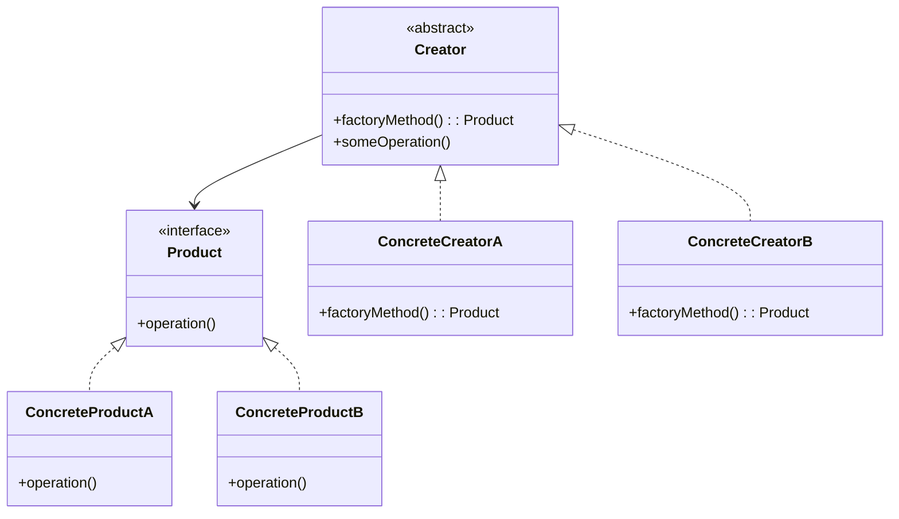

# Kotlin工厂方法模式

工厂方法模式（Factory Method Pattern）是一种创建型设计模式，它提供了一种创建对象的方式，而无需指定具体的类。通过定义一个创建对象的接口，但让子类决定实例化哪个类，工厂方法模式使得类的实例化过程延迟到子类。

## 什么是工厂方法模式？

工厂方法模式的核心思想是将对象的创建过程封装在一个方法中，而不是直接在代码中通过构造函数创建对象。这样做的好处是，客户端代码不需要知道具体的类名，只需要通过工厂方法来获取对象。这种方式使得代码更加灵活，易于扩展和维护。

### 工厂方法模式的结构

工厂方法模式通常包含以下几个角色：

1. **产品接口（Product Interface）**：定义了产品的接口，所有具体产品都需要实现这个接口。
2. **具体产品（Concrete Product）**：实现了产品接口的具体类。
3. **创建者接口（Creator Interface）**：定义了工厂方法的接口，通常是一个抽象类或接口。
4. **具体创建者（Concrete Creator）**：实现了工厂方法的具体类，负责创建具体产品的实例。



## Kotlin中的工厂方法模式

在Kotlin中，工厂方法模式可以通过多种方式实现。下面我们通过一个简单的例子来展示如何在Kotlin中使用工厂方法模式。

### 示例：创建不同类型的车辆

假设我们有一个车辆制造系统，需要创建不同类型的车辆，如汽车和卡车。我们可以使用工厂方法模式来实现这个需求。

#### 1. 定义产品接口

首先，我们定义一个 `Vehicle` 接口，表示所有车辆的共同行为。

```kotlin
interface Vehicle {
    fun drive()
}
```

#### 2. 实现具体产品

接下来，我们实现两种具体的车辆：`Car` 和 `Truck`。

```kotlin
class Car : Vehicle {
    override fun drive() {
        println("Driving a car")
    }
}

class Truck : Vehicle {
    override fun drive() {
        println("Driving a truck")
    }
}
```

#### 3. 定义创建者接口

然后，我们定义一个 `VehicleFactory` 接口，其中包含一个工厂方法 `createVehicle`。

```kotlin
interface VehicleFactory {
    fun createVehicle(): Vehicle
}
```

#### 4. 实现具体创建者

最后，我们实现两个具体的工厂类：`CarFactory` 和 `TruckFactory`，分别用于创建 `Car` 和 `Truck`。

```kotlin
class CarFactory : VehicleFactory {
    override fun createVehicle(): Vehicle {
        return Car()
    }
}

class TruckFactory : VehicleFactory {
    override fun createVehicle(): Vehicle {
        return Truck()
    }
}
```

#### 5. 使用工厂方法创建对象

现在，我们可以通过工厂方法来创建不同类型的车辆，而无需直接调用具体的构造函数。

```kotlin
fun main() {
    val carFactory: VehicleFactory = CarFactory()
    val car: Vehicle = carFactory.createVehicle()
    car.drive()  // 输出: Driving a car

    val truckFactory: VehicleFactory = TruckFactory()
    val truck: Vehicle = truckFactory.createVehicle()
    truck.drive()  // 输出: Driving a truck
}
```

:::tip
通过工厂方法模式，我们可以轻松地扩展系统，添加新的车辆类型，而无需修改现有的客户端代码。
:::

## 实际应用场景

工厂方法模式在实际开发中有广泛的应用，特别是在以下场景中：

1. **框架设计**：许多框架使用工厂方法模式来创建对象，例如Spring框架中的BeanFactory。
2. **插件系统**：在插件系统中，工厂方法模式可以用于动态加载和创建插件实例。
3. **跨平台开发**：在跨平台开发中，工厂方法模式可以用于创建与平台相关的对象，而无需修改核心代码。

## 总结

工厂方法模式是一种强大的设计模式，它通过将对象的创建过程封装在工厂方法中，使得代码更加灵活和易于扩展。在Kotlin中，工厂方法模式可以通过接口和抽象类来实现，适用于各种需要动态创建对象的场景。

:::note
**附加资源**：
- [Kotlin官方文档](https://kotlinlang.org/docs/home.html)
- [设计模式：可复用面向对象软件的基础](https://www.amazon.com/Design-Patterns-Elements-Reusable-Object-Oriented/dp/0201633612)

**练习**：
1. 尝试扩展上面的车辆制造系统，添加一个新的车辆类型（如摩托车），并实现相应的工厂类。
2. 思考如何在现有的项目中应用工厂方法模式，以提升代码的可维护性和扩展性。
:::