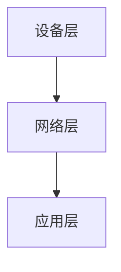

## 介绍

物联网（IoT）是指通过互联网连接各种设备，使它们能够相互通信和交换数据。Android作为全球最流行的移动操作系统之一，为开发物联网应用程序提供了强大的支持。通过Android，开发者可以轻松连接和管理各种智能设备，如传感器、智能家居设备、可穿戴设备等。

在本教程中，我们将逐步介绍如何在Android平台上开发物联网应用程序，涵盖从基础概念到实际应用的各个方面。

## 基础概念

### 1. 物联网架构

物联网系统通常由以下几个部分组成：

- **设备层**：包括各种传感器、执行器和智能设备。
- **网络层**：负责设备之间的通信和数据传输。
- **应用层**：处理数据、提供用户界面和业务逻辑。



### 2. Android中的物联网支持

Android提供了多种API和工具来支持物联网开发，包括：

- **Android Things**：一个专门为物联网设备设计的操作系统。
- **Google Play服务**：提供设备管理、数据同步和云集成功能。
- **Bluetooth API**：用于与蓝牙设备通信。
- **Wi-Fi Direct**：用于设备之间的直接通信。

## 开发环境设置

在开始开发之前，确保你已经安装了以下工具：

- **Android Studio**：用于开发Android应用程序的官方IDE。
- **Android SDK**：包含开发所需的各种库和工具。
- **物理设备或模拟器**：用于测试应用程序。

## 实际案例：智能家居控制

让我们通过一个简单的案例来展示如何在Android上开发物联网应用程序。假设我们要开发一个应用程序，用于控制家中的智能灯泡。

### 1. 创建项目

首先，在Android Studio中创建一个新的项目，选择“Empty Activity”模板。

### 2. 添加依赖

在`build.gradle`文件中添加以下依赖项：

```groovy
dependencies {
    implementation 'com.google.android.things:androidthings:1.0'
    implementation 'com.google.android.gms:play-services-nearby:18.0.0'
}
```

### 3. 编写代码

在`MainActivity.java`中编写以下代码：

```java
import android.os.Bundle;
import android.widget.Button;
import android.widget.Toast;
import androidx.appcompat.app.AppCompatActivity;
import com.google.android.things.pio.Gpio;
import com.google.android.things.pio.PeripheralManager;

public class MainActivity extends AppCompatActivity {

    private Gpio ledGpio;
    private Button toggleButton;

    @Override
    protected void onCreate(Bundle savedInstanceState) {
        super.onCreate(savedInstanceState);
        setContentView(R.layout.activity_main);

        toggleButton = findViewById(R.id.toggleButton);
        toggleButton.setOnClickListener(v -> toggleLed());

        try {
            PeripheralManager manager = PeripheralManager.getInstance();
            ledGpio = manager.openGpio("BCM6");
            ledGpio.setDirection(Gpio.DIRECTION_OUT_INITIALLY_LOW);
        } catch (Exception e) {
            Toast.makeText(this, "Error initializing GPIO", Toast.LENGTH_SHORT).show();
        }
    }

    private void toggleLed() {
        try {
            ledGpio.setValue(!ledGpio.getValue());
        } catch (Exception e) {
            Toast.makeText(this, "Error toggling LED", Toast.LENGTH_SHORT).show();
        }
    }

    @Override
    protected void onDestroy() {
        super.onDestroy();
        try {
            ledGpio.close();
        } catch (Exception e) {
            Toast.makeText(this, "Error closing GPIO", Toast.LENGTH_SHORT).show();
        }
    }
}
```

### 4. 运行应用程序

将应用程序部署到支持Android Things的设备或模拟器上，点击按钮即可控制LED灯的开关。

## 总结

通过本教程，我们了解了如何在Android平台上开发物联网应用程序。我们学习了物联网的基本架构、Android中的物联网支持工具，并通过一个简单的智能家居控制案例展示了实际开发过程。

## 附加资源

- [Android Things官方文档](https://developer.android.com/things)
- [Google Play服务文档](https://developers.google.com/android/guides/overview)
- [Bluetooth API指南](https://developer.android.com/guide/topics/connectivity/bluetooth)

## 练习

1. 扩展智能家居控制应用程序，添加更多设备（如温度传感器）的控制功能。
2. 尝试使用Wi-Fi Direct实现设备之间的直接通信。
3. 探索Android Things的其他功能，如PWM输出和I2C通信。

:::tip
在开发物联网应用程序时，务必注意设备的安全性和隐私保护，确保数据传输和存储的安全性。
:::