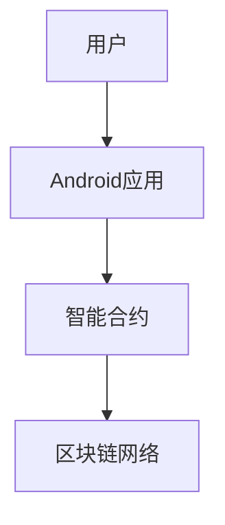

# Android区块链应用

区块链技术近年来迅速发展，成为许多行业的热门话题。它不仅仅局限于加密货币，还可以应用于数据存储、智能合约、供应链管理等领域。本文将介绍如何在Android应用中集成区块链技术，帮助初学者理解其基本原理和实现方法。

## 什么是区块链？

区块链是一种分布式数据库技术，它通过加密算法将数据存储在多个节点上，确保数据的安全性和不可篡改性。每个区块包含一组交易记录，并通过哈希值与前一个区块链接，形成一个链式结构。

:::note
区块链的核心特点包括去中心化、透明性和不可篡改性。
:::

## 在Android应用中集成区块链

要在Android应用中集成区块链，首先需要选择一个合适的区块链平台。常见的选择包括以太坊（Ethereum）、Hyperledger Fabric等。本文将使用以太坊作为示例。

### 1. 设置开发环境

首先，确保你的开发环境中已经安装了以下工具：

- Android Studio
- Node.js
- Truffle（以太坊开发框架）
- Ganache（本地以太坊区块链模拟器）

### 2. 创建智能合约

智能合约是运行在区块链上的程序，可以自动执行预定义的规则。以下是一个简单的智能合约示例，用于存储和检索数据：

```solidity
// SPDX-License-Identifier: MIT
pragma solidity ^0.8.0;

contract SimpleStorage {
    uint256 storedData;

    function set(uint256 x) public {
        storedData = x;
    }

    function get() public view returns (uint256) {
        return storedData;
    }
}
```

### 3. 部署智能合约

使用Truffle和Ganache部署智能合约：

```bash
truffle migrate --reset
```

### 4. 在Android应用中与智能合约交互

要在Android应用中与智能合约交互，可以使用Web3j库。首先，在`build.gradle`中添加依赖：

```groovy
implementation 'org.web3j:core:4.8.7'
```

然后，编写代码与智能合约交互：

```java
import org.web3j.crypto.Credentials;
import org.web3j.protocol.Web3j;
import org.web3j.protocol.http.HttpService;
import org.web3j.tx.gas.DefaultGasProvider;
import org.web3j.tx.gas.StaticGasProvider;

public class MainActivity extends AppCompatActivity {
    private static final String CONTRACT_ADDRESS = "0xYourContractAddress";
    private static final String PRIVATE_KEY = "YourPrivateKey";

    @Override
    protected void onCreate(Bundle savedInstanceState) {
        super.onCreate(savedInstanceState);
        setContentView(R.layout.activity_main);

        Web3j web3j = Web3j.build(new HttpService("https://rinkeby.infura.io/v3/YOUR_INFURA_PROJECT_ID"));
        Credentials credentials = Credentials.create(PRIVATE_KEY);

        SimpleStorage contract = SimpleStorage.load(CONTRACT_ADDRESS, web3j, credentials, new DefaultGasProvider());

        // 设置数据
        try {
            TransactionReceipt receipt = contract.set(BigInteger.valueOf(42)).send();
            Log.d("TransactionHash", receipt.getTransactionHash());
        } catch (Exception e) {
            e.printStackTrace();
        }

        // 获取数据
        try {
            BigInteger value = contract.get().send();
            Log.d("StoredValue", value.toString());
        } catch (Exception e) {
            e.printStackTrace();
        }
    }
}
```

### 5. 实际案例

假设你正在开发一个去中心化的投票应用。用户可以通过Android应用投票，投票结果存储在区块链上，确保透明性和不可篡改性。



## 总结

通过本文，你了解了如何在Android应用中集成区块链技术。我们介绍了区块链的基本概念，展示了如何创建和部署智能合约，并提供了与智能合约交互的代码示例。区块链技术为Android应用开发带来了新的可能性，尤其是在需要数据透明性和安全性的场景中。

## 附加资源

- [以太坊官方文档](https://ethereum.org/en/developers/docs/)
- [Web3j文档](https://docs.web3j.io/)
- [Truffle框架](https://trufflesuite.com/docs/truffle/)

## 练习

1. 修改智能合约，使其支持多个用户存储和检索数据。
2. 在Android应用中实现一个简单的投票功能，将投票结果存储在区块链上。
3. 探索其他区块链平台（如Hyperledger Fabric）并尝试在Android应用中集成。

:::tip
区块链技术仍在快速发展，建议持续关注最新的技术动态和最佳实践。
:::