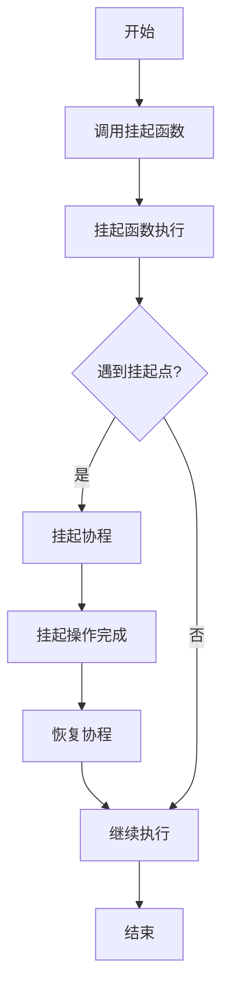

# Kotlin挂起函数

Kotlin协程是Kotlin语言中用于简化异步编程的强大工具。而**挂起函数**（Suspending Functions）是协程的核心概念之一。本文将详细介绍什么是挂起函数、它们的工作原理，以及如何在实际项目中使用它们。

## 什么是挂起函数？

挂起函数是Kotlin协程中的一种特殊函数，它可以在不阻塞线程的情况下暂停执行，并在稍后恢复执行。挂起函数通常用于执行耗时操作，例如网络请求、文件读写或数据库查询，而不会阻塞主线程。

挂起函数的关键特性是：
- 它们可以在执行过程中暂停，并在稍后恢复。
- 它们只能在协程或其他挂起函数中调用。
- 它们不会阻塞线程，而是将控制权交还给调用者。

## 挂起函数的基本语法

在Kotlin中，挂起函数通过 `suspend` 关键字来定义。以下是一个简单的挂起函数示例：

```kotlin
suspend fun fetchData(): String {
    delay(1000) // 模拟耗时操作
    return "Data fetched"
}
```

在这个例子中，`fetchData` 是一个挂起函数，它使用 `delay` 函数模拟了一个耗时操作。`delay` 是Kotlin协程库提供的一个挂起函数，它会暂停当前协程的执行，但不会阻塞线程。

## 挂起函数的工作原理

挂起函数的执行过程可以分为以下几个步骤：
1. **挂起**：当挂起函数遇到一个挂起点（例如 `delay` 或 `await`）时，它会暂停当前协程的执行，并将控制权交还给调用者。
2. **恢复**：当挂起操作完成后，协程会从挂起点恢复执行。

以下是一个简单的流程图，展示了挂起函数的执行过程：



## 挂起函数的实际应用

挂起函数在实际开发中有广泛的应用场景，特别是在需要执行耗时操作时。以下是一个实际案例，展示了如何使用挂起函数进行网络请求：

```kotlin
import kotlinx.coroutines.*
import java.net.URL

suspend fun fetchUserData(userId: String): String {
    return withContext(Dispatchers.IO) {
        URL("https://api.example.com/users/$userId").readText()
    }
}

fun main() = runBlocking {
    val userData = fetchUserData("123")
    println(userData)
}
```

在这个例子中，`fetchUserData` 是一个挂起函数，它使用 `withContext` 将代码块切换到 `Dispatchers.IO` 上下文中执行，以避免阻塞主线程。`URL.readText()` 是一个阻塞操作，但由于它在 `Dispatchers.IO` 上下文中执行，因此不会阻塞主线程。

## 总结

挂起函数是Kotlin协程的核心概念之一，它允许我们在不阻塞线程的情况下执行耗时操作。通过使用 `suspend` 关键字，我们可以定义挂起函数，并在协程中调用它们。挂起函数的工作原理是通过挂起和恢复机制来实现的，这使得异步编程变得更加简单和高效。

在实际开发中，挂起函数可以用于执行各种耗时操作，例如网络请求、文件读写和数据库查询。通过合理地使用挂起函数，我们可以编写出高效且易于维护的异步代码。

## 附加资源与练习

- **官方文档**：[Kotlin协程官方指南](https://kotlinlang.org/docs/coroutines-guide.html)
- **练习**：尝试编写一个挂起函数，模拟从数据库中读取数据并返回结果。使用 `delay` 函数模拟数据库查询的耗时操作。

:::tip
在编写挂起函数时，尽量避免在挂起函数中执行阻塞操作。如果必须执行阻塞操作，请使用 `withContext` 将其切换到适当的线程池中执行。
:::