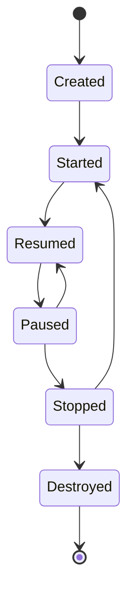
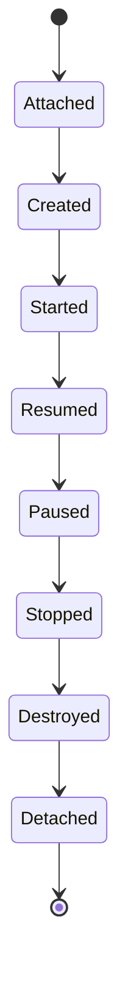

# Android生命周期

在Android开发中，**生命周期**是一个核心概念。它描述了应用组件（如Activity或Fragment）从创建到销毁的整个过程。理解生命周期对于管理应用的状态、资源分配以及用户体验至关重要。

## 什么是Android生命周期？

Android生命周期是指应用组件在其运行过程中经历的一系列状态变化。每个状态都对应着特定的回调方法，开发者可以通过重写这些方法来控制组件的行为。例如，当用户启动一个Activity时，系统会调用`onCreate()`方法；当Activity不再可见时，系统会调用`onStop()`方法。

## Activity生命周期

Activity是Android应用中最常见的组件之一。它的生命周期包括以下几个主要状态：

1. **Created**：Activity被创建，但尚未显示。
2. **Started**：Activity可见，但未获得焦点。
3. **Resumed**：Activity可见且获得焦点，用户可以与之交互。
4. **Paused**：Activity部分被遮挡，但仍可见。
5. **Stopped**：Activity完全不可见。
6. **Destroyed**：Activity被销毁。

以下是一个典型的Activity生命周期图：



### 生命周期回调方法

以下是Activity生命周期中常用的回调方法：

- `onCreate()`：Activity首次创建时调用，通常用于初始化UI和数据。
- `onStart()`：Activity即将可见时调用。
- `onResume()`：Activity获得焦点并可与用户交互时调用。
- `onPause()`：Activity失去焦点但仍可见时调用。
- `onStop()`：Activity完全不可见时调用。
- `onDestroy()`：Activity被销毁时调用。

以下是一个简单的代码示例，展示了如何在Activity中重写这些方法：

```java
public class MainActivity extends AppCompatActivity {

    @Override
    protected void onCreate(Bundle savedInstanceState) {
        super.onCreate(savedInstanceState);
        setContentView(R.layout.activity_main);
        Log.d("Lifecycle", "onCreate called");
    }

    @Override
    protected void onStart() {
        super.onStart();
        Log.d("Lifecycle", "onStart called");
    }

    @Override
    protected void onResume() {
        super.onResume();
        Log.d("Lifecycle", "onResume called");
    }

    @Override
    protected void onPause() {
        super.onPause();
        Log.d("Lifecycle", "onPause called");
    }

    @Override
    protected void onStop() {
        super.onStop();
        Log.d("Lifecycle", "onStop called");
    }

    @Override
    protected void onDestroy() {
        super.onDestroy();
        Log.d("Lifecycle", "onDestroy called");
    }
}
```

:::note
**注意**：在`onPause()`和`onStop()`中，应避免执行耗时操作，因为这些方法可能会被快速调用，影响用户体验。
:::

## Fragment生命周期

Fragment是Activity的一部分，它也有自己的生命周期。Fragment的生命周期与Activity类似，但有一些额外的回调方法，如`onAttach()`和`onDetach()`。

以下是一个Fragment生命周期的简化图：



### Fragment生命周期回调方法

- `onAttach()`：Fragment与Activity关联时调用。
- `onCreateView()`：Fragment创建视图时调用。
- `onActivityCreated()`：Activity的`onCreate()`方法完成后调用。
- `onDestroyView()`：Fragment的视图被销毁时调用。
- `onDetach()`：Fragment与Activity解除关联时调用。

## 实际应用场景

### 场景1：保存和恢复状态

当Activity被系统销毁并重新创建时（例如屏幕旋转），可以通过`onSaveInstanceState()`和`onRestoreInstanceState()`方法来保存和恢复状态。

```java
@Override
protected void onSaveInstanceState(Bundle outState) {
    super.onSaveInstanceState(outState);
    outState.putString("key", "value");
}

@Override
protected void onRestoreInstanceState(Bundle savedInstanceState) {
    super.onRestoreInstanceState(savedInstanceState);
    String value = savedInstanceState.getString("key");
}
```

### 场景2：管理资源

在`onPause()`中释放资源（如摄像头），并在`onResume()`中重新获取资源，以确保应用在后台时不会占用不必要的资源。

```java
@Override
protected void onPause() {
    super.onPause();
    releaseCamera();
}

@Override
protected void onResume() {
    super.onResume();
    initializeCamera();
}
```

## 总结

Android生命周期是开发高效、稳定应用的基础。通过理解Activity和Fragment的生命周期回调方法，开发者可以更好地管理应用的状态和资源。在实际开发中，合理利用生命周期方法可以显著提升用户体验。

## 附加资源

- [Android官方文档：Activity生命周期](https://developer.android.com/guide/components/activities/activity-lifecycle)
- [Android官方文档：Fragment生命周期](https://developer.android.com/guide/fragments/lifecycle)

## 练习

1. 创建一个简单的Activity，重写所有生命周期方法，并在每个方法中打印日志。观察日志输出，理解每个方法的调用时机。
2. 尝试在`onSaveInstanceState()`中保存一个字符串，并在`onRestoreInstanceState()`中恢复它。
3. 创建一个Fragment，并观察其生命周期与Activity生命周期的关系。