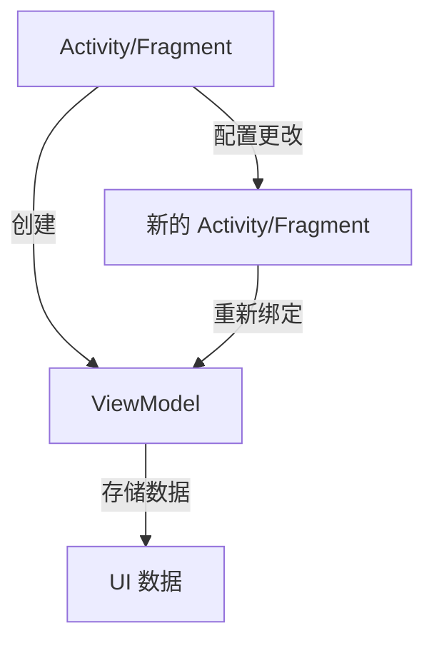

# ViewModel

## 介绍

在 Android 应用开发中，**ViewModel** 是一个非常重要的组件，它属于 Android Jetpack 的一部分。ViewModel 的主要作用是管理与 UI 相关的数据，并确保这些数据在配置更改（如屏幕旋转）时不会丢失。通过使用 ViewModel，开发者可以将 UI 逻辑与数据逻辑分离，从而使代码更加清晰和易于维护。

:::note
ViewModel 并不是用来替代 Activity 或 Fragment 的，而是用来存储和管理与 UI 相关的数据。
:::

## ViewModel 的工作原理

ViewModel 的生命周期与 Activity 或 Fragment 的生命周期不同。当 Activity 或 Fragment 因配置更改而重建时，ViewModel 不会被销毁，而是会继续存在。这使得 ViewModel 成为存储 UI 相关数据的理想选择。



如上图所示，ViewModel 在 Activity 或 Fragment 重建时仍然存在，因此可以保留 UI 数据。

## 创建和使用 ViewModel

要使用 ViewModel，首先需要在项目中添加 `lifecycle-viewmodel` 依赖项。在 `build.gradle` 文件中添加以下依赖：

```groovy
dependencies {
    implementation "androidx.lifecycle:lifecycle-viewmodel-ktx:2.5.1"
}
```

接下来，我们可以创建一个 ViewModel 类。假设我们有一个简单的计数器应用，我们可以创建一个 `CounterViewModel` 类来管理计数器的值。

```kotlin
import androidx.lifecycle.ViewModel

class CounterViewModel : ViewModel() {
    private var count = 0

    fun getCount(): Int {
        return count
    }

    fun incrementCount() {
        count++
    }
}
```

在 Activity 或 Fragment 中，我们可以通过 `ViewModelProvider` 来获取 ViewModel 的实例。

```kotlin
import android.os.Bundle
import androidx.activity.viewModels
import androidx.appcompat.app.AppCompatActivity

class MainActivity : AppCompatActivity() {

    private val viewModel: CounterViewModel by viewModels()

    override fun onCreate(savedInstanceState: Bundle?) {
        super.onCreate(savedInstanceState)
        setContentView(R.layout.activity_main)

        // 使用 ViewModel 中的数据
        val count = viewModel.getCount()
        println("Current count: $count")

        // 增加计数
        viewModel.incrementCount()
    }
}
```

:::tip
在 Fragment 中，可以使用 `by activityViewModels()` 来获取与 Activity 共享的 ViewModel 实例。
:::

## ViewModel 的实际应用场景

ViewModel 在许多场景中都非常有用，尤其是在以下情况下：

1. **配置更改**：当用户旋转屏幕时，Activity 或 Fragment 会被销毁并重新创建。使用 ViewModel 可以确保数据不会丢失。
2. **数据共享**：多个 Fragment 可以共享同一个 ViewModel，从而实现数据共享。
3. **UI 逻辑分离**：将 UI 逻辑与数据逻辑分离，使代码更易于维护和测试。

### 示例：共享 ViewModel

假设我们有一个包含两个 Fragment 的 Activity，这两个 Fragment 需要共享同一个计数器数据。我们可以通过以下方式实现：

```kotlin
class SharedViewModel : ViewModel() {
    private val count = MutableLiveData<Int>()

    fun getCount(): LiveData<Int> {
        return count
    }

    fun incrementCount() {
        count.value = (count.value ?: 0) + 1
    }
}
```

在 Activity 中，我们可以通过 `ViewModelProvider` 获取 ViewModel 实例，并在 Fragment 中共享它。

```kotlin
class FirstFragment : Fragment() {

    private val sharedViewModel: SharedViewModel by activityViewModels()

    override fun onCreateView(
        inflater: LayoutInflater, container: ViewGroup?,
        savedInstanceState: Bundle?
    ): View? {
        val view = inflater.inflate(R.layout.fragment_first, container, false)

        sharedViewModel.getCount().observe(viewLifecycleOwner, Observer { count ->
            println("Count in FirstFragment: $count")
        })

        return view
    }
}
```

在第二个 Fragment 中，我们可以执行相同的操作来观察和更新计数器。

## 总结

ViewModel 是 Android Jetpack 中一个强大的工具，它帮助开发者管理与 UI 相关的数据，并确保数据在配置更改时不会丢失。通过将 UI 逻辑与数据逻辑分离，ViewModel 使代码更加清晰和易于维护。

:::caution
虽然 ViewModel 可以存储数据，但它不应该存储与 UI 无关的数据。对于与 UI 无关的数据，应该使用其他组件，如 Repository 或 UseCase。
:::

## 附加资源与练习

- **官方文档**：[ViewModel Overview](https://developer.android.com/topic/libraries/architecture/viewmodel)
- **练习**：尝试创建一个简单的待办事项应用，使用 ViewModel 来管理任务列表，并确保在屏幕旋转时任务列表不会丢失。

通过学习和实践，你将能够更好地理解 ViewModel 的工作原理，并在实际项目中应用它。