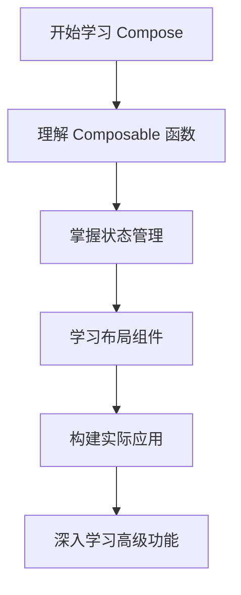

# Compose简介

Jetpack Compose 是 Google 推出的一种用于构建 Android 用户界面的现代工具包。它采用声明式 UI 编程模型，使开发者能够以更简洁、更直观的方式构建动态且响应式的用户界面。与传统的基于 XML 的布局方式相比，Compose 提供了更高的灵活性和开发效率。

## 什么是声明式 UI？

在传统的命令式 UI 编程中，开发者需要手动更新 UI 状态，例如通过 `findViewById` 获取视图并修改其属性。而在声明式 UI 中，开发者只需描述 UI 的外观和行为，Compose 会自动处理状态变化并更新 UI。

### 传统命令式 UI 示例
```kotlin
val textView = findViewById<TextView>(R.id.textView)
textView.text = "Hello, World!"
```

### 声明式 UI 示例
```kotlin
@Composable
fun Greeting(name: String) {
    Text(text = "Hello, $name!")
}
```

在声明式 UI 中，`Greeting` 函数描述了 UI 的外观，Compose 会根据传入的 `name` 参数自动更新 UI。

---

## Compose 的核心概念

### 1. Composable 函数
Composable 函数是 Compose 的基本构建块。它们是用 `@Composable` 注解标记的函数，用于描述 UI 的一部分。Composable 函数可以嵌套和组合，从而构建复杂的 UI。

```kotlin
@Composable
fun MyApp() {
    Greeting(name = "Android")
}
```

### 2. 状态管理
Compose 使用状态来驱动 UI 更新。状态是 UI 的数据源，当状态发生变化时，Compose 会自动重新绘制相关的 UI 部分。

```kotlin
@Composable
fun Counter() {
    var count by remember { mutableStateOf(0) }
    Button(onClick = { count++ }) {
        Text("Clicked $count times")
    }
}
```

在上面的示例中，`count` 是一个状态变量。每次点击按钮时，`count` 的值会增加，Compose 会自动更新按钮上的文本。

### 3. 布局和排列
Compose 提供了多种布局组件，例如 `Column`、`Row` 和 `Box`，用于排列和组合 UI 元素。

```kotlin
@Composable
fun ProfileCard(name: String, bio: String) {
    Column {
        Text(text = name, style = MaterialTheme.typography.h5)
        Text(text = bio, style = MaterialTheme.typography.body1)
    }
}
```

`Column` 用于垂直排列子组件，而 `Row` 用于水平排列。

---

## 实际应用场景

### 构建一个简单的待办事项列表
以下是一个使用 Compose 构建的简单待办事项列表示例：

```kotlin
@Composable
fun TodoList(tasks: List<String>) {
    Column {
        tasks.forEach { task ->
            Text(text = task)
        }
    }
}

@Composable
fun TodoApp() {
    val tasks = listOf("Buy groceries", "Walk the dog", "Write code")
    TodoList(tasks = tasks)
}
```

在这个示例中，`TodoList` 组件接收一个任务列表，并使用 `Column` 垂直排列每个任务。

---

## 总结

Jetpack Compose 是一种强大的工具，可以帮助开发者以声明式的方式构建 Android 应用。通过 Composable 函数、状态管理和灵活的布局组件，Compose 简化了 UI 开发流程，并提高了代码的可读性和可维护性。

:::tip
**小贴士**：如果你已经熟悉传统的 Android 开发，建议从简单的 Composable 函数开始，逐步尝试更复杂的 UI 构建。
:::

---

## 附加资源与练习

- **官方文档**：[Jetpack Compose 官方指南](https://developer.android.com/jetpack/compose)
- **练习**：尝试使用 Compose 构建一个简单的用户注册表单，包含姓名、邮箱和密码输入字段。
- **深入学习**：探索 Compose 中的动画和主题功能，为你的应用添加更多动态效果。



通过以上内容，你已经对 Jetpack Compose 有了初步的了解。接下来，动手实践是掌握 Compose 的最佳方式！