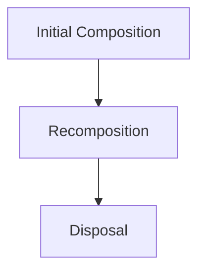

# Compose生命周期

Jetpack Compose 是Android现代UI开发工具包，它通过声明式的方式构建用户界面。与传统的View系统不同，Compose的核心是**Composable函数**，这些函数会根据状态的变化自动重新组合（recompose）UI。理解Compose的生命周期对于构建高效、可维护的UI至关重要。

## 什么是Compose生命周期？

在Compose中，**生命周期**指的是Composable函数从创建到销毁的整个过程。Composable函数的生命周期与传统的Activity或Fragment生命周期不同，它更关注UI的**组合**（composition）和**重组**（recomposition）。

- **组合（Composition）**：Composable函数首次被调用时，Compose会创建一个UI树，并将其渲染到屏幕上。
- **重组（Recomposition）**：当Composable函数依赖的状态发生变化时，Compose会重新调用该函数，更新UI树。

## Compose生命周期的关键阶段

Compose的生命周期可以分为以下几个关键阶段：

1. **Initial Composition（初始组合）**：Composable函数首次被调用，创建UI树。
2. **Recomposition（重组）**：当状态发生变化时，Composable函数被重新调用，更新UI树。
3. **Disposal（销毁）**：当Composable函数不再需要时，Compose会清理相关资源。



## 状态管理与重组

Compose的核心是**状态驱动UI**。当状态发生变化时，Compose会自动触发重组。以下是一个简单的例子：

```kotlin
@Composable
fun Counter() {
    var count by remember { mutableStateOf(0) }

    Button(onClick = { count++ }) {
        Text("Clicked $count times")
    }
}
```

在这个例子中，`count` 是一个状态变量。每次点击按钮时，`count` 的值会增加，触发 `Counter` 函数的重组，从而更新UI。

:::tip
使用 `remember` 可以在重组过程中保留状态，避免每次重组时重置状态。
:::

## 实际案例：列表项的点击状态

假设我们有一个列表，每个列表项都有一个点击状态。我们需要在点击时更新状态并改变UI：

```kotlin
@Composable
fun ClickableItem(index: Int) {
    var isClicked by remember { mutableStateOf(false) }

    Box(
        modifier = Modifier
            .fillMaxWidth()
            .clickable { isClicked = !isClicked }
            .background(if (isClicked) Color.Green else Color.White)
    ) {
        Text("Item $index", modifier = Modifier.padding(16.dp))
    }
}
```

在这个例子中，每次点击列表项时，`isClicked` 状态会切换，UI会根据状态的变化重新组合，改变背景颜色。

## 总结

Compose的生命周期围绕**组合**和**重组**展开。理解状态如何驱动UI更新是掌握Compose的关键。通过合理使用 `remember` 和 `mutableStateOf`，你可以构建出高效、响应式的UI。

## 附加资源与练习

- **官方文档**：[Jetpack Compose 生命周期](https://developer.android.com/jetpack/compose/lifecycle)
- **练习**：尝试创建一个Composable函数，使用 `LaunchedEffect` 在组合时启动一个协程，并在销毁时取消它。

:::caution
避免在Composable函数中执行耗时操作，这可能导致UI卡顿。使用 `LaunchedEffect` 或 `rememberCoroutineScope` 来处理异步任务。
:::

通过不断实践和探索，你将能够更好地理解Compose的生命周期，并构建出更加复杂的UI。