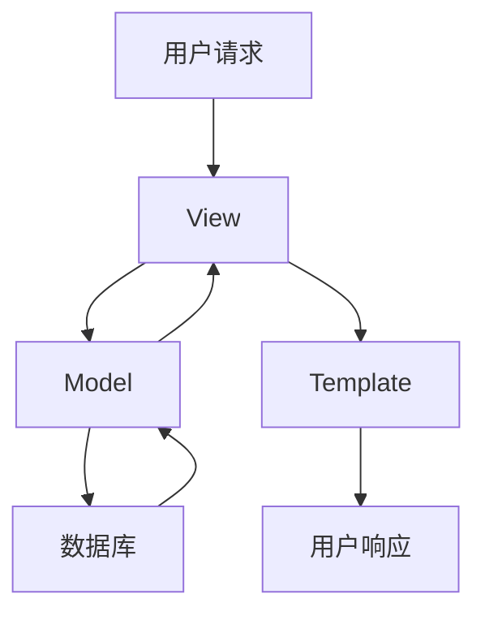

## 什么是Django？

Django是一个高级Python Web框架，旨在帮助开发者快速构建复杂、数据库驱动的网站。它遵循“**DRY**”（Don't Repeat Yourself，不要重复自己）原则，提供了许多内置功能，如用户认证、内容管理、表单处理和数据库迁移等，使开发者能够专注于业务逻辑，而不是重复的基础工作。

Django最初由Lawrence Journal-World的开发团队创建，用于管理新闻网站。2005年，Django作为开源项目发布，并迅速成为Python社区中最受欢迎的Web框架之一。

---

## Django 的主要特点

Django具有以下核心特点：

1. **快速开发**：Django提供了许多开箱即用的功能，如ORM（对象关系映射）、模板引擎和自动生成的管理界面，帮助开发者快速构建应用。
2. **安全性**：Django内置了防止常见Web攻击（如SQL注入、跨站脚本攻击和跨站请求伪造）的功能。
3. **可扩展性**：Django的模块化设计使其易于扩展，开发者可以根据需求添加或替换组件。
4. **社区支持**：Django拥有庞大的社区，提供了丰富的文档、教程和第三方库。

---

## Django 的架构

Django遵循**MVT**（Model-View-Template）架构模式，类似于MVC（Model-View-Controller）。以下是MVT的组成部分：

1. **Model**：负责处理数据逻辑，定义数据库表结构。
2. **View**：处理业务逻辑，接收请求并返回响应。
3. **Template**：负责渲染HTML页面，展示数据。



---

## 安装Django

在开始使用Django之前，需要先安装它。可以通过以下命令安装Django：

```bash
pip install django
```

安装完成后，可以通过以下命令验证是否安装成功：

```bash
django-admin --version
```

如果输出了Django的版本号，说明安装成功。

---

## 创建一个Django项目

Django提供了一个命令行工具`django-admin`，用于创建和管理项目。以下是一个简单的示例，展示如何创建一个名为`myproject`的Django项目：

```bash
django-admin startproject myproject
```

运行上述命令后，Django会生成一个项目目录结构：

```
myproject/
    manage.py
    myproject/
        __init__.py
        settings.py
        urls.py
        asgi.py
        wsgi.py
```

- `manage.py`：用于管理项目的命令行工具。
- `settings.py`：项目的配置文件，包含数据库设置、静态文件路径等。
- `urls.py`：定义URL路由。
- `asgi.py`和`wsgi.py`：用于部署项目的入口文件。

---

## 运行开发服务器

Django自带一个轻量级的开发服务器，可以用于本地测试。在项目根目录下运行以下命令启动服务器：

```bash
python manage.py runserver
```

默认情况下，服务器会运行在`http://127.0.0.1:8000/`。打开浏览器访问该地址，如果看到Django的欢迎页面，说明项目已成功运行。

---

## 实际案例：创建一个简单的博客应用

以下是一个简单的示例，展示如何使用Django创建一个博客应用。

### 1. 创建应用

在项目根目录下运行以下命令，创建一个名为`blog`的应用：

```bash
python manage.py startapp blog
```

### 2. 定义模型

在`blog/models.py`中定义一个`Post`模型，用于存储博客文章：

```python
from django.db import models

class Post(models.Model):
    title = models.CharField(max_length=200)
    content = models.TextField()
    created_at = models.DateTimeField(auto_now_add=True)

    def __str__(self):
        return self.title
```

### 3. 迁移数据库

运行以下命令，将模型同步到数据库：

```bash
python manage.py makemigrations
python manage.py migrate
```

### 4. 创建视图和模板

在`blog/views.py`中创建一个视图，用于显示所有博客文章：

```python
from django.shortcuts import render
from .models import Post

def post_list(request):
    posts = Post.objects.all()
    return render(request, 'blog/post_list.html', {'posts': posts})
```

在`blog/templates/blog/post_list.html`中创建一个模板文件：

```html
<h1>博客文章列表</h1>
<ul>
    
        <li>{{ post.title }} - {{ post.created_at }}</li>
    
</ul>
```

### 5. 配置URL路由

在`blog/urls.py`中配置URL路由：

```python
from django.urls import path
from . import views

urlpatterns = [
    path('', views.post_list, name='post_list'),
]
```

在`myproject/urls.py`中包含`blog`应用的URL配置：

```python
from django.contrib import admin
from django.urls import include, path

urlpatterns = [
    path('admin/', admin.site.urls),
    path('blog/', include('blog.urls')),
]
```

### 6. 运行并测试

启动开发服务器，访问`http://127.0.0.1:8000/blog/`，即可看到博客文章列表。

---

## 总结

Django是一个功能强大且易于使用的Web框架，适合快速开发复杂的Web应用。通过本文，你已经了解了Django的基本概念、安装方法以及如何创建一个简单的博客应用。

:::tip 下一步
- 深入学习Django的ORM和模板系统。
- 探索Django的内置用户认证系统。
- 尝试部署一个Django应用到生产环境。
:::

---

## 附加资源

- [Django官方文档](https://docs.djangoproject.com/)
- [Django for Beginners](https://djangoforbeginners.com/)
- [Django Girls Tutorial](https://tutorial.djangogirls.org/)