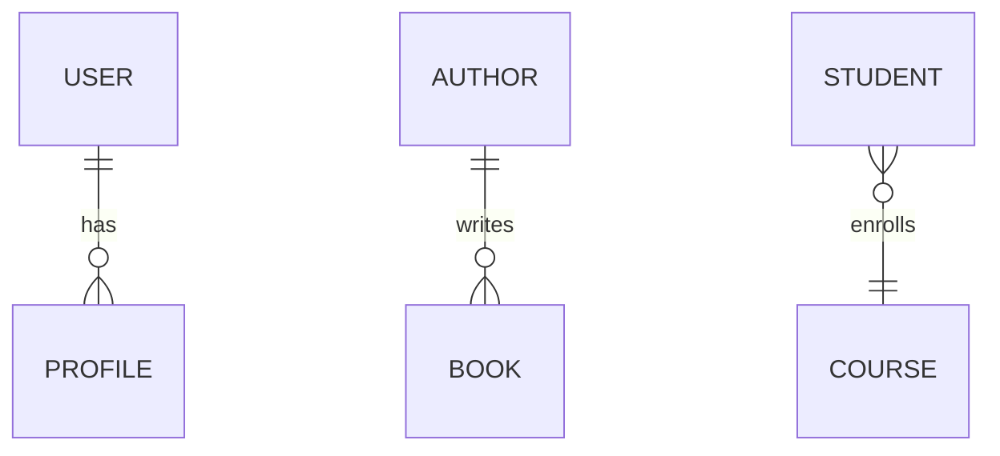

# Django 模型关系

在Django中，模型（Model）是用于定义数据库表结构的Python类。模型之间的关系是数据库设计中的重要部分，它们定义了数据表之间的关联方式。Django支持三种主要的关系类型：**一对一（One-to-One）**、**一对多（One-to-Many）** 和 **多对多（Many-to-Many）**。本文将详细介绍这些关系类型，并通过实际案例帮助你理解它们的应用场景。

## 1. 一对一关系（One-to-One）

一对一关系表示两个模型之间的唯一对应关系。例如，一个用户（User）可能有一个唯一的用户档案（Profile）。在Django中，可以使用 `OneToOneField` 来定义这种关系。

### 示例代码

```python
from django.db import models
from django.contrib.auth.models import User

class Profile(models.Model):
    user = models.OneToOneField(User, on_delete=models.CASCADE)
    bio = models.TextField()
    location = models.CharField(max_length=100)

    def __str__(self):
        return f'{self.user.username} Profile'
```

在这个例子中，`Profile` 模型与 `User` 模型之间建立了一对一关系。每个 `User` 实例只能有一个 `Profile` 实例，反之亦然。

### 实际应用场景

- **用户档案**：每个用户有一个唯一的档案，用于存储额外的个人信息。
- **扩展模型**：当需要扩展某个模型的功能时，可以使用一对一关系来避免修改原始模型。

## 2. 一对多关系（One-to-Many）

一对多关系表示一个模型实例可以关联多个另一个模型的实例。例如，一个作者（Author）可以写多本书（Book）。在Django中，可以使用 `ForeignKey` 来定义这种关系。

### 示例代码

```python
from django.db import models

class Author(models.Model):
    name = models.CharField(max_length=100)

    def __str__(self):
        return self.name

class Book(models.Model):
    title = models.CharField(max_length=200)
    author = models.ForeignKey(Author, on_delete=models.CASCADE)

    def __str__(self):
        return self.title
```

在这个例子中，`Book` 模型与 `Author` 模型之间建立了一对多关系。一个 `Author` 实例可以关联多个 `Book` 实例，但每个 `Book` 实例只能关联一个 `Author` 实例。

### 实际应用场景

- **博客系统**：一个用户可以发布多篇文章。
- **订单系统**：一个客户可以下多个订单。

## 3. 多对多关系（Many-to-Many）

多对多关系表示两个模型实例之间可以相互关联多个实例。例如，一个学生（Student）可以选修多门课程（Course），而一门课程也可以被多个学生选修。在Django中，可以使用 `ManyToManyField` 来定义这种关系。

### 示例代码

```python
from django.db import models

class Student(models.Model):
    name = models.CharField(max_length=100)

    def __str__(self):
        return self.name

class Course(models.Model):
    title = models.CharField(max_length=200)
    students = models.ManyToManyField(Student)

    def __str__(self):
        return self.title
```

在这个例子中，`Course` 模型与 `Student` 模型之间建立了多对多关系。一个 `Student` 实例可以关联多个 `Course` 实例，反之亦然。

### 实际应用场景

- **社交网络**：一个用户可以关注多个用户，同时也可以被多个用户关注。
- **标签系统**：一篇文章可以有多个标签，一个标签也可以被多篇文章使用。

## 4. 关系图示例

为了更好地理解这些关系，我们可以使用Mermaid图表来展示它们之间的关系。



- `USER` 和 `PROFILE` 之间是一对一关系。
- `AUTHOR` 和 `BOOK` 之间是一对多关系。
- `STUDENT` 和 `COURSE` 之间是多对多关系。

## 5. 总结

Django模型关系是数据库设计中的核心概念，理解并正确使用这些关系可以帮助你构建高效、可维护的应用程序。本文介绍了一对一、一对多和多对多关系，并通过实际案例展示了它们的应用场景。

:::tip 提示
在实际开发中，合理设计模型关系可以大大提高数据库的查询效率和数据一致性。建议在项目初期仔细规划模型之间的关系。
:::

## 6. 附加资源与练习

- **Django官方文档**：[模型关系](https://docs.djangoproject.com/en/stable/topics/db/models/#relationships)
- **练习**：尝试创建一个简单的博客系统，其中包含用户、文章和标签模型，并使用上述关系类型将它们关联起来。

通过本文的学习，你应该已经掌握了Django模型关系的基本概念和应用方法。继续实践和探索，你将能够更熟练地使用这些关系来构建复杂的应用程序。