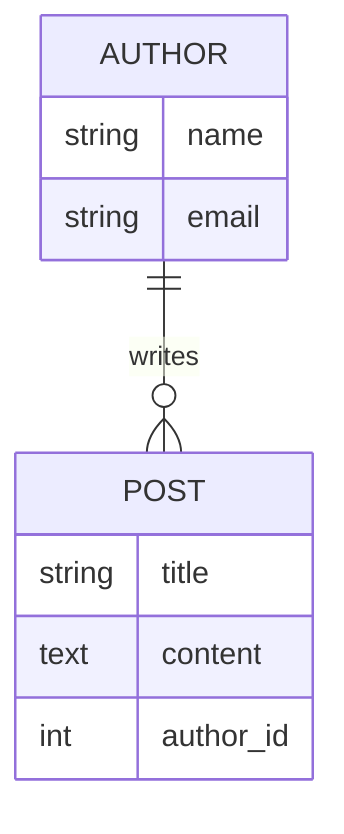

# Django 一对多关系

在 Django 中，模型（Model）是数据库表的抽象表示。模型之间的关系是数据库设计中的重要部分，而一对多关系（One-to-Many Relationship）是最常见的关系之一。本文将详细介绍 Django 中的一对多关系，并通过代码示例和实际案例帮助你掌握这一概念。

## 什么是一对多关系？

一对多关系是指一个模型实例可以关联多个另一个模型的实例，但另一个模型的实例只能关联一个该模型的实例。例如，一个作者可以写多本书，但一本书只能有一个作者。这种关系在数据库中通过外键（ForeignKey）实现。

在 Django 中，一对多关系通过 `ForeignKey` 字段定义。接下来，我们将通过一个实际的例子来演示如何在 Django 中实现一对多关系。

## 实现一对多关系

假设我们正在构建一个博客系统，其中有两个模型：`Author`（作者）和 `Post`（文章）。一个作者可以写多篇文章，但每篇文章只能有一个作者。这就是典型的一对多关系。

### 定义模型

首先，我们需要在 `models.py` 中定义这两个模型：

```python
from django.db import models

class Author(models.Model):
    name = models.CharField(max_length=100)
    email = models.EmailField()

    def __str__(self):
        return self.name

class Post(models.Model):
    title = models.CharField(max_length=200)
    content = models.TextField()
    author = models.ForeignKey(Author, on_delete=models.CASCADE)

    def __str__(self):
        return self.title
```

在上面的代码中，`Post` 模型中的 `author` 字段是一个 `ForeignKey`，它指向 `Author` 模型。`on_delete=models.CASCADE` 表示当删除一个作者时，该作者的所有文章也会被删除。

### 数据库迁移

定义好模型后，我们需要生成并应用数据库迁移：

```bash
python manage.py makemigrations
python manage.py migrate
```

### 创建数据

接下来，我们可以通过 Django 的 shell 来创建一些数据：

```bash
python manage.py shell
```

在 shell 中，我们可以创建作者和文章：

```python
from myapp.models import Author, Post

# 创建一个作者
author = Author.objects.create(name="John Doe", email="john@example.com")

# 创建两篇文章
post1 = Post.objects.create(title="First Post", content="This is the first post.", author=author)
post2 = Post.objects.create(title="Second Post", content="This is the second post.", author=author)
```

### 查询数据

我们可以通过以下方式查询数据：

```python
# 获取作者的所有文章
author.post_set.all()

# 获取文章的作者
post1.author
```

## 实际案例：博客系统

让我们通过一个实际的案例来进一步理解一对多关系。假设我们正在开发一个博客系统，用户可以注册成为作者并发布文章。每个作者可以发布多篇文章，但每篇文章只能有一个作者。

### 模型关系图

我们可以使用 Mermaid 来绘制模型之间的关系图：



在上面的图中，`AUTHOR` 和 `POST` 之间存在一对多关系，`AUTHOR` 可以写多篇 `POST`。

### 视图和模板

在视图和模板中，我们可以展示作者及其文章。例如，我们可以创建一个视图来显示某个作者的所有文章：

```python
from django.shortcuts import render
from myapp.models import Author

def author_posts(request, author_id):
    author = Author.objects.get(id=author_id)
    posts = author.post_set.all()
    return render(request, 'author_posts.html', {'author': author, 'posts': posts})
```

在模板 `author_posts.html` 中，我们可以这样展示数据：

```html
<h1>{{ author.name }}'s Posts</h1>
<ul>
    
        <li>{{ post.title }} - {{ post.content }}</li>
    
</ul>
```

## 总结

在本文中，我们介绍了 Django 中的一对多关系，并通过一个博客系统的案例演示了如何使用 `ForeignKey` 实现这种关系。我们定义了模型、创建了数据，并通过视图和模板展示了数据。

一对多关系是 Django 中最常见的关系之一，掌握它对于构建复杂的应用程序至关重要。希望本文能帮助你理解并应用这一概念。

## 附加资源与练习

- **练习**：尝试在你的项目中实现一个类似的一对多关系，例如用户和评论的关系。
- **资源**：阅读 [Django 官方文档](https://docs.djangoproject.com/en/stable/topics/db/models/) 以了解更多关于模型和关系的内容。

:::tip
如果你在实现过程中遇到问题，可以查阅 Django 的官方文档或在社区中寻求帮助。
:::