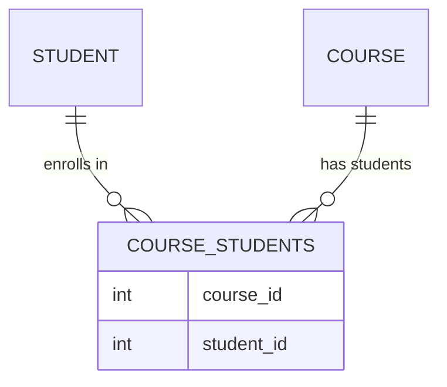

# Django 多对多关系

在Django中，多对多关系（Many-to-Many Relationship）是一种常见的数据库关系类型，用于描述两个模型之间的复杂关联。例如，一个学生可以选修多门课程，而一门课程也可以被多个学生选修。这种关系需要通过中间表来管理。

## 什么是多对多关系？

多对多关系是指两个模型之间的关联，其中一个模型的实例可以与另一个模型的多个实例相关联，反之亦然。在数据库中，这种关系通常通过一个中间表来实现，该表存储两个模型之间的关联关系。

### 示例场景

假设我们有两个模型：`Student`（学生）和 `Course`（课程）。一个学生可以选修多门课程，而一门课程也可以被多个学生选修。这就是典型的多对多关系。

## 在Django中定义多对多关系

在Django中，我们可以使用 `ManyToManyField` 来定义多对多关系。以下是一个简单的示例：

```python
from django.db import models

class Student(models.Model):
    name = models.CharField(max_length=100)

    def __str__(self):
        return self.name

class Course(models.Model):
    name = models.CharField(max_length=100)
    students = models.ManyToManyField(Student, related_name='courses')

    def __str__(self):
        return self.name
```

在这个示例中，`Course` 模型通过 `students` 字段与 `Student` 模型建立了多对多关系。`related_name` 参数允许我们从 `Student` 实例反向访问其关联的 `Course` 实例。

### 数据库表结构

Django会自动创建一个中间表来管理 `Student` 和 `Course` 之间的多对多关系。这个中间表通常命名为 `course_students`，并包含两个外键字段：`course_id` 和 `student_id`。



## 使用多对多关系

### 添加关系

我们可以通过以下方式将学生添加到课程中：

```python
# 创建学生和课程实例
student1 = Student.objects.create(name="Alice")
student2 = Student.objects.create(name="Bob")
course1 = Course.objects.create(name="Math")
course2 = Course.objects.create(name="Science")

# 将学生添加到课程中
course1.students.add(student1, student2)
course2.students.add(student1)
```

### 查询关系

我们可以通过以下方式查询与某个课程相关的学生：

```python
# 获取与课程相关的学生
math_students = course1.students.all()
for student in math_students:
    print(student.name)
```

输出：
```
Alice
Bob
```

我们也可以通过学生查询其选修的课程：

```python
# 获取学生选修的课程
alice_courses = student1.courses.all()
for course in alice_courses:
    print(course.name)
```

输出：
```
Math
Science
```

### 删除关系

我们可以通过以下方式从课程中移除学生：

```python
# 从课程中移除学生
course1.students.remove(student1)
```

## 实际应用场景

多对多关系在实际应用中非常常见。以下是一些典型的应用场景：

1. **社交网络中的好友关系**：一个用户可以拥有多个好友，而每个好友也可以拥有多个用户。
2. **标签系统**：一篇文章可以有多个标签，而一个标签也可以被多篇文章使用。
3. **权限管理**：一个用户可以拥有多个角色，而一个角色也可以被多个用户拥有。

## 总结

多对多关系是Django中非常强大的功能，能够帮助我们轻松管理复杂的数据库关系。通过 `ManyToManyField`，我们可以定义多对多关系，并通过简单的方法来添加、查询和删除关系。

在实际开发中，多对多关系广泛应用于各种场景，如社交网络、标签系统和权限管理等。掌握多对多关系的使用，将有助于你构建更加灵活和强大的应用程序。

## 附加资源与练习

- **官方文档**：[Django Many-to-Many Relationships](https://docs.djangoproject.com/en/stable/topics/db/examples/many_to_many/)
- **练习**：尝试创建一个博客系统，其中 `Post` 模型和 `Tag` 模型之间建立多对多关系，并实现文章的标签管理功能。

:::tip
在定义多对多关系时，建议使用 `related_name` 参数来指定反向查询的名称，以避免冲突并提高代码的可读性。
:::