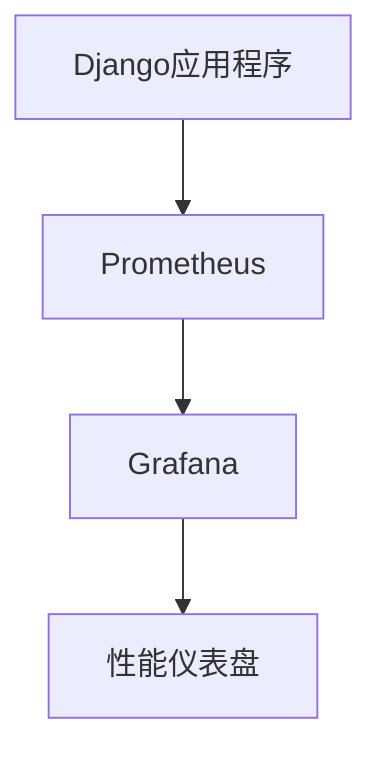

# Django 性能监控

在开发和部署Django应用程序时，性能监控是一个至关重要的环节。通过监控，您可以了解应用程序的运行状况，识别瓶颈，并优化代码以提高响应速度和资源利用率。本文将介绍如何在Django中实现性能监控，并提供一些实用的工具和技巧。

## 什么是性能监控？

性能监控是指通过收集和分析应用程序的运行数据，来评估其性能表现的过程。这些数据通常包括响应时间、请求频率、数据库查询时间、内存使用情况等。通过监控这些指标，您可以及时发现性能问题并采取相应的优化措施。

## 为什么需要性能监控？

1. **提高用户体验**：快速响应的应用程序能够提供更好的用户体验，减少用户流失。
2. **优化资源利用**：通过监控，您可以发现资源浪费的地方，从而优化服务器配置。
3. **预防故障**：及时发现性能瓶颈，可以预防潜在的故障和停机时间。

## Django 性能监控工具

Django社区提供了多种性能监控工具，以下是一些常用的工具：

1. **Django Debug Toolbar**：一个用于开发环境的调试工具，可以显示请求的详细信息，包括SQL查询、缓存使用等。
2. **Django Silk**：一个实时性能分析工具，可以记录每个请求的执行时间、数据库查询等信息。
3. **New Relic**：一个商业性能监控工具，提供详细的应用程序性能分析。
4. **Prometheus + Grafana**：一个开源的监控系统，可以用于监控Django应用程序的性能指标。

## 使用Django Debug Toolbar进行性能监控

Django Debug Toolbar是一个非常有用的工具，特别适合在开发环境中使用。它可以帮助您快速识别性能问题。

### 安装和配置

首先，安装Django Debug Toolbar：

```bash
pip install django-debug-toolbar
```

然后，在`settings.py`中进行配置：

```python
INSTALLED_APPS = [
    # 其他应用
    'debug_toolbar',
]

MIDDLEWARE = [
    # 其他中间件
    'debug_toolbar.middleware.DebugToolbarMiddleware',
]

INTERNAL_IPS = [
    '127.0.0.1',
]
```

### 使用示例

启动开发服务器并访问您的应用程序，您将在页面的右侧看到一个调试工具栏。点击工具栏中的各个面板，您可以查看SQL查询、缓存使用、请求时间等详细信息。

:::tip
Django Debug Toolbar仅在开发环境中使用，不要在生产环境中启用它。
:::

## 使用Django Silk进行实时性能分析

Django Silk是一个更强大的性能分析工具，适合在生产环境中使用。它可以记录每个请求的执行时间、数据库查询等信息。

### 安装和配置

首先，安装Django Silk：

```bash
pip install django-silk
```

然后，在`settings.py`中进行配置：

```python
INSTALLED_APPS = [
    # 其他应用
    'silk',
]

MIDDLEWARE = [
    # 其他中间件
    'silk.middleware.SilkyMiddleware',
]
```

### 使用示例

启动开发服务器并访问您的应用程序，您可以在`/silk/`路径下查看性能分析报告。Silk会记录每个请求的详细信息，包括SQL查询、执行时间等。

:::note
Django Silk可以在生产环境中使用，但请注意其对性能的影响。
:::

## 使用Prometheus + Grafana进行监控

Prometheus是一个开源的监控系统，Grafana是一个用于可视化监控数据的工具。结合使用这两个工具，您可以构建一个强大的Django性能监控系统。

### 安装和配置

首先，安装`django-prometheus`：

```bash
pip install django-prometheus
```

然后，在`settings.py`中进行配置：

```python
INSTALLED_APPS = [
    # 其他应用
    'django_prometheus',
]

MIDDLEWARE = [
    # 其他中间件
    'django_prometheus.middleware.PrometheusBeforeMiddleware',
    'django_prometheus.middleware.PrometheusAfterMiddleware',
]
```

### 使用示例

启动Prometheus和Grafana，并配置数据源。您可以在Grafana中创建仪表盘，实时监控Django应用程序的性能指标。



:::caution
Prometheus和Grafana的配置较为复杂，建议在生产环境中由有经验的开发人员操作。
:::

## 实际案例

假设您正在开发一个电子商务网站，用户反馈页面加载速度较慢。通过使用Django Debug Toolbar，您发现某个视图的数据库查询次数过多。通过优化查询，您成功将页面加载时间从5秒降低到1秒。

## 总结

性能监控是确保Django应用程序高效运行的关键步骤。通过使用Django Debug Toolbar、Django Silk、Prometheus等工具，您可以及时发现并解决性能问题，从而提高用户体验和资源利用率。

## 附加资源

- [Django Debug Toolbar官方文档](https://django-debug-toolbar.readthedocs.io/)
- [Django Silk官方文档](https://github.com/jazzband/django-silk)
- [Prometheus官方文档](https://prometheus.io/docs/)
- [Grafana官方文档](https://grafana.com/docs/)

## 练习

1. 在您的Django项目中安装并配置Django Debug Toolbar，查看某个页面的SQL查询次数。
2. 尝试使用Django Silk记录一个请求的执行时间，并分析其性能瓶颈。
3. 配置Prometheus和Grafana，监控您的Django应用程序的请求频率和响应时间。
