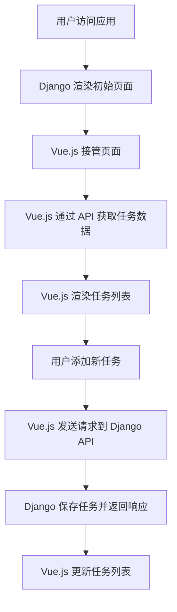

# Django SPA 开发

在现代 Web 开发中，单页应用（Single Page Application，SPA）已经成为一种流行的架构模式。SPA 通过动态加载内容，提供了更流畅的用户体验。Django 作为一个强大的后端框架，可以与前端框架（如 React 或 Vue.js）结合，构建功能强大的 SPA。

本文将带你了解如何使用 Django 开发 SPA，并展示如何将 Django 与前端框架集成。

## 什么是 SPA？

单页应用（SPA）是一种 Web 应用，它在加载初始页面后，通过 JavaScript 动态更新页面内容，而无需重新加载整个页面。SPA 通常使用前端框架（如 React、Vue.js 或 Angular）来管理视图和状态。

### SPA 的优势
- **更快的页面切换**：页面切换时无需重新加载整个页面，用户体验更流畅。
- **前后端分离**：前端和后端可以独立开发和部署。
- **更好的交互性**：通过 JavaScript 动态更新页面内容，提供更丰富的用户交互。

## Django 与 SPA 的集成

Django 通常用于构建传统的多页应用（MPA），但它也可以与前端框架结合，构建 SPA。以下是 Django 与 SPA 集成的两种常见方式：

1. **Django 作为 API 后端**：Django 提供 RESTful API，前端框架通过 API 获取数据并渲染页面。
2. **Django 与前端框架结合**：Django 负责渲染初始页面，前端框架接管后续的页面更新。

### 1. Django 作为 API 后端

在这种模式下，Django 仅负责提供数据，前端框架负责渲染页面。Django 可以使用 `Django REST Framework`（DRF）来构建 RESTful API。

#### 安装 Django REST Framework

首先，安装 `Django REST Framework`：

```bash
pip install djangorestframework
```

然后，在 `settings.py` 中添加 `rest_framework` 到 `INSTALLED_APPS`：

```python
INSTALLED_APPS = [
    ...
    'rest_framework',
]
```

#### 创建 API 视图

接下来，创建一个简单的 API 视图。假设我们有一个 `Task` 模型：

```python
from django.db import models

class Task(models.Model):
    title = models.CharField(max_length=200)
    completed = models.BooleanField(default=False)
```

然后，创建一个序列化器和视图：

```python
from rest_framework import serializers, viewsets
from .models import Task

class TaskSerializer(serializers.ModelSerializer):
    class Meta:
        model = Task
        fields = '__all__'

class TaskViewSet(viewsets.ModelViewSet):
    queryset = Task.objects.all()
    serializer_class = TaskSerializer
```

最后，在 `urls.py` 中注册视图：

```python
from django.urls import path, include
from rest_framework.routers import DefaultRouter
from .views import TaskViewSet

router = DefaultRouter()
router.register(r'tasks', TaskViewSet)

urlpatterns = [
    path('api/', include(router.urls)),
]
```

现在，你可以通过 `/api/tasks/` 访问任务列表。

### 2. Django 与前端框架结合

在这种模式下，Django 负责渲染初始页面，前端框架接管后续的页面更新。你可以使用 Django 的模板系统来渲染初始页面，然后在前端使用 React 或 Vue.js 进行动态更新。

#### 渲染初始页面

首先，在 Django 中创建一个视图来渲染初始页面：

```python
from django.shortcuts import render

def index(request):
    return render(request, 'index.html')
```

然后，在 `index.html` 中引入前端框架的入口文件：

```html
<!DOCTYPE html>
<html lang="en">
<head>
    <meta charset="UTF-8">
    <title>SPA with Django</title>
</head>
<body>
    <div id="app"></div>
    <script src=""></script>
</body>
</html>
```

#### 使用 React 或 Vue.js

你可以使用 React 或 Vue.js 来构建前端应用。以下是一个简单的 Vue.js 示例：

```javascript
// app.js
import Vue from 'vue';
import App from './App.vue';

new Vue({
  el: '#app',
  render: h => h(App)
});
```

```vue
<!-- App.vue -->
<template>
  <div>
    <h1>Tasks</h1>
    <ul>
      <li v-for="task in tasks" :key="task.id">{{ task.title }}</li>
    </ul>
  </div>
</template>

<script>
export default {
  data() {
    return {
      tasks: []
    };
  },
  mounted() {
    fetch('/api/tasks/')
      .then(response => response.json())
      .then(data => {
        this.tasks = data;
      });
  }
};
</script>
```

## 实际案例

假设你正在构建一个任务管理应用。你可以使用 Django 作为后端，提供任务数据的 API，然后使用 Vue.js 构建前端界面。用户可以通过前端界面添加、编辑和删除任务，而无需重新加载页面。

### 任务管理应用的工作流程



## 总结

通过本文，你学习了如何使用 Django 构建单页应用（SPA）。我们讨论了 Django 作为 API 后端和与前端框架结合的两种集成方式，并通过一个任务管理应用的案例展示了实际应用场景。

### 附加资源
- [Django REST Framework 官方文档](https://www.django-rest-framework.org/)
- [Vue.js 官方文档](https://vuejs.org/)
- [React 官方文档](https://reactjs.org/)

### 练习
1. 使用 Django 和 Vue.js 构建一个简单的博客应用。
2. 尝试将 Django 与 React 集成，构建一个任务管理应用。
3. 探索如何在 Django 中使用 GraphQL 替代 RESTful API。

希望本文能帮助你更好地理解 Django SPA 开发，并为你的项目提供灵感！