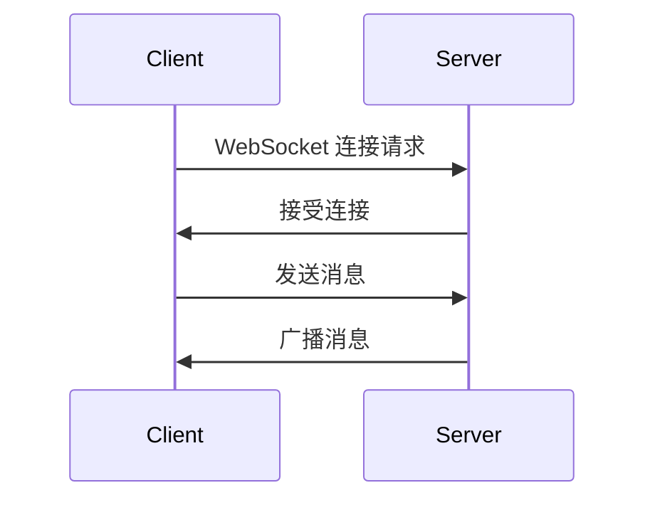

# Django Channels

Django Channels 是 Django 的一个扩展，允许开发者处理 WebSocket、聊天协议、IoT 协议等异步通信协议。它为 Django 提供了对实时功能的支持，使得构建实时 Web 应用变得更加容易。

## 什么是 Django Channels？

Django Channels 扩展了 Django 的能力，使其不仅能够处理 HTTP 请求，还能处理 WebSocket、长轮询和其他协议。它通过引入“通道层”（Channel Layer）来实现异步通信，允许 Django 应用处理多个连接并实时推送数据。

### 核心概念

1. **通道（Channels）**：通道是 Django Channels 的基本构建块，用于处理异步消息。每个连接（如 WebSocket 连接）都有一个唯一的通道。
2. **通道层（Channel Layer）**：通道层是 Django Channels 的核心组件，负责管理通道之间的消息传递。它支持多种后端，如 Redis、In-memory 等。
3. **消费者（Consumers）**：消费者是处理消息的代码单元。它们类似于 Django 的视图，但专门用于处理异步消息。

## 安装 Django Channels

要使用 Django Channels，首先需要安装它。你可以通过以下命令安装：

```bash
pip install channels
```

安装完成后，将 `channels` 添加到 `INSTALLED_APPS` 中：

```python
# settings.py
INSTALLED_APPS = [
    ...
    'channels',
]
```

接下来，配置 `ASGI_APPLICATION` 以指向你的 ASGI 应用：

```python
# settings.py
ASGI_APPLICATION = 'myproject.asgi.application'
```

## 配置通道层

Django Channels 需要一个通道层来处理消息传递。默认情况下，它使用内存中的通道层，但在生产环境中，建议使用 Redis 作为后端。

```python
# settings.py
CHANNEL_LAYERS = {
    'default': {
        'BACKEND': 'channels_redis.core.RedisChannelLayer',
        'CONFIG': {
            "hosts": [('127.0.0.1', 6379)],
        },
    },
}
```

## 创建消费者

消费者是处理 WebSocket 连接的核心部分。以下是一个简单的 WebSocket 消费者示例：

```python
# consumers.py
import json
from channels.generic.websocket import AsyncWebsocketConsumer

class ChatConsumer(AsyncWebsocketConsumer):
    async def connect(self):
        await self.accept()

    async def disconnect(self, close_code):
        pass

    async def receive(self, text_data):
        text_data_json = json.loads(text_data)
        message = text_data_json['message']

        await self.send(text_data=json.dumps({
            'message': message
        }))
```

### 路由配置

为了让 Django Channels 知道如何处理 WebSocket 连接，你需要配置路由：

```python
# routing.py
from django.urls import re_path
from . import consumers

websocket_urlpatterns = [
    re_path(r'ws/chat/$', consumers.ChatConsumer.as_asgi()),
]
```

最后，在 `asgi.py` 中配置 ASGI 应用：

```python
# asgi.py
import os
from django.core.asgi import get_asgi_application
from channels.routing import ProtocolTypeRouter, URLRouter
from channels.auth import AuthMiddlewareStack
from myapp import routing

os.environ.setdefault('DJANGO_SETTINGS_MODULE', 'myproject.settings')

application = ProtocolTypeRouter({
    "http": get_asgi_application(),
    "websocket": AuthMiddlewareStack(
        URLRouter(
            routing.websocket_urlpatterns
        )
    ),
})
```

## 实际应用场景

### 实时聊天应用

Django Channels 最常见的应用场景之一是构建实时聊天应用。通过 WebSocket，客户端和服务器可以保持持久的双向连接，从而实现实时消息传递。



### 实时通知系统

另一个常见的应用场景是实时通知系统。当服务器端发生某些事件时，可以通过 WebSocket 实时推送给客户端，而不需要客户端不断轮询服务器。

## 总结

Django Channels 为 Django 提供了处理异步通信的能力，使得构建实时 Web 应用变得更加容易。通过引入通道层和消费者，开发者可以轻松处理 WebSocket 连接、实时消息推送等场景。

### 附加资源

- [Django Channels 官方文档](https://channels.readthedocs.io/en/stable/)
- [Redis 作为通道层后端](https://redis.io/)
- [WebSocket 协议详解](https://developer.mozilla.org/en-US/docs/Web/API/WebSockets_API)

### 练习

1. 尝试创建一个简单的实时聊天应用，使用 Django Channels 处理 WebSocket 连接。
2. 扩展聊天应用，使其支持多个聊天室，并确保消息只在相应的聊天室中广播。
3. 使用 Redis 作为通道层后端，部署你的应用并测试其性能。

:::tip
在开发过程中，确保使用 Django 的调试工具和日志记录功能，以便更好地理解和调试你的代码。
:::