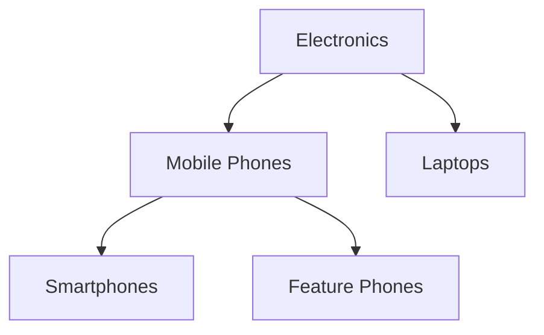
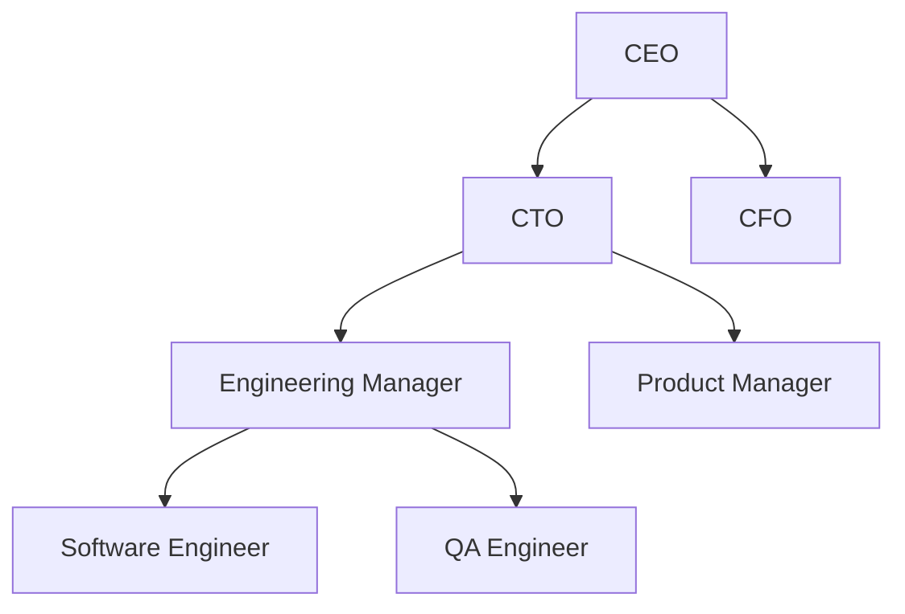

# Django MPTT

Django MPTT（Modified Preorder Tree Traversal）是一个用于在 Django 中处理树形数据结构的扩展库。树形数据结构在现实世界中有许多应用场景，例如组织结构、分类目录、评论系统等。Django MPTT 提供了一种高效的方式来存储和查询这些树形数据。

## 什么是 MPTT？

MPTT 是一种用于表示树形结构的算法。它通过为每个节点分配一个“左值”和“右值”来存储树的结构信息。这种表示方法使得查询树中的节点及其子节点变得非常高效。

### MPTT 的基本概念

- **左值（left）**：表示节点在树中的起始位置。
- **右值（right）**：表示节点在树中的结束位置。
- **层级（level）**：表示节点在树中的深度。

通过这些值，MPTT 可以快速确定节点的父子关系、兄弟关系以及子树的范围。

## 安装 Django MPTT

首先，你需要安装 Django MPTT 库。你可以使用 pip 来安装：

```bash
pip install django-mptt
```

安装完成后，将 `mptt` 添加到你的 Django 项目的 `INSTALLED_APPS` 中：

```python
INSTALLED_APPS = [
    ...
    'mptt',
    ...
]
```

## 使用 Django MPTT

### 创建树形模型

假设我们要创建一个表示分类目录的模型。我们可以使用 `MPTTModel` 来定义这个模型：

```python
from django.db import models
from mptt.models import MPTTModel, TreeForeignKey

class Category(MPTTModel):
    name = models.CharField(max_length=100)
    parent = TreeForeignKey('self', on_delete=models.CASCADE, null=True, blank=True, related_name='children')

    class MPTTMeta:
        order_insertion_by = ['name']

    def __str__(self):
        return self.name
```

在这个模型中，`parent` 字段是一个外键，指向同一模型的另一个实例，表示当前分类的父分类。`MPTTMeta` 类中的 `order_insertion_by` 属性用于指定插入新节点时的排序方式。

### 添加数据

现在我们可以添加一些分类数据：

```python
# 创建根分类
root = Category.objects.create(name="Electronics")

# 创建子分类
mobile = Category.objects.create(name="Mobile Phones", parent=root)
laptop = Category.objects.create(name="Laptops", parent=root)

# 创建孙子分类
smartphone = Category.objects.create(name="Smartphones", parent=mobile)
feature_phone = Category.objects.create(name="Feature Phones", parent=mobile)
```

### 查询树形数据

Django MPTT 提供了许多有用的方法来查询树形数据。例如，我们可以获取某个节点的所有子节点：

```python
# 获取根分类的所有子分类
children = root.get_children()
for child in children:
    print(child.name)
```

输出：

```
Mobile Phones
Laptops
```

我们还可以获取某个节点的所有后代节点：

```python
# 获取根分类的所有后代分类
descendants = root.get_descendants(include_self=False)
for descendant in descendants:
    print(descendant.name)
```

输出：

```
Mobile Phones
Smartphones
Feature Phones
Laptops
```

### 树形结构的可视化

为了更好地理解树形结构，我们可以使用 Mermaid 来绘制树形图：



## 实际应用场景

### 组织结构

假设我们有一个公司，其组织结构如下：



我们可以使用 Django MPTT 来存储和查询这个组织结构。

### 评论系统

在评论系统中，评论可以嵌套，形成树形结构。Django MPTT 可以帮助我们高效地存储和查询这些嵌套评论。

## 总结

Django MPTT 是一个强大的工具，用于在 Django 中处理树形数据结构。通过使用 MPTT，我们可以轻松地存储、查询和操作树形数据。本文介绍了如何安装和使用 Django MPTT，并通过实际案例展示了其应用场景。

## 附加资源

- [Django MPTT 官方文档](https://django-mptt.readthedocs.io/en/latest/)
- [Django 官方文档](https://docs.djangoproject.com/)

## 练习

1. 创建一个表示公司组织结构的树形模型，并添加一些数据。
2. 使用 Django MPTT 查询某个部门的所有子部门。
3. 尝试在评论系统中使用 Django MPTT 来存储嵌套评论。
