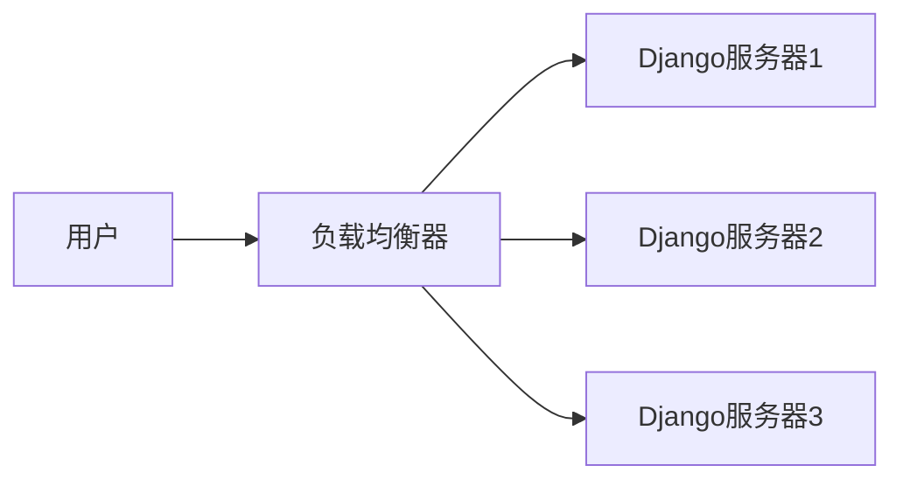

# Django 可扩展性

在构建Web应用程序时，可扩展性是一个至关重要的概念。它指的是应用程序能够在不显著降低性能的情况下，处理不断增长的用户请求和数据量。对于Django开发者来说，理解如何设计和构建可扩展的应用程序是确保项目长期成功的关键。

## 什么是可扩展性？

可扩展性通常分为两种类型：

1. **垂直扩展**：通过增加单个服务器的资源（如CPU、内存）来提高性能。
2. **水平扩展**：通过增加更多的服务器来分担负载。

Django作为一个强大的Web框架，提供了许多工具和技术来支持这两种扩展方式。

## 设计可扩展的Django应用程序

### 1. 数据库优化

数据库通常是Web应用程序的瓶颈之一。以下是一些优化数据库性能的策略：

- **使用索引**：确保在经常查询的字段上创建索引。
- **分片**：将数据库分成多个部分，每个部分存储在不同的服务器上。
- **缓存**：使用缓存来减少数据库查询次数。

```python
# 示例：在Django中使用缓存
from django.core.cache import cache

def get_user_data(user_id):
    data = cache.get(f'user_data_{user_id}')
    if data is None:
        data = User.objects.get(id=user_id)
        cache.set(f'user_data_{user_id}', data, timeout=60*15)  # 缓存15分钟
    return data
```

### 2. 异步任务处理

对于耗时的任务（如发送电子邮件、处理图像），使用异步任务队列（如Celery）可以显著提高应用程序的响应速度。

```python
# 示例：使用Celery处理异步任务
from celery import shared_task

@shared_task
def send_email_async(email, message):
    # 发送电子邮件的逻辑
    pass
```

### 3. 负载均衡

通过负载均衡器（如Nginx或HAProxy）将流量分发到多个Django应用服务器，可以有效提高应用程序的吞吐量。



### 4. 使用CDN

内容分发网络（CDN）可以加速静态资源（如图片、CSS、JavaScript文件）的加载速度，从而减轻服务器的负担。

## 实际案例

假设你正在开发一个电子商务网站，随着用户数量的增加，你发现数据库查询变得越来越慢。通过以下步骤，你可以显著提高网站的性能：

1. **优化数据库查询**：使用索引和缓存来减少查询时间。
2. **异步处理订单**：使用Celery异步处理订单，避免阻塞主线程。
3. **负载均衡**：使用Nginx将流量分发到多个Django服务器。
4. **使用CDN**：将静态资源托管在CDN上，加速页面加载。

## 总结

设计和构建可扩展的Django应用程序需要综合考虑多个方面，包括数据库优化、异步任务处理、负载均衡和使用CDN。通过合理应用这些策略，你可以确保你的应用程序能够应对不断增长的用户需求和数据量。

## 附加资源

- [Django官方文档](https://docs.djangoproject.com/)
- [Celery官方文档](https://docs.celeryproject.org/)
- [Nginx官方文档](https://nginx.org/en/docs/)

## 练习

1. 在你的Django项目中实现一个简单的缓存机制。
2. 使用Celery处理一个耗时的任务，并观察其对应用程序性能的影响。
3. 配置Nginx作为负载均衡器，将流量分发到多个Django服务器。

通过完成这些练习，你将更深入地理解Django可扩展性的重要性，并掌握实现它的关键技能。