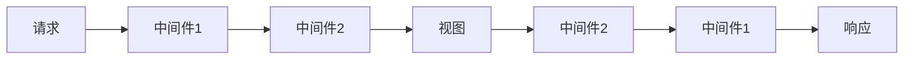

## 介绍

在Django中，中间件（Middleware）是一个轻量级的插件系统，用于全局处理请求和响应。它允许你在请求到达视图之前或响应返回给客户端之前执行一些操作。中间件可以用于多种用途，例如身份验证、日志记录、跨域资源共享（CORS）等。

Django中间件的工作原理类似于一个“管道”，请求和响应会依次通过这个管道中的每个中间件。每个中间件都可以对请求或响应进行修改，或者决定是否继续传递请求。

## Django 中间件的基本结构

Django中间件是一个Python类，通常包含以下方法：

- `__init__(self, get_response)`：初始化方法，`get_response`是一个可调用对象，用于获取下一个中间件或视图的响应。
- `__call__(self, request)`：处理请求的方法，通常在这里编写处理逻辑。
- `process_view(self, request, view_func, view_args, view_kwargs)`：在调用视图之前执行。
- `process_exception(self, request, exception)`：在视图抛出异常时执行。
- `process_template_response(self, request, response)`：在视图返回模板响应时执行。

### 示例：简单的中间件

以下是一个简单的中间件示例，它在每个请求之前打印一条日志：

```python
class SimpleMiddleware:
    def __init__(self, get_response):
        self.get_response = get_response

    def __call__(self, request):
        # 在请求到达视图之前执行
        print("Request received:", request.path)

        response = self.get_response(request)

        # 在响应返回给客户端之前执行
        print("Response sent:", response.status_code)

        return response
```

要将这个中间件添加到Django项目中，需要在 `settings.py` 文件的 `MIDDLEWARE` 列表中添加它的路径：

```python
MIDDLEWARE = [
    # 其他中间件
    'myapp.middleware.SimpleMiddleware',
]
```

## 中间件的执行顺序

中间件的执行顺序非常重要，因为它决定了请求和响应通过中间件的顺序。在 `settings.py` 中，`MIDDLEWARE` 列表的顺序决定了中间件的执行顺序。请求会从上到下依次通过每个中间件，而响应则会从下到上返回。



## 实际应用场景

### 1. 用户身份验证

中间件常用于用户身份验证。例如，你可以创建一个中间件来检查用户是否已登录，如果未登录则重定向到登录页面。

```python
from django.shortcuts import redirect

class AuthMiddleware:
    def __init__(self, get_response):
        self.get_response = get_response

    def __call__(self, request):
        if not request.user.is_authenticated and request.path != '/login/':
            return redirect('/login/')
        return self.get_response(request)
```

### 2. 日志记录

中间件还可以用于记录每个请求的详细信息，例如请求路径、用户IP地址等。

```python
import logging

logger = logging.getLogger(__name__)

class LoggingMiddleware:
    def __init__(self, get_response):
        self.get_response = get_response

    def __call__(self, request):
        logger.info(f"Request: {request.method} {request.path} from {request.META['REMOTE_ADDR']}")
        response = self.get_response(request)
        logger.info(f"Response: {response.status_code}")
        return response
```

### 3. 跨域资源共享（CORS）

如果你需要允许跨域请求，可以使用中间件来设置响应头。

```python
class CorsMiddleware:
    def __init__(self, get_response):
        self.get_response = get_response

    def __call__(self, request):
        response = self.get_response(request)
        response['Access-Control-Allow-Origin'] = '*'
        return response
```

## 总结

Django中间件是一个非常强大的工具，允许你在请求和响应的生命周期中插入自定义逻辑。通过中间件，你可以实现身份验证、日志记录、跨域资源共享等功能。理解中间件的工作原理和如何创建自定义中间件是掌握Django开发的重要一步。

## 附加资源与练习

- **官方文档**：[Django中间件文档](https://docs.djangoproject.com/en/stable/topics/http/middleware/)
- **练习**：尝试创建一个自定义中间件，记录每个请求的处理时间，并将其添加到你的Django项目中。
- **进一步学习**：探索Django内置的中间件，例如 `django.middleware.security.SecurityMiddleware`，了解它们的功能和用法。
