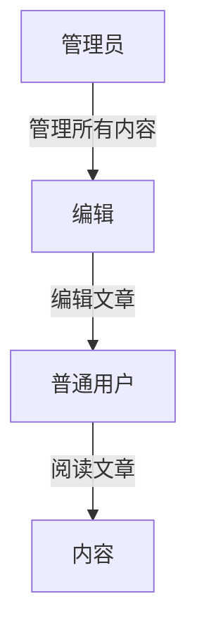

# Django 用户组

在Django中，用户组（Groups）是一种强大的工具，用于管理用户的权限和授权。通过将用户分配到不同的组中，您可以轻松地为多个用户分配相同的权限，而不需要为每个用户单独设置权限。这对于管理大型应用程序中的用户权限尤其有用。

## 什么是用户组？

用户组是Django中的一个模型，它允许您将一组权限分配给多个用户。每个组可以包含多个用户，而每个用户也可以属于多个组。通过这种方式，您可以轻松地管理用户的权限，而不需要为每个用户单独设置权限。

## 创建用户组

在Django中，您可以通过Django管理界面或代码来创建用户组。以下是如何通过代码创建用户组的示例：

```python
from django.contrib.auth.models import Group

# 创建一个新的用户组
group, created = Group.objects.get_or_create(name='Editors')

# 如果组已存在，created将为False
if created:
    print(f"Group '{group.name}' created successfully.")
else:
    print(f"Group '{group.name}' already exists.")
```

### 输出
```
Group 'Editors' created successfully.
```

## 为用户分配组

创建用户组后，您可以将用户分配到该组中。以下是如何将用户分配到组的示例：

```python
from django.contrib.auth.models import User, Group

# 获取用户和组
user = User.objects.get(username='john_doe')
group = Group.objects.get(name='Editors')

# 将用户添加到组中
user.groups.add(group)

# 保存更改
user.save()
```

### 输出
```
User 'john_doe' has been added to the 'Editors' group.
```

## 分配权限给组

您可以为组分配权限，这样组中的所有用户都会继承这些权限。以下是如何为组分配权限的示例：

```python
from django.contrib.auth.models import Permission

# 获取权限
permission = Permission.objects.get(codename='can_edit_articles')

# 将权限分配给组
group.permissions.add(permission)

# 保存更改
group.save()
```

### 输出
```
Permission 'can_edit_articles' has been added to the 'Editors' group.
```

## 实际应用场景

假设您正在开发一个内容管理系统（CMS），其中有三种类型的用户：管理员、编辑和普通用户。您可以为每种类型的用户创建一个组，并为每个组分配相应的权限。



在这个场景中，管理员可以管理所有内容，编辑可以编辑文章，而普通用户只能阅读文章。通过使用用户组，您可以轻松地为每种类型的用户分配权限，而不需要为每个用户单独设置权限。

## 总结

Django的用户组功能为管理用户权限提供了一种高效的方式。通过将用户分配到组中，并为组分配权限，您可以轻松地管理大型应用程序中的用户权限。本文介绍了如何创建用户组、将用户分配到组中以及为组分配权限，并通过实际应用场景展示了用户组的强大功能。

## 附加资源

- [Django官方文档 - 用户组](https://docs.djangoproject.com/en/stable/topics/auth/default/#groups)
- [Django权限系统详解](https://realpython.com/manage-user-permissions-django/)

## 练习

1. 创建一个名为`Moderators`的用户组，并为其分配`can_moderate_comments`权限。
2. 将用户`jane_doe`添加到`Moderators`组中。
3. 检查`jane_doe`是否继承了`can_moderate_comments`权限。

通过完成这些练习，您将更好地理解Django用户组的使用方法。