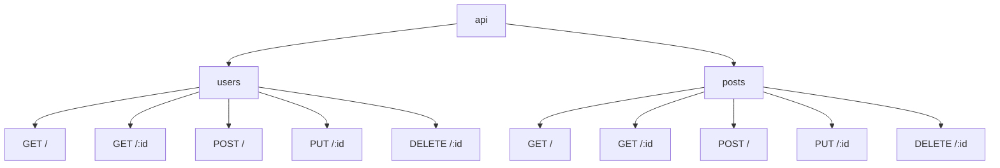

# Gin 嵌套路由

在构建Web应用程序时，路由是核心部分之一。Gin是一个高性能的Go语言Web框架，它提供了强大的路由功能。随着应用程序的复杂性增加，路由结构可能会变得复杂。为了更好地组织和管理这些路由，Gin提供了嵌套路由的功能。

## 什么是嵌套路由？

嵌套路由是指在一个路由组中定义另一个路由组。这种方式可以帮助我们将相关的路由组织在一起，使代码更加模块化和易于维护。例如，你可以将所有的API路由放在一个路由组中，然后在其中再定义与用户相关的路由组。

## 基本语法

在Gin中，你可以使用 `Group` 方法来创建一个路由组。嵌套路由的语法与普通路由类似，只是它是在一个路由组中定义的。

```go
router := gin.Default()

// 创建一个顶级路由组
api := router.Group("/api")
{
    // 在api路由组中创建一个嵌套路由组
    users := api.Group("/users")
    {
        users.GET("/", getUsers)
        users.GET("/:id", getUser)
    }
}
```

在上面的代码中，我们首先创建了一个顶级路由组 `/api`，然后在这个路由组中创建了一个嵌套路由组 `/users`。这样，所有与用户相关的路由都会被组织在 `/api/users` 路径下。

## 实际案例

假设我们正在构建一个简单的博客系统，我们需要管理用户和文章。我们可以使用嵌套路由来组织这些路由。

```go
router := gin.Default()

// 创建一个顶级路由组
api := router.Group("/api")
{
    // 用户相关的路由
    users := api.Group("/users")
    {
        users.GET("/", getUsers)
        users.GET("/:id", getUser)
        users.POST("/", createUser)
        users.PUT("/:id", updateUser)
        users.DELETE("/:id", deleteUser)
    }

    // 文章相关的路由
    posts := api.Group("/posts")
    {
        posts.GET("/", getPosts)
        posts.GET("/:id", getPost)
        posts.POST("/", createPost)
        posts.PUT("/:id", updatePost)
        posts.DELETE("/:id", deletePost)
    }
}
```

在这个例子中，我们创建了两个嵌套路由组：`/users` 和 `/posts`。这样，所有与用户相关的路由都会被组织在 `/api/users` 路径下，而所有与文章相关的路由都会被组织在 `/api/posts` 路径下。

## 路由嵌套的层次结构

为了更好地理解嵌套路由的层次结构，我们可以使用Mermaid图表来可视化它。



在这个图表中，`api` 是顶级路由组，`users` 和 `posts` 是嵌套在 `api` 下的路由组。每个路由组下又有多个具体的路由。

## 总结

嵌套路由是Gin框架中一个非常有用的功能，它可以帮助我们更好地组织和管理复杂的路由结构。通过将相关的路由组织在一起，我们可以使代码更加模块化和易于维护。

:::tip
在实际开发中，建议根据功能模块来划分路由组，这样可以提高代码的可读性和可维护性。
:::

## 附加资源

- [Gin官方文档](https://gin-gonic.com/docs/)
- [Go语言编程指南](https://golang.org/doc/)

## 练习

1. 尝试在你的项目中创建一个嵌套路由组，将相关的路由组织在一起。
2. 使用Mermaid图表绘制你项目中的路由层次结构。
