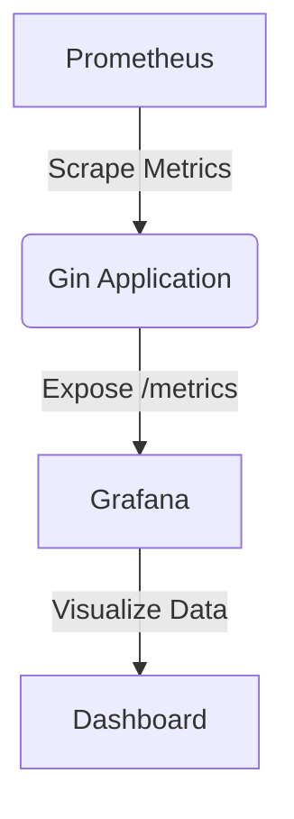

# Gin 应用状态监控

在现代Web应用中，监控应用的状态是确保系统稳定性和性能的关键步骤。Gin是一个高性能的Go语言Web框架，通过集成监控工具，我们可以实时了解应用的运行状态，及时发现并解决问题。本文将详细介绍如何在Gin应用中实现状态监控。

## 什么是应用状态监控？

应用状态监控是指通过收集和分析应用的运行数据，如请求响应时间、内存使用情况、CPU负载等，来评估应用的性能和健康状况。这些数据可以帮助开发者及时发现潜在问题，优化应用性能。

## 为什么需要监控Gin应用？

Gin应用通常用于构建高性能的Web服务，但随着用户量和请求量的增加，应用的性能可能会受到影响。通过监控，我们可以：

- 实时了解应用的运行状态。
- 快速定位性能瓶颈。
- 预防和解决潜在的系统故障。

## 如何实现Gin应用状态监控？

### 1. 使用Prometheus进行监控

[Prometheus](https://prometheus.io/) 是一个开源的系统监控和警报工具包，非常适合用于监控Gin应用。我们可以通过集成 `github.com/prometheus/client_golang` 包来收集和暴露应用的监控数据。

#### 安装Prometheus客户端库

首先，安装Prometheus的Go客户端库：

```bash
go get github.com/prometheus/client_golang/prometheus
go get github.com/prometheus/client_golang/prometheus/promhttp
```

#### 在Gin中集成Prometheus

接下来，我们在Gin应用中集成Prometheus：

```go
package main

import (
    "github.com/gin-gonic/gin"
    "github.com/prometheus/client_golang/prometheus"
    "github.com/prometheus/client_golang/prometheus/promhttp"
    "net/http"
)

var (
    httpRequestsTotal = prometheus.NewCounterVec(
        prometheus.CounterOpts{
            Name: "http_requests_total",
            Help: "Total number of HTTP requests.",
        },
        []string{"method", "path"},
    )
)

func init() {
    prometheus.MustRegister(httpRequestsTotal)
}

func main() {
    r := gin.Default()

    // Prometheus metrics endpoint
    r.GET("/metrics", gin.WrapH(promhttp.Handler()))

    // Middleware to count requests
    r.Use(func(c *gin.Context) {
        httpRequestsTotal.WithLabelValues(c.Request.Method, c.Request.URL.Path).Inc()
        c.Next()
    })

    r.GET("/", func(c *gin.Context) {
        c.JSON(http.StatusOK, gin.H{
            "message": "Hello, World!",
        })
    })

    r.Run(":8080")
}
```

在这个示例中，我们创建了一个计数器 `httpRequestsTotal` 来记录每个HTTP请求的数量。通过中间件，我们在每个请求处理之前递增计数器。最后，我们暴露了一个 `/metrics` 端点，供Prometheus抓取数据。

### 2. 使用Grafana可视化监控数据

[Grafana](https://grafana.com/) 是一个开源的可视化工具，可以与Prometheus集成，用于展示监控数据。

#### 配置Grafana

1. 安装并启动Grafana。
2. 添加Prometheus数据源。
3. 创建仪表盘，选择Prometheus作为数据源，并配置查询以展示Gin应用的监控数据。

例如，我们可以创建一个图表来展示HTTP请求的总数：



### 3. 监控应用性能指标

除了请求数量，我们还可以监控其他关键性能指标，如：

- **响应时间**：记录每个请求的处理时间。
- **内存使用**：监控应用的内存使用情况。
- **CPU负载**：监控应用的CPU使用率。

这些指标可以帮助我们更全面地了解应用的性能状况。

## 实际案例

假设我们有一个Gin应用，用户可以通过API上传文件。随着用户量的增加，我们发现上传接口的响应时间变长。通过监控，我们发现上传接口的请求处理时间显著增加，进一步分析发现是由于文件存储服务的性能瓶颈导致的。通过优化存储服务，我们成功降低了响应时间，提升了用户体验。

## 总结

通过集成Prometheus和Grafana，我们可以轻松实现Gin应用的状态监控。这不仅帮助我们实时了解应用的运行状态，还能快速定位和解决性能问题。对于初学者来说，掌握这些工具和技术是构建高性能Web应用的重要一步。

## 附加资源

- [Prometheus官方文档](https://prometheus.io/docs/)
- [Grafana官方文档](https://grafana.com/docs/)
- [Gin框架官方文档](https://gin-gonic.com/docs/)

## 练习

1. 在你的Gin应用中集成Prometheus，并暴露 `/metrics` 端点。
2. 使用Grafana创建一个仪表盘，展示HTTP请求的总数和响应时间。
3. 尝试监控其他性能指标，如内存使用和CPU负载，并在Grafana中可视化这些数据。

通过完成这些练习，你将更深入地理解Gin应用状态监控的实现和应用。