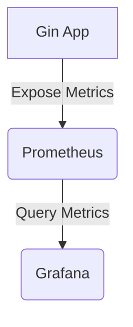

# Gin 运维最佳实践

Gin是一个高性能的Go语言Web框架，广泛用于构建RESTful API和Web应用。在开发完成后，如何高效地部署和运维Gin应用是确保其稳定性和可扩展性的关键。本文将介绍Gin运维的最佳实践，帮助初学者掌握从部署到监控的全流程。

## 1. 部署Gin应用

### 1.1 使用Docker部署

Docker是部署Gin应用的理想选择，它可以将应用及其依赖打包到一个容器中，确保环境一致性。

```dockerfile
# Dockerfile
FROM golang:1.19-alpine

WORKDIR /app

COPY . .

RUN go mod download

RUN go build -o main .

EXPOSE 8080

CMD ["./main"]
```

构建并运行Docker镜像：

```bash
docker build -t gin-app .
docker run -p 8080:8080 gin-app
```

### 1.2 使用Supervisor管理进程

Supervisor是一个进程管理工具，可以确保Gin应用在崩溃后自动重启。

```ini
# /etc/supervisor/conf.d/gin-app.conf
[program:gin-app]
command=/path/to/gin-app
autostart=true
autorestart=true
stderr_logfile=/var/log/gin-app.err.log
stdout_logfile=/var/log/gin-app.out.log
```

启动Supervisor并管理Gin应用：

```bash
sudo supervisorctl reread
sudo supervisorctl update
sudo supervisorctl start gin-app
```

## 2. 配置管理

### 2.1 使用环境变量

将配置信息存储在环境变量中，避免硬编码敏感信息。

```go
port := os.Getenv("PORT")
if port == "" {
    port = "8080"
}

r := gin.Default()
r.Run(":" + port)
```

### 2.2 使用Viper管理配置

Viper是一个强大的配置管理库，支持多种配置格式和环境变量。

```go
import "github.com/spf13/viper"

viper.SetConfigFile("config.yaml")
viper.ReadInConfig()

port := viper.GetString("port")
r := gin.Default()
r.Run(":" + port)
```

## 3. 日志管理

### 3.1 使用Logrus进行结构化日志记录

Logrus是一个流行的日志库，支持结构化日志记录。

```go
import (
    "github.com/sirupsen/logrus"
    "github.com/gin-gonic/gin"
)

func main() {
    log := logrus.New()
    log.SetFormatter(&logrus.JSONFormatter{})

    r := gin.Default()
    r.Use(func(c *gin.Context) {
        log.WithFields(logrus.Fields{
            "path": c.Request.URL.Path,
            "method": c.Request.Method,
        }).Info("Request received")
        c.Next()
    })

    r.Run(":8080")
}
```

### 3.2 日志轮转

使用`lumberjack`库实现日志轮转，避免日志文件过大。

```go
import (
    "gopkg.in/natefinch/lumberjack.v2"
    "github.com/sirupsen/logrus"
)

func main() {
    log := logrus.New()
    log.SetOutput(&lumberjack.Logger{
        Filename:   "/var/log/gin-app.log",
        MaxSize:    100, // megabytes
        MaxBackups: 3,
        MaxAge:     28, // days
    })

    r := gin.Default()
    r.Run(":8080")
}
```

## 4. 监控与告警

### 4.1 使用Prometheus监控

Prometheus是一个开源的监控系统，可以轻松集成到Gin应用中。

```go
import (
    "github.com/gin-gonic/gin"
    "github.com/prometheus/client_golang/prometheus/promhttp"
)

func main() {
    r := gin.Default()

    r.GET("/metrics", gin.WrapH(promhttp.Handler()))

    r.Run(":8080")
}
```

### 4.2 使用Grafana可视化

Grafana是一个强大的可视化工具，可以与Prometheus集成，实时监控应用状态。



## 5. 实际案例

### 5.1 高并发场景下的优化

在高并发场景下，可以通过以下方式优化Gin应用：

- 使用连接池管理数据库连接。
- 启用Gzip压缩减少响应大小。
- 使用缓存减少数据库查询。

```go
import (
    "github.com/gin-gonic/gin"
    "github.com/gin-contrib/gzip"
)

func main() {
    r := gin.Default()
    r.Use(gzip.Gzip(gzip.DefaultCompression))

    r.Run(":8080")
}
```

## 6. 总结

通过本文，我们学习了如何高效部署和运维基于Gin框架的Web应用。从Docker部署到配置管理，再到日志记录和监控，这些最佳实践将帮助您构建稳定、可扩展的Gin应用。

## 7. 附加资源与练习

- **练习1**：尝试使用Docker部署一个简单的Gin应用，并配置Supervisor进行进程管理。
- **练习2**：使用Viper管理应用的配置，并尝试从环境变量中读取配置。
- **附加资源**：
  - [Gin官方文档](https://gin-gonic.com/docs/)
  - [Docker官方文档](https://docs.docker.com/)
  - [Prometheus官方文档](https://prometheus.io/docs/)

:::tip
在实际生产环境中，建议结合CI/CD工具（如Jenkins、GitLab CI）自动化部署流程，进一步提高运维效率。
:::