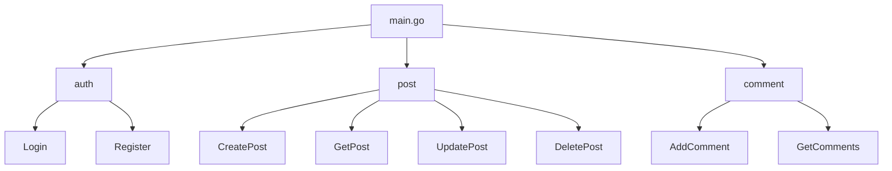

## 介绍

在开发Web应用程序时，随着项目规模的增大，代码的复杂性也会随之增加。为了保持代码的可维护性和可扩展性，模块化开发成为一种重要的实践。Gin是一个高性能的Go语言Web框架，支持模块化开发，允许开发者将应用程序分解为多个独立的模块，每个模块负责特定的功能。

本文将详细介绍如何在Gin中进行模块化开发，包括如何组织代码、定义路由、处理请求以及如何将模块组合成一个完整的应用程序。

## 模块化开发的优势

- **可维护性**：模块化开发使得代码更易于理解和维护，因为每个模块都有明确的职责。
- **可扩展性**：通过添加或替换模块，可以轻松扩展应用程序的功能。
- **代码复用**：模块可以在不同的项目或应用程序中复用，减少重复代码。
- **团队协作**：模块化开发使得团队成员可以并行开发不同的模块，提高开发效率。

## 模块化开发的基本步骤

### 1. 项目结构

首先，我们需要为项目定义一个清晰的结构。以下是一个典型的Gin模块化项目的目录结构：

```
myapp/
├── main.go
├── modules/
│   ├── auth/
│   │   ├── auth.go
│   │   ├── routes.go
│   ├── user/
│   │   ├── user.go
│   │   ├── routes.go
├── config/
│   ├── config.go
├── models/
│   ├── user.go
├── utils/
│   ├── utils.go
```

在这个结构中，`modules`目录包含了所有的模块，每个模块都有自己的路由和处理逻辑。`config`目录用于存放配置文件，`models`目录用于定义数据模型，`utils`目录用于存放工具函数。

### 2. 定义模块

每个模块通常包含两个主要文件：一个用于定义模块的逻辑（如`auth.go`），另一个用于定义模块的路由（如`routes.go`）。

以下是一个简单的`auth`模块示例：

```go
// modules/auth/auth.go
package auth

import (
    "github.com/gin-gonic/gin"
)

func Login(c *gin.Context) {
    // 处理登录逻辑
    c.JSON(200, gin.H{"message": "Login successful"})
}

func Register(c *gin.Context) {
    // 处理注册逻辑
    c.JSON(200, gin.H{"message": "Registration successful"})
}
```

```go
// modules/auth/routes.go
package auth

import (
    "github.com/gin-gonic/gin"
)

func SetupRoutes(router *gin.Engine) {
    authGroup := router.Group("/auth")
    {
        authGroup.POST("/login", Login)
        authGroup.POST("/register", Register)
    }
}
```

### 3. 组合模块

在`main.go`中，我们可以将各个模块的路由组合在一起，形成一个完整的应用程序。

```go
// main.go
package main

import (
    "github.com/gin-gonic/gin"
    "myapp/modules/auth"
    "myapp/modules/user"
)

func main() {
    router := gin.Default()

    // 设置各个模块的路由
    auth.SetupRoutes(router)
    user.SetupRoutes(router)

    // 启动服务器
    router.Run(":8080")
}
```

### 4. 处理请求

每个模块可以独立处理自己的请求。例如，`auth`模块处理登录和注册请求，而`user`模块处理用户信息的获取和更新。

```go
// modules/user/user.go
package user

import (
    "github.com/gin-gonic/gin"
)

func GetUser(c *gin.Context) {
    // 获取用户信息
    c.JSON(200, gin.H{"message": "User information"})
}

func UpdateUser(c *gin.Context) {
    // 更新用户信息
    c.JSON(200, gin.H{"message": "User updated"})
}
```

```go
// modules/user/routes.go
package user

import (
    "github.com/gin-gonic/gin"
)

func SetupRoutes(router *gin.Engine) {
    userGroup := router.Group("/user")
    {
        userGroup.GET("/info", GetUser)
        userGroup.PUT("/update", UpdateUser)
    }
}
```

## 实际案例

假设我们正在开发一个简单的博客系统，包含以下模块：

- **auth**：处理用户认证（登录、注册）
- **post**：处理博客文章的创建、读取、更新和删除
- **comment**：处理文章的评论

每个模块都有自己的路由和处理逻辑，最终组合成一个完整的博客系统。



## 总结

通过模块化开发，我们可以将复杂的应用程序分解为多个独立的模块，每个模块负责特定的功能。这不仅提高了代码的可维护性和可扩展性，还使得团队协作更加高效。Gin框架提供了强大的路由功能，使得模块化开发变得简单易行。

## 附加资源

- [Gin官方文档](https://gin-gonic.com/docs/)
- [Go语言模块化开发指南](https://golang.org/doc/modules)
- [Gin模块化开发示例项目](https://github.com/gin-gonic/examples)

## 练习

1. 尝试将上述博客系统的`post`模块和`comment`模块实现出来。
2. 创建一个新的模块`profile`，用于处理用户个人信息的获取和更新。
3. 将`auth`模块中的登录逻辑与数据库集成，实现真实的用户认证功能。
