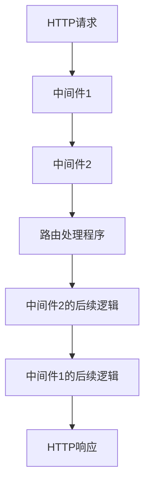

# Gin 中间件原理

Gin是一个用Go语言编写的高性能Web框架，以其简洁的API和强大的中间件支持而闻名。中间件是Gin框架中非常重要的概念，它允许开发者在请求处理流程中插入自定义逻辑。本文将详细介绍Gin中间件的原理，并通过实际案例帮助你理解如何在项目中使用中间件。

## 什么是中间件？

中间件是一种函数，它在HTTP请求到达路由处理程序之前或之后执行。中间件可以用于执行各种任务，例如日志记录、身份验证、错误处理等。在Gin中，中间件是一个`gin.HandlerFunc`类型的函数，它接收一个`*gin.Context`参数，并可以调用`c.Next()`将控制权传递给下一个中间件或路由处理程序。

## Gin 中间件的工作原理

Gin中间件的工作原理可以概括为以下几个步骤：

1. **注册中间件**：在Gin中，可以通过`Use`方法将中间件注册到路由或全局。
2. **中间件链**：当HTTP请求到达时，Gin会按照中间件注册的顺序依次调用它们。
3. **执行中间件**：每个中间件可以执行一些逻辑，然后调用`c.Next()`将控制权传递给下一个中间件或路由处理程序。
4. **响应处理**：在所有中间件和路由处理程序执行完毕后，Gin会将响应发送给客户端。

### 中间件链的流程图



## 代码示例

以下是一个简单的Gin中间件示例，它记录每个请求的处理时间：

```go
package main

import (
    "fmt"
    "time"

    "github.com/gin-gonic/gin"
)

func LoggerMiddleware() gin.HandlerFunc {
    return func(c *gin.Context) {
        start := time.Now()
        c.Next()
        duration := time.Since(start)
        fmt.Printf("Request %s took %v\n", c.Request.URL.Path, duration)
    }
}

func main() {
    r := gin.Default()
    r.Use(LoggerMiddleware())

    r.GET("/", func(c *gin.Context) {
        c.String(200, "Hello, World!")
    })

    r.Run()
}
```

### 输入和输出

当你访问`http://localhost:8080/`时，控制台会输出类似以下内容：

```
Request / took 123.456µs
```

## 实际应用场景

### 1. 身份验证中间件

在Web应用中，身份验证是一个常见的需求。你可以编写一个中间件来检查请求是否包含有效的身份验证令牌：

```go
func AuthMiddleware() gin.HandlerFunc {
    return func(c *gin.Context) {
        token := c.GetHeader("Authorization")
        if token != "valid-token" {
            c.AbortWithStatusJSON(401, gin.H{"error": "Unauthorized"})
            return
        }
        c.Next()
    }
}
```

### 2. 错误处理中间件

你可以编写一个中间件来捕获和处理请求处理过程中发生的错误：

```go
func ErrorMiddleware() gin.HandlerFunc {
    return func(c *gin.Context) {
        defer func() {
            if err := recover(); err != nil {
                c.JSON(500, gin.H{"error": "Internal Server Error"})
            }
        }()
        c.Next()
    }
}
```

## 总结

Gin中间件是处理HTTP请求和响应的强大工具。通过中间件，你可以在请求处理流程中插入自定义逻辑，从而实现日志记录、身份验证、错误处理等功能。本文介绍了Gin中间件的工作原理，并通过实际案例展示了如何在项目中使用中间件。

## 附加资源

- [Gin官方文档](https://gin-gonic.com/docs/)
- [Go语言官方文档](https://golang.org/doc/)

## 练习

1. 编写一个中间件，记录每个请求的IP地址。
2. 修改身份验证中间件，使其支持多种身份验证方式（例如JWT和API密钥）。
3. 创建一个错误处理中间件，将错误信息记录到日志文件中。

通过完成这些练习，你将更深入地理解Gin中间件的使用和原理。