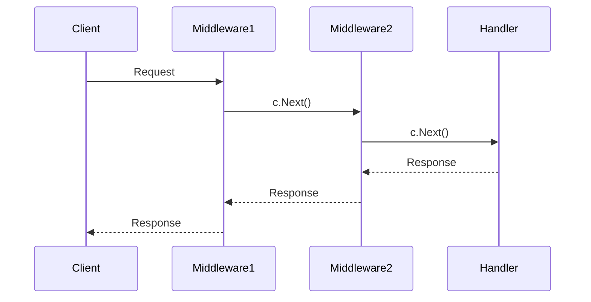

# Gin 中间件链通信

在Gin框架中，中间件是一种强大的工具，允许你在请求到达处理程序之前或之后执行某些操作。中间件链是指多个中间件按顺序执行的过程。理解中间件链的通信机制对于构建高效、可维护的Web应用程序至关重要。

## 什么是中间件链？

中间件链是由多个中间件组成的序列，每个中间件都可以对请求进行处理，并将处理结果传递给下一个中间件。最终，请求会到达处理程序（Handler），处理程序会生成响应并返回给客户端。

在Gin中，中间件链的执行顺序是按照中间件被添加的顺序进行的。每个中间件都可以选择是否继续执行链中的下一个中间件，或者直接终止请求的处理。

## 中间件链的基本结构

在Gin中，中间件是一个函数，它接收一个 `gin.Context` 对象作为参数。中间件可以通过调用 `c.Next()` 来继续执行链中的下一个中间件，或者通过调用 `c.Abort()` 来终止链的执行。

以下是一个简单的中间件链示例：

```go
package main

import (
    "github.com/gin-gonic/gin"
    "log"
)

func Middleware1(c *gin.Context) {
    log.Println("Middleware1: Before Next")
    c.Next()
    log.Println("Middleware1: After Next")
}

func Middleware2(c *gin.Context) {
    log.Println("Middleware2: Before Next")
    c.Next()
    log.Println("Middleware2: After Next")
}

func Handler(c *gin.Context) {
    log.Println("Handler: Processing Request")
    c.JSON(200, gin.H{"message": "Hello, World!"})
}

func main() {
    r := gin.Default()

    r.Use(Middleware1, Middleware2)

    r.GET("/", Handler)

    r.Run()
}
```

在这个示例中，`Middleware1` 和 `Middleware2` 是两个中间件，它们会在请求到达 `Handler` 之前执行。`c.Next()` 用于将控制权传递给下一个中间件或处理程序。

## 中间件链的执行顺序

中间件链的执行顺序是按照中间件被添加的顺序进行的。在上面的示例中，`Middleware1` 会先执行，然后是 `Middleware2`，最后是 `Handler`。



## 中间件链的通信

中间件链中的中间件可以通过 `gin.Context` 对象进行通信。`gin.Context` 是一个上下文对象，它包含了请求和响应的所有信息，并且可以在中间件之间共享数据。

以下是一个示例，展示了如何在中间件之间传递数据：

```go
package main

import (
    "github.com/gin-gonic/gin"
    "log"
)

func Middleware1(c *gin.Context) {
    log.Println("Middleware1: Setting Data")
    c.Set("key", "value")
    c.Next()
}

func Middleware2(c *gin.Context) {
    log.Println("Middleware2: Getting Data")
    value, exists := c.Get("key")
    if exists {
        log.Printf("Middleware2: Got Data: %s\n", value)
    }
    c.Next()
}

func Handler(c *gin.Context) {
    log.Println("Handler: Processing Request")
    c.JSON(200, gin.H{"message": "Hello, World!"})
}

func main() {
    r := gin.Default()

    r.Use(Middleware1, Middleware2)

    r.GET("/", Handler)

    r.Run()
}
```

在这个示例中，`Middleware1` 通过 `c.Set("key", "value")` 设置了一个值，`Middleware2` 通过 `c.Get("key")` 获取了这个值。这样，中间件之间就可以共享数据了。

## 实际应用场景

中间件链在实际应用中有很多用途，例如：

1. **身份验证**：在请求到达处理程序之前，验证用户的身份。
2. **日志记录**：记录每个请求的详细信息，用于调试和监控。
3. **错误处理**：捕获并处理请求过程中的错误。
4. **数据预处理**：对请求数据进行预处理，例如解析JSON或表单数据。

以下是一个实际应用场景的示例，展示了如何使用中间件链进行身份验证：

```go
package main

import (
    "github.com/gin-gonic/gin"
    "log"
    "net/http"
)

func AuthMiddleware(c *gin.Context) {
    token := c.GetHeader("Authorization")
    if token != "valid-token" {
        c.AbortWithStatusJSON(http.StatusUnauthorized, gin.H{"error": "Unauthorized"})
        return
    }
    c.Next()
}

func Handler(c *gin.Context) {
    c.JSON(200, gin.H{"message": "Authenticated"})
}

func main() {
    r := gin.Default()

    r.Use(AuthMiddleware)

    r.GET("/", Handler)

    r.Run()
}
```

在这个示例中，`AuthMiddleware` 会检查请求头中的 `Authorization` 字段，如果字段值不是 `"valid-token"`，则返回 `401 Unauthorized` 错误。否则，请求会继续传递给 `Handler`。

## 总结

Gin中间件链是一个强大的工具，允许你在请求处理过程中插入自定义逻辑。通过理解中间件链的执行顺序和通信机制，你可以构建出更加灵活和可维护的Web应用程序。

在实际应用中，中间件链可以用于身份验证、日志记录、错误处理等多种场景。通过合理地使用中间件链，你可以提高代码的复用性和可读性。

## 附加资源

- [Gin官方文档](https://gin-gonic.com/docs/)
- [Gin中间件示例](https://github.com/gin-gonic/gin#middleware)
- [Go语言官方文档](https://golang.org/doc/)

## 练习

1. 尝试创建一个新的中间件，用于记录每个请求的处理时间。
2. 修改上面的身份验证示例，使其支持多个不同的令牌。
3. 研究如何在中间件中处理错误，并将错误信息返回给客户端。
