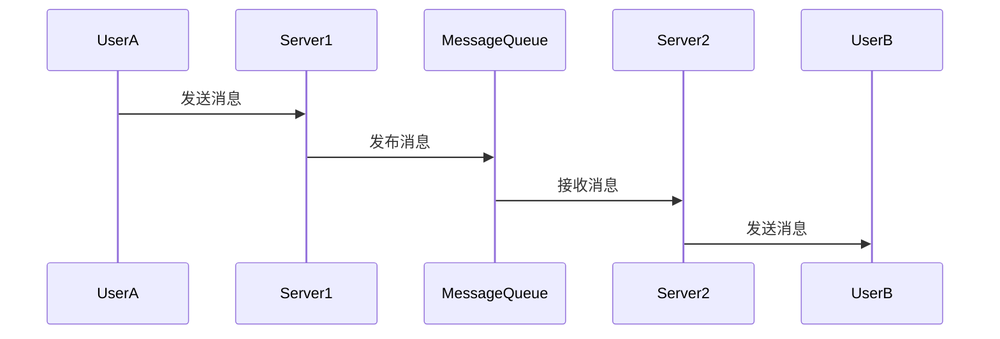

# Gin WebSocket集群支持

在现代Web应用中，WebSocket是实现实时通信的关键技术之一。然而，当应用需要扩展到多个服务器时，WebSocket的集群支持变得至关重要。本文将介绍如何在Gin框架中实现WebSocket集群支持，确保高可用性和可扩展性。

## 什么是WebSocket集群支持？

WebSocket集群支持是指在多个服务器之间共享WebSocket连接状态，使得客户端无论连接到哪个服务器，都能保持一致的通信状态。这对于需要高可用性和负载均衡的应用场景尤为重要。

## 为什么需要WebSocket集群支持？

在单服务器环境中，WebSocket连接状态存储在内存中。然而，当应用扩展到多个服务器时，每个服务器的内存状态是独立的，这会导致以下问题：

1. **状态不一致**：客户端连接到不同的服务器时，可能会看到不同的状态。
2. **连接丢失**：如果客户端连接的服务器宕机，连接将丢失，且无法恢复。

通过实现WebSocket集群支持，可以解决这些问题，确保应用的高可用性和一致性。

## 实现WebSocket集群支持的关键技术

实现WebSocket集群支持通常需要以下技术：

1. **消息队列**：用于在服务器之间传递消息。
2. **分布式缓存**：用于存储WebSocket连接状态。
3. **负载均衡器**：用于将客户端请求分发到不同的服务器。

## 在Gin中实现WebSocket集群支持

### 1. 使用Redis作为分布式缓存

Redis是一个高性能的键值存储系统，非常适合用于存储WebSocket连接状态。我们可以使用Redis来存储每个连接的会话信息。

```go
import (
    "github.com/gin-gonic/gin"
    "github.com/gorilla/websocket"
    "github.com/go-redis/redis/v8"
)

var upgrader = websocket.Upgrader{
    CheckOrigin: func(r *http.Request) bool {
        return true
    },
}

var rdb = redis.NewClient(&redis.Options{
    Addr:     "localhost:6379",
    Password: "", // no password set
    DB:       0,  // use default DB
})

func handleWebSocket(c *gin.Context) {
    conn, err := upgrader.Upgrade(c.Writer, c.Request, nil)
    if err != nil {
        log.Println("Upgrade error:", err)
        return
    }
    defer conn.Close()

    // 存储连接状态到Redis
    sessionID := c.Query("sessionID")
    rdb.Set(c, sessionID, conn.RemoteAddr().String(), 0)

    for {
        _, message, err := conn.ReadMessage()
        if err != nil {
            log.Println("Read error:", err)
            break
        }
        log.Printf("Received: %s", message)
    }
}
```

### 2. 使用消息队列传递消息

为了在服务器之间传递消息，我们可以使用消息队列（如RabbitMQ或Kafka）。以下是一个使用RabbitMQ的示例：

```go
import (
    "github.com/streadway/amqp"
)

func publishMessage(ch *amqp.Channel, queueName string, message string) {
    err := ch.Publish(
        "",        // exchange
        queueName, // routing key
        false,     // mandatory
        false,     // immediate
        amqp.Publishing{
            ContentType: "text/plain",
            Body:        []byte(message),
        })
    if err != nil {
        log.Fatalf("Failed to publish a message: %s", err)
    }
}

func consumeMessages(ch *amqp.Channel, queueName string) {
    msgs, err := ch.Consume(
        queueName, // queue
        "",        // consumer
        true,      // auto-ack
        false,     // exclusive
        false,     // no-local
        false,     // no-wait
        nil,       // args
    )
    if err != nil {
        log.Fatalf("Failed to register a consumer: %s", err)
    }

    for d := range msgs {
        log.Printf("Received a message: %s", d.Body)
    }
}
```

### 3. 使用负载均衡器分发请求

负载均衡器（如Nginx或HAProxy）可以将客户端请求分发到不同的服务器。以下是一个简单的Nginx配置示例：

```nginx
http {
    upstream websocket_cluster {
        server 127.0.0.1:8080;
        server 127.0.0.1:8081;
    }

    server {
        listen 80;

        location /ws {
            proxy_pass http://websocket_cluster;
            proxy_http_version 1.1;
            proxy_set_header Upgrade $http_upgrade;
            proxy_set_header Connection "Upgrade";
            proxy_set_header Host $host;
        }
    }
}
```

## 实际应用场景

假设我们正在开发一个实时聊天应用，用户可以在不同的设备上登录并发送消息。通过实现WebSocket集群支持，我们可以确保无论用户连接到哪个服务器，都能接收到所有消息。

### 示例：实时聊天应用

1. **用户A**连接到服务器1，发送一条消息。
2. 服务器1将消息发布到消息队列。
3. 服务器2从消息队列中接收到消息，并将其发送给连接到服务器2的**用户B**。



## 总结

通过实现WebSocket集群支持，我们可以确保应用在扩展到多个服务器时，仍然能够保持一致的通信状态和高可用性。本文介绍了如何使用Redis、消息队列和负载均衡器在Gin框架中实现WebSocket集群支持，并提供了一个实时聊天应用的实际案例。

## 附加资源与练习

- **练习1**：尝试在本地环境中搭建一个简单的WebSocket集群，并使用Redis存储连接状态。
- **练习2**：使用RabbitMQ或Kafka实现消息队列，并在多个服务器之间传递消息。
- **附加资源**：
  - [Redis官方文档](https://redis.io/documentation)
  - [RabbitMQ官方文档](https://www.rabbitmq.com/documentation.html)
  - [Nginx负载均衡配置指南](https://nginx.org/en/docs/http/load_balancing.html)

通过完成这些练习和阅读附加资源，你将更深入地理解WebSocket集群支持的实现原理和应用场景。