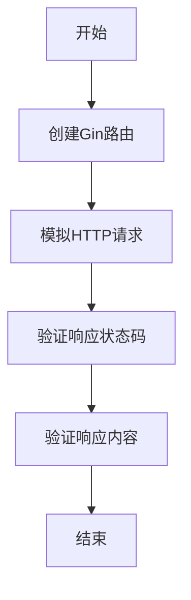

# Gin 测试工具集成

在开发Web应用程序时，测试是确保代码质量和功能正确性的关键步骤。Gin是一个高性能的Go语言Web框架，它提供了丰富的功能来简化Web开发。为了确保你的Gin应用程序能够稳定运行，集成测试工具是必不可少的。本文将介绍如何在Gin中集成测试工具，并编写单元测试和集成测试。

## 什么是Gin测试工具集成？

Gin测试工具集成是指在Gin框架中使用Go语言的标准测试工具（如`testing`包）或第三方测试库（如`httptest`）来编写和运行测试。这些测试工具可以帮助你验证路由、中间件、处理函数等组件的正确性，确保应用程序在各种情况下都能按预期工作。

## 为什么需要测试工具集成？

1. **提高代码质量**：通过编写测试，你可以发现并修复潜在的错误，确保代码的健壮性。
2. **简化调试过程**：测试可以帮助你快速定位问题，减少调试时间。
3. **支持持续集成**：自动化测试是持续集成（CI）流程的重要组成部分，确保每次代码变更都不会引入新的问题。

## 如何集成测试工具

### 1. 使用`httptest`进行HTTP测试

`httptest`是Go标准库中的一个包，专门用于测试HTTP处理程序。你可以使用它来模拟HTTP请求和响应，从而测试Gin的路由和处理函数。

#### 示例：测试一个简单的GET请求

```go
package main

import (
    "net/http"
    "net/http/httptest"
    "testing"

    "github.com/gin-gonic/gin"
    "github.com/stretchr/testify/assert"
)

func setupRouter() *gin.Engine {
    r := gin.Default()
    r.GET("/ping", func(c *gin.Context) {
        c.JSON(http.StatusOK, gin.H{
            "message": "pong",
        })
    })
    return r
}

func TestPingRoute(t *testing.T) {
    router := setupRouter()

    w := httptest.NewRecorder()
    req, _ := http.NewRequest("GET", "/ping", nil)
    router.ServeHTTP(w, req)

    assert.Equal(t, http.StatusOK, w.Code)
    assert.Equal(t, `{"message":"pong"}`, w.Body.String())
}
```

在这个示例中，我们创建了一个简单的Gin路由`/ping`，它返回一个JSON响应。然后，我们使用`httptest`模拟了一个GET请求，并验证了响应的状态码和内容。

### 2. 使用`testing`包进行单元测试

Go语言的`testing`包是编写单元测试的标准工具。你可以使用它来测试Gin应用程序中的各个组件，如中间件、处理函数等。

#### 示例：测试一个中间件

```go
package main

import (
    "net/http"
    "net/http/httptest"
    "testing"

    "github.com/gin-gonic/gin"
    "github.com/stretchr/testify/assert"
)

func authMiddleware() gin.HandlerFunc {
    return func(c *gin.Context) {
        token := c.GetHeader("Authorization")
        if token != "valid-token" {
            c.AbortWithStatusJSON(http.StatusUnauthorized, gin.H{"error": "unauthorized"})
            return
        }
        c.Next()
    }
}

func TestAuthMiddleware(t *testing.T) {
    router := gin.New()
    router.Use(authMiddleware())
    router.GET("/protected", func(c *gin.Context) {
        c.JSON(http.StatusOK, gin.H{"message": "protected"})
    })

    // 测试未授权的情况
    w := httptest.NewRecorder()
    req, _ := http.NewRequest("GET", "/protected", nil)
    router.ServeHTTP(w, req)
    assert.Equal(t, http.StatusUnauthorized, w.Code)

    // 测试授权的情况
    w = httptest.NewRecorder()
    req, _ = http.NewRequest("GET", "/protected", nil)
    req.Header.Set("Authorization", "valid-token")
    router.ServeHTTP(w, req)
    assert.Equal(t, http.StatusOK, w.Code)
}
```

在这个示例中，我们测试了一个简单的授权中间件。我们模拟了两种请求：一种是没有提供有效令牌的请求，另一种是提供了有效令牌的请求。通过这种方式，我们可以验证中间件的正确性。

### 3. 使用`mermaid`绘制测试流程图

为了更好地理解测试流程，我们可以使用`mermaid`绘制一个简单的流程图。



这个流程图展示了测试Gin路由的基本步骤。

## 实际应用场景

假设你正在开发一个用户管理系统，你需要确保用户注册、登录和注销功能都能正常工作。通过集成测试工具，你可以编写测试用例来验证这些功能。

### 示例：测试用户注册功能

```go
func TestUserRegistration(t *testing.T) {
    router := setupRouter()

    w := httptest.NewRecorder()
    reqBody := `{"username": "testuser", "password": "testpass"}`
    req, _ := http.NewRequest("POST", "/register", strings.NewReader(reqBody))
    req.Header.Set("Content-Type", "application/json")
    router.ServeHTTP(w, req)

    assert.Equal(t, http.StatusCreated, w.Code)
    assert.Equal(t, `{"message":"user created"}`, w.Body.String())
}
```

在这个示例中，我们测试了用户注册功能。我们模拟了一个POST请求，并验证了响应的状态码和内容。

## 总结

通过集成测试工具，你可以确保Gin应用程序的各个组件都能按预期工作。无论是单元测试还是集成测试，测试工具都能帮助你提高代码质量，简化调试过程，并支持持续集成。

## 附加资源

- [Go Testing Package Documentation](https://golang.org/pkg/testing/)
- [Gin Framework Documentation](https://gin-gonic.com/docs/)
- [httptest Package Documentation](https://golang.org/pkg/net/http/httptest/)

## 练习

1. 编写一个测试用例，验证Gin路由的POST请求处理函数。
2. 使用`httptest`测试一个带有查询参数的GET请求。
3. 为你的Gin应用程序编写一个中间件，并为其编写测试用例。

通过完成这些练习，你将更深入地理解Gin测试工具集成的概念，并能够将其应用到实际项目中。