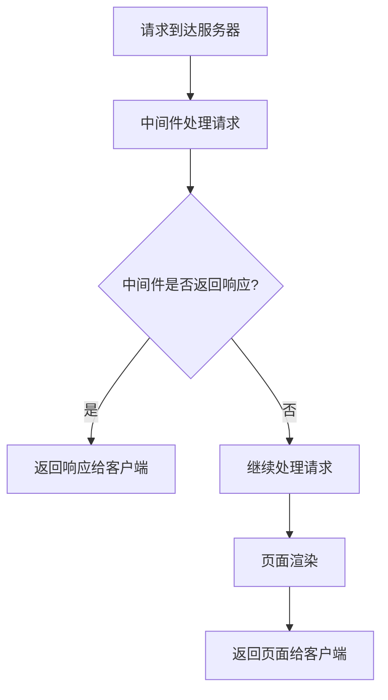

## 介绍

Next.js 中间件是一种强大的工具，允许你在请求到达页面之前或响应发送给客户端之前执行代码。中间件可以用于多种场景，例如身份验证、日志记录、重定向、修改请求或响应头等。通过中间件，你可以在不修改页面代码的情况下，灵活地处理请求和响应。

在 Next.js 中，中间件是运行在 Edge Runtime 上的函数，这意味着它们可以在靠近用户的地理位置运行，从而提供更快的响应时间。

## 中间件的基本结构

Next.js 中间件是一个导出为 `middleware` 的函数，它接收 `request` 和 `response` 对象，并可以对这些对象进行操作。以下是一个简单的中间件示例：

```javascript
import { NextResponse } from 'next/server';

export function middleware(request) {
  // 在这里处理请求
  if (request.nextUrl.pathname === '/dashboard') {
    return NextResponse.redirect(new URL('/login', request.url));
  }

  // 继续处理请求
  return NextResponse.next();
}
```

在这个示例中，如果用户尝试访问 `/dashboard` 页面，中间件会将他们重定向到 `/login` 页面。

## 中间件的执行顺序

中间件在请求到达页面之前执行，因此它们可以拦截请求并决定是否继续处理请求或返回响应。以下是一个简单的流程图，展示了中间件的执行顺序：



## 实际应用场景

### 1. 身份验证

中间件非常适合用于身份验证。例如，你可以创建一个中间件来检查用户是否已登录，如果未登录，则重定向到登录页面。

```javascript
import { NextResponse } from 'next/server';

export function middleware(request) {
  const token = request.cookies.get('authToken');

  if (!token && request.nextUrl.pathname.startsWith('/dashboard')) {
    return NextResponse.redirect(new URL('/login', request.url));
  }

  return NextResponse.next();
}
```

### 2. 日志记录

中间件还可以用于记录请求的详细信息，例如请求的路径、方法、IP 地址等。

```javascript
import { NextResponse } from 'next/server';

export function middleware(request) {
  console.log(`Request URL: ${request.nextUrl.pathname}`);
  console.log(`Request Method: ${request.method}`);
  console.log(`IP Address: ${request.ip}`);

  return NextResponse.next();
}
```

### 3. 修改请求头

你可以使用中间件来修改请求头或响应头。例如，你可以为所有请求添加一个自定义的 `X-Custom-Header`。

```javascript
import { NextResponse } from 'next/server';

export function middleware(request) {
  const response = NextResponse.next();
  response.headers.set('X-Custom-Header', 'Hello from middleware!');
  return response;
}
```

## 总结

Next.js 中间件是一个强大的工具，允许你在请求到达页面之前或响应发送给客户端之前执行代码。通过中间件，你可以实现身份验证、日志记录、重定向、修改请求或响应头等功能。中间件在 Edge Runtime 上运行，因此它们可以提供更快的响应时间。

## 附加资源

- [Next.js 官方文档 - 中间件](https://nextjs.org/docs/middleware)
- [Next.js 中间件示例](https://github.com/vercel/next.js/tree/canary/examples/middleware)

## 练习

1. 创建一个中间件，将所有 `/admin` 路径的请求重定向到 `/login` 页面。
2. 修改中间件，使其记录所有请求的路径和方法，并将日志输出到控制台。
3. 尝试使用中间件为所有响应添加一个自定义的响应头。

通过完成这些练习，你将更好地理解 Next.js 中间件的工作原理，并能够在实际项目中应用它们。