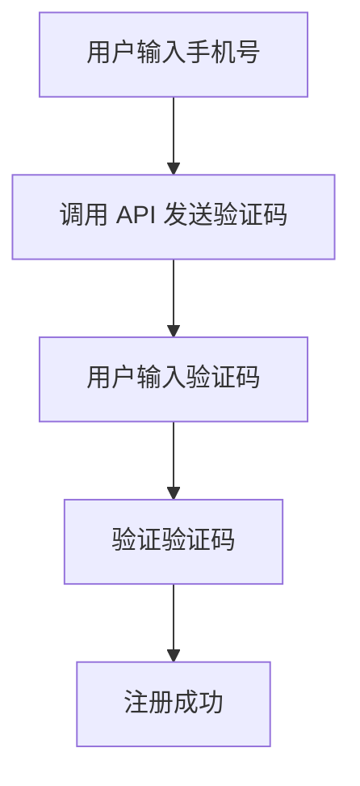

# Next.js 短信服务集成

在现代 Web 应用中，短信服务（SMS）是一个常见的功能，用于用户验证、通知发送等场景。Next.js 作为一个全栈框架，提供了强大的 API 路由功能，使得与第三方短信服务的集成变得非常简单。本文将带你从零开始，学习如何在 Next.js 中集成短信服务。

## 什么是短信服务集成？

短信服务集成是指将第三方短信服务（如 Twilio、Nexmo 等）与你的应用连接起来，以便通过代码发送短信。常见的应用场景包括：

- **用户验证**：发送验证码以验证用户手机号。
- **通知提醒**：向用户发送订单状态更新、活动提醒等。
- **营销推广**：发送促销信息或优惠券。

在 Next.js 中，你可以通过 API 路由（API Routes）轻松实现这些功能。

---

## 准备工作

在开始之前，你需要：

1. 一个 Next.js 项目（如果没有，可以通过 `npx create-next-app` 创建）。
2. 一个短信服务提供商的账号（本文以 [Twilio](https://www.twilio.com/) 为例）。
3. 安装 Twilio 的 Node.js SDK：`npm install twilio`。

:::note
Twilio 是一个流行的短信服务提供商，提供免费试用额度，适合学习和测试。
:::

---

## 第一步：配置 Twilio

首先，登录 Twilio 并获取以下信息：

- **Account SID**：你的 Twilio 账户的唯一标识符。
- **Auth Token**：用于验证 API 请求的令牌。
- **Twilio Phone Number**：用于发送短信的电话号码。

将这些信息保存在 `.env.local` 文件中：

```bash
TWILIO_ACCOUNT_SID=your_account_sid
TWILIO_AUTH_TOKEN=your_auth_token
TWILIO_PHONE_NUMBER=your_twilio_phone_number
```

:::caution
不要将敏感信息（如 `Account SID` 和 `Auth Token`）提交到版本控制系统中。确保 `.env.local` 文件已添加到 `.gitignore` 中。
:::

---

## 第二步：创建 API 路由

在 Next.js 中，API 路由位于 `pages/api` 目录下。我们将创建一个新的路由来处理短信发送请求。

1. 在 `pages/api` 目录下创建一个新文件 `send-sms.js`。
2. 添加以下代码：

```javascript
import twilio from 'twilio';

export default async function handler(req, res) {
  if (req.method !== 'POST') {
    return res.status(405).json({ message: 'Method Not Allowed' });
  }

  const { to, message } = req.body;

  if (!to || !message) {
    return res.status(400).json({ message: 'Missing required fields' });
  }

  const client = twilio(process.env.TWILIO_ACCOUNT_SID, process.env.TWILIO_AUTH_TOKEN);

  try {
    const result = await client.messages.create({
      body: message,
      from: process.env.TWILIO_PHONE_NUMBER,
      to: to,
    });

    res.status(200).json({ success: true, message: 'SMS sent successfully', sid: result.sid });
  } catch (error) {
    console.error('Error sending SMS:', error);
    res.status(500).json({ success: false, message: 'Failed to send SMS' });
  }
}
```

### 代码解析

- 我们使用 `twilio` SDK 创建一个客户端实例。
- 通过 `client.messages.create` 方法发送短信。
- 如果请求成功，返回短信的唯一标识符 `sid`；如果失败，返回错误信息。

---

## 第三步：测试 API 路由

你可以使用 Postman 或直接在浏览器中测试 API 路由。

1. 启动 Next.js 开发服务器：`npm run dev`。
2. 发送一个 POST 请求到 `http://localhost:3000/api/send-sms`，请求体如下：

```json
{
  "to": "+1234567890", // 目标手机号
  "message": "Hello from Next.js!" // 短信内容
}
```

3. 如果一切正常，你会收到类似以下的响应：

```json
{
  "success": true,
  "message": "SMS sent successfully",
  "sid": "SMXXXXXXXXXXXXXXXXXXXXXXXXXXXXXXXX"
}
```

---

## 实际应用场景

### 用户手机号验证

在用户注册时，你可以通过短信发送验证码，并要求用户输入验证码以完成验证。以下是一个简单的流程：



### 订单状态通知

在电商应用中，当用户下单后，你可以通过短信通知用户订单状态的变化，例如：

- 订单已确认
- 订单已发货
- 订单已送达

---

## 总结

通过本文，你学习了如何在 Next.js 中集成短信服务，并使用 Twilio 发送短信。我们创建了一个 API 路由来处理短信发送请求，并展示了实际应用场景。短信服务集成是一个强大的功能，可以为你的应用增加更多实用性和用户体验。

---

## 附加资源与练习

- **练习**：尝试扩展 API 路由，使其支持批量发送短信。
- **资源**：
  - [Twilio 官方文档](https://www.twilio.com/docs)
  - [Next.js API 路由文档](https://nextjs.org/docs/api-routes/introduction)

:::tip
如果你对短信服务集成有任何疑问，欢迎在评论区留言，我们会尽快回复！
:::