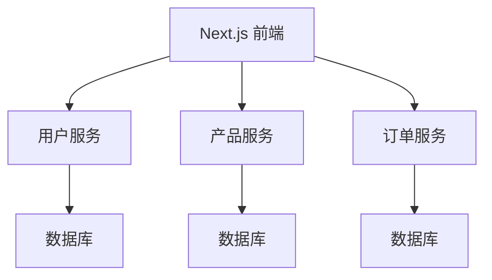

## 介绍

在现代 Web 开发中，微服务架构已成为一种流行的设计模式。它将应用程序拆分为多个小型、独立的服务，每个服务负责特定的功能。Next.js 作为一个全栈框架，不仅支持前端开发，还可以与后端服务无缝集成。通过将 Next.js 与微服务架构结合，您可以构建高性能、可扩展且易于维护的应用程序。

本文将逐步介绍如何在 Next.js 中实现微服务架构，并通过实际案例展示其应用场景。

---

## 什么是微服务架构？

微服务架构是一种将应用程序拆分为多个小型、独立服务的架构风格。每个服务都运行在自己的进程中，并通过轻量级的通信机制（如 HTTP 或消息队列）与其他服务交互。这种架构的主要优点包括：

- **可扩展性**：每个服务可以独立扩展。
- **灵活性**：不同的服务可以使用不同的技术栈。
- **容错性**：一个服务的故障不会影响整个系统。

在 Next.js 中，您可以通过 API 路由与后端微服务进行通信，从而实现前后端解耦。

---

## Next.js 中的微服务架构实现

### 1. 创建 Next.js API 路由

Next.js 提供了内置的 API 路由功能，允许您在 `pages/api` 目录下创建后端端点。这些端点可以直接与微服务通信。

例如，创建一个简单的 API 路由来获取用户信息：

```javascript
// pages/api/user.js
export default async function handler(req, res) {
  const { userId } = req.query;

  // 调用用户微服务
  const response = await fetch(`http://user-service/api/users/${userId}`);
  const user = await response.json();

  res.status(200).json(user);
}
```

### 2. 与微服务通信

在上面的示例中，我们通过 `fetch` 函数与用户微服务通信。您可以根据需要替换为其他 HTTP 客户端（如 `axios`）或使用消息队列（如 RabbitMQ）。

:::tip
确保在微服务之间使用 HTTPS 或其他安全协议来保护数据传输。
:::

### 3. 前端调用 API 路由

在 Next.js 前端页面中，您可以使用 `fetch` 或 `axios` 调用 API 路由：

```javascript
// pages/index.js
import { useEffect, useState } from 'react';

export default function Home() {
  const [user, setUser] = useState(null);

  useEffect(() => {
    async function fetchUser() {
      const response = await fetch('/api/user?userId=123');
      const data = await response.json();
      setUser(data);
    }

    fetchUser();
  }, []);

  return (
    <div>
      {user ? <p>Welcome, {user.name}!</p> : <p>Loading...</p>}
    </div>
  );
}
```

---

## 实际案例：电商平台的微服务架构

假设我们正在构建一个电商平台，以下是其微服务架构的示例：



- **用户服务**：负责用户注册、登录和个人信息管理。
- **产品服务**：负责产品目录和库存管理。
- **订单服务**：负责订单创建和支付处理。

每个服务都可以独立部署和扩展，Next.js 前端通过 API 路由与这些服务通信。

---

## 总结

通过将 Next.js 与微服务架构结合，您可以构建灵活、可扩展且易于维护的 Web 应用程序。本文介绍了如何在 Next.js 中实现微服务架构，并通过实际案例展示了其应用场景。

:::note
微服务架构虽然强大，但也增加了系统的复杂性。在小型项目中，单体架构可能更为合适。
:::

---

## 附加资源与练习

### 资源
- [Next.js 官方文档](https://nextjs.org/docs)
- [微服务架构指南](https://microservices.io/)

### 练习
1. 尝试在本地创建一个简单的 Next.js 项目，并实现一个与微服务通信的 API 路由。
2. 扩展电商平台案例，添加一个新的微服务（如评论服务），并在前端集成。

Happy coding! 🚀