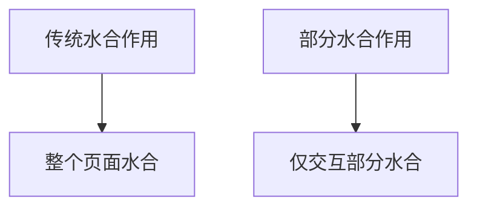

## 介绍

Next.js Islands 架构是一种创新的前端架构模式，旨在通过部分水合作用（Partial Hydration）优化页面性能。传统的单页应用（SPA）通常会对整个页面进行水合作用，这可能会导致性能瓶颈，尤其是在页面内容较多时。Islands 架构通过将页面分解为多个独立的“岛屿”（Islands），每个岛屿可以独立进行水合作用，从而显著提升页面加载速度和交互性能。

## 什么是 Islands 架构？

Islands 架构的核心思想是将页面划分为多个独立的交互区域（即“岛屿”），每个岛屿可以独立进行水合作用。这意味着只有那些需要交互的部分才会被水合，而其他静态内容则保持原样。这种方式不仅减少了 JavaScript 的加载和执行时间，还降低了内存占用，从而提升了整体性能。

### 传统水合作用 vs 部分水合作用

在传统的水合作用中，整个页面的 JavaScript 都会被加载和执行，即使某些部分并不需要交互。而部分水合作用则只对需要交互的部分进行水合，从而减少了不必要的开销。



## 如何在 Next.js 中实现 Islands 架构

Next.js 通过其内置的 React Server Components 和 Client Components 支持 Islands 架构。以下是一个简单的示例，展示如何在 Next.js 中实现部分水合作用。

### 示例：创建一个带有 Islands 架构的页面

假设我们有一个页面，其中包含一个静态的标题和一个动态的计数器。我们可以将计数器部分作为一个独立的岛屿进行水合。

```jsx
// pages/index.js
import dynamic from 'next/dynamic';

// 静态标题组件
function StaticTitle() {
  return <h1>Welcome to My Website</h1>;
}

// 动态计数器组件
const DynamicCounter = dynamic(() => import('../components/Counter'), {
  ssr: false, // 禁用服务器端渲染，仅在客户端进行水合
});

export default function Home() {
  return (
    <div>
      <StaticTitle />
      <DynamicCounter />
    </div>
  );
}
```

```jsx
// components/Counter.js
import { useState } from 'react';

export default function Counter() {
  const [count, setCount] = useState(0);

  return (
    <div>
      <p>Count: {count}</p>
      <button onClick={() => setCount(count + 1)}>Increment</button>
    </div>
  );
}
```

在这个示例中，`StaticTitle` 组件是静态的，不会进行水合作用，而 `DynamicCounter` 组件则作为一个独立的岛屿，仅在客户端进行水合。

## 实际应用场景

Islands 架构特别适用于以下场景：

1. **内容丰富的页面**：如博客、新闻网站等，其中大部分内容是静态的，只有少数部分需要交互。
2. **电商网站**：商品列表可以是静态的，而购物车和搜索功能可以作为独立的岛屿进行水合。
3. **仪表盘**：仪表盘中的图表和控件可以作为独立的岛屿，提升页面加载速度。

## 总结

Next.js Islands 架构通过部分水合作用优化了页面性能，特别适用于内容丰富的页面和需要高度交互的应用。通过将页面划分为多个独立的岛屿，每个岛屿可以独立进行水合，从而减少了不必要的 JavaScript 加载和执行时间。

## 附加资源与练习

- **官方文档**：[Next.js 官方文档](https://nextjs.org/docs) 提供了更多关于 React Server Components 和 Client Components 的详细信息。
- **练习**：尝试在一个现有的 Next.js 项目中实现 Islands 架构，观察页面性能的提升。

:::tip
在实现 Islands 架构时，务必仔细分析页面的交互需求，确保只有必要的部分进行水合作用，以达到最佳性能优化效果。
:::