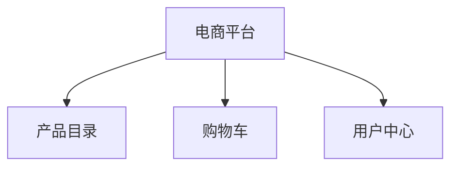

## 介绍

微前端（Micro Frontends）是一种将前端应用程序拆分为多个独立模块的架构模式。每个模块可以独立开发、测试和部署，最终组合成一个完整的应用程序。Next.js 作为一个强大的 React 框架，支持微前端的实现，使得团队可以更高效地协作开发大型应用。

在本教程中，我们将探讨如何在 Next.js 中实现微前端架构，并通过实际案例展示其应用场景。

## 微前端的核心概念

微前端的核心思想是将前端应用拆分为多个独立的子应用，每个子应用可以独立开发、测试和部署。这些子应用可以通过某种方式组合在一起，形成一个完整的应用。

### 主要优点
- **独立开发**：每个团队可以独立开发和部署自己的子应用。
- **技术栈无关**：不同的子应用可以使用不同的技术栈。
- **增量升级**：可以逐步升级应用的不同部分，而不需要一次性重写整个应用。

## 在 Next.js 中实现微前端

### 1. 使用 Module Federation

Module Federation 是 Webpack 5 引入的一个功能，允许在运行时动态加载远程模块。我们可以利用这个功能在 Next.js 中实现微前端。

首先，确保你的项目使用的是 Webpack 5。然后，安装 `@module-federation/nextjs-mf` 插件：

```bash
npm install @module-federation/nextjs-mf
```

### 2. 配置 Module Federation

在你的 Next.js 项目中，创建一个 `next.config.js` 文件，并添加以下配置：

```javascript
const { withModuleFederation } = require('@module-federation/nextjs-mf');

module.exports = withModuleFederation({
  name: 'host',
  remotes: {
    remoteApp: 'remoteApp@http://localhost:3001/remoteEntry.js',
  },
  shared: {
    react: { singleton: true, eager: true },
    'react-dom': { singleton: true, eager: true },
  },
});
```

在这个配置中，`remoteApp` 是远程应用的名称，`http://localhost:3001/remoteEntry.js` 是远程应用的入口文件。

### 3. 创建远程应用

在另一个 Next.js 项目中，创建一个远程应用。同样，配置 `next.config.js` 文件：

```javascript
const { withModuleFederation } = require('@module-federation/nextjs-mf');

module.exports = withModuleFederation({
  name: 'remoteApp',
  filename: 'remoteEntry.js',
  exposes: {
    './Button': './components/Button',
  },
  shared: {
    react: { singleton: true, eager: true },
    'react-dom': { singleton: true, eager: true },
  },
});
```

在这个配置中，`exposes` 指定了远程应用暴露的模块。

### 4. 在主机应用中加载远程模块

在主机应用中，你可以动态加载远程模块：

```javascript
import dynamic from 'next/dynamic';

const RemoteButton = dynamic(() => import('remoteApp/Button'), { ssr: false });

export default function Home() {
  return (
    <div>
      <h1>Welcome to the Host App</h1>
      <RemoteButton />
    </div>
  );
}
```

在这个例子中，`RemoteButton` 是从远程应用加载的按钮组件。

## 实际案例

假设我们有一个电商平台，包含以下子应用：
- **产品目录**：展示产品列表。
- **购物车**：管理用户的购物车。
- **用户中心**：管理用户信息。

每个子应用都可以独立开发和部署，最终通过微前端架构组合在一起。



## 总结

通过微前端架构，我们可以将大型前端应用拆分为多个独立的子应用，每个子应用可以独立开发、测试和部署。Next.js 结合 Module Federation 提供了一种简单而强大的方式来实现微前端。

## 附加资源

- [Webpack Module Federation 官方文档](https://webpack.js.org/concepts/module-federation/)
- [Next.js 官方文档](https://nextjs.org/docs)
- [微前端架构实战](https://micro-frontends.org/)

## 练习

1. 尝试在本地创建两个 Next.js 项目，分别作为主机应用和远程应用，并实现模块的动态加载。
2. 探索如何在微前端架构中处理共享状态（如用户登录状态）。
3. 研究如何在生产环境中部署微前端应用。

:::tip
在实际项目中，微前端的实现可能会涉及到更多的细节，如路由管理、状态共享、性能优化等。建议在实际应用中逐步探索这些高级主题。
:::