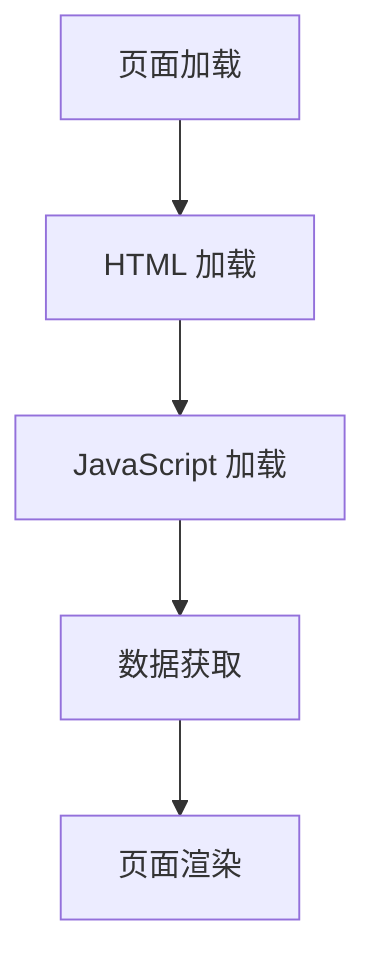

# Next.js 浏览器扩展

Next.js 是一个功能强大的 React 框架，提供了许多工具和扩展来帮助开发者更高效地构建现代 Web 应用。其中，**Next.js 浏览器扩展**是一个非常有用的工具，它可以帮助开发者在浏览器中调试和优化 Next.js 应用。本文将详细介绍 Next.js 浏览器扩展的功能、使用方法以及实际应用场景。

## 什么是 Next.js 浏览器扩展？

Next.js 浏览器扩展是一个专门为 Next.js 开发者设计的浏览器插件，通常与 Chrome 或 Firefox 等主流浏览器兼容。它提供了许多有用的功能，例如：

- **实时查看页面性能**：帮助开发者分析页面的加载时间和性能瓶颈。
- **调试路由**：查看当前页面的路由信息，包括动态路由和静态路由。
- **检查 API 请求**：监控 Next.js 应用中的 API 请求，帮助开发者快速定位问题。
- **查看页面状态**：实时查看页面的状态（如 `getStaticProps` 或 `getServerSideProps` 返回的数据）。

这些功能使得 Next.js 浏览器扩展成为开发者在调试和优化应用时的得力助手。

## 如何安装 Next.js 浏览器扩展

要使用 Next.js 浏览器扩展，首先需要在浏览器中安装它。以下是安装步骤：

1. 打开 Chrome 或 Firefox 的扩展商店。
2. 搜索 "Next.js DevTools" 或 "Next.js 浏览器扩展"。
3. 点击 "添加到浏览器" 按钮进行安装。

安装完成后，你可以在浏览器的扩展栏中看到 Next.js 扩展的图标。点击图标即可打开扩展面板。

## 使用 Next.js 浏览器扩展

### 1. 查看页面性能

Next.js 浏览器扩展提供了一个性能面板，可以实时查看页面的加载时间和资源使用情况。这对于优化页面性能非常有帮助。



:::note
**注意**：性能面板中的数据可以帮助你识别哪些资源加载时间过长，从而进行针对性优化。
:::

### 2. 调试路由

Next.js 的路由系统非常强大，支持动态路由和静态路由。通过 Next.js 浏览器扩展，你可以轻松查看当前页面的路由信息。

```javascript
// pages/[id].js
export async function getStaticPaths() {
    return {
        paths: [{ params: { id: '1' } }, { params: { id: '2' } }],
        fallback: false,
    };
}

export async function getStaticProps({ params }) {
    return {
        props: {
            id: params.id,
        },
    };
}
```

在扩展中，你可以看到当前页面的路由参数（如 `id`），并检查 `getStaticProps` 返回的数据。

### 3. 检查 API 请求

Next.js 浏览器扩展还可以监控应用中的 API 请求。这对于调试 API 调用和检查请求/响应数据非常有用。

```javascript
// pages/api/hello.js
export default function handler(req, res) {
    res.status(200).json({ message: 'Hello, world!' });
}
```

在扩展中，你可以看到 `/api/hello` 的请求状态、响应数据以及请求时间。

### 4. 查看页面状态

Next.js 浏览器扩展允许你实时查看页面的状态，包括 `getStaticProps` 或 `getServerSideProps` 返回的数据。

```javascript
// pages/index.js
export async function getStaticProps() {
    return {
        props: {
            message: 'Hello, Next.js!',
        },
    };
}
```

在扩展中，你可以看到 `message` 的值，并检查它是否正确传递到页面组件中。

## 实际应用场景

### 1. 性能优化

假设你正在开发一个电商网站，发现某个页面的加载速度较慢。通过 Next.js 浏览器扩展的性能面板，你可以识别出是哪个资源加载时间过长，并采取相应的优化措施，例如使用 `next/image` 优化图片加载。

### 2. 调试动态路由

在一个博客应用中，你可能使用了动态路由来显示不同的文章。通过 Next.js 浏览器扩展，你可以轻松查看当前页面的路由参数，并检查 `getStaticProps` 返回的数据是否正确。

### 3. 监控 API 请求

在一个需要频繁调用 API 的应用中，你可以使用 Next.js 浏览器扩展来监控 API 请求的状态和响应数据，确保 API 调用正常工作。

## 总结

Next.js 浏览器扩展是一个强大的工具，可以帮助开发者更高效地调试和优化 Next.js 应用。通过实时查看页面性能、调试路由、检查 API 请求和查看页面状态，开发者可以快速定位问题并提升应用性能。

## 附加资源

- [Next.js 官方文档](https://nextjs.org/docs)
- [Next.js 浏览器扩展 GitHub 仓库](https://github.com/vercel/next.js/tree/canary/packages/next-devtools)

## 练习

1. 安装 Next.js 浏览器扩展，并尝试查看一个页面的性能数据。
2. 创建一个动态路由页面，并使用扩展检查路由参数和 `getStaticProps` 返回的数据。
3. 编写一个简单的 API 路由，并使用扩展监控 API 请求的状态和响应数据。
