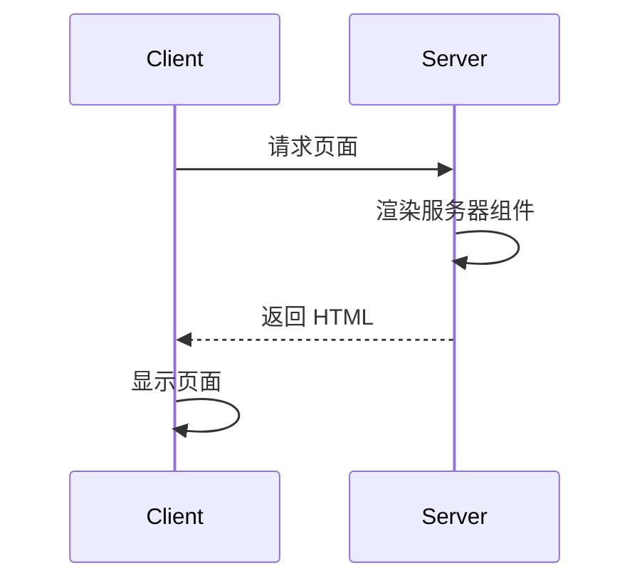

## 介绍

Next.js 是一个流行的 React 框架，提供了多种渲染策略来优化应用程序的性能和用户体验。其中，**服务器组件**是 Next.js 13 引入的一项新特性，旨在进一步简化服务器端渲染（SSR）和静态生成（SSG）的开发流程。

服务器组件允许开发者在服务器上运行 React 组件，从而减少客户端 JavaScript 的加载量，提升页面加载速度。与传统的客户端组件不同，服务器组件在服务器端渲染，并将结果直接发送到客户端，减少了客户端的计算负担。

## 什么是服务器组件？

服务器组件是 React 组件的一种特殊类型，它们在服务器端运行，而不是在客户端。这意味着：

- **数据获取**：服务器组件可以直接访问数据库或 API，无需通过客户端发送请求。
- **性能优化**：由于组件在服务器端渲染，客户端只需接收 HTML 和 CSS，减少了 JavaScript 的加载和执行时间。
- **安全性**：敏感逻辑和数据可以在服务器端处理，避免暴露给客户端。

## 服务器组件的工作原理

服务器组件的核心思想是将组件的渲染逻辑从客户端转移到服务器端。以下是其工作原理的简要说明：

1. **请求到达服务器**：当用户访问一个页面时，请求首先到达 Next.js 服务器。
2. **服务器渲染组件**：服务器根据请求的 URL 找到对应的服务器组件，并执行其渲染逻辑。
3. **生成 HTML**：服务器将渲染结果生成为 HTML，并发送给客户端。
4. **客户端显示**：客户端接收到 HTML 后，直接显示页面内容，无需额外的 JavaScript 执行。



## 如何使用服务器组件

在 Next.js 中，服务器组件的使用非常简单。你只需在组件文件的顶部添加 `'use server'` 指令，即可将其标记为服务器组件。

### 示例：简单的服务器组件

以下是一个简单的服务器组件示例，它从服务器端获取数据并渲染到页面上：

```jsx
// app/page.server.js
'use server';

export default function Page() {
  const data = await fetchDataFromAPI();
  return (
    <div>
      <h1>服务器组件示例</h1>
      <p>数据: {data}</p>
    </div>
  );
}

async function fetchDataFromAPI() {
  // 模拟从 API 获取数据
  return '这是从服务器获取的数据';
}
```

在这个示例中，`Page` 组件被标记为服务器组件，因此它会在服务器端渲染。`fetchDataFromAPI` 函数模拟了从 API 获取数据的过程，数据会在服务器端获取并直接嵌入到 HTML 中。

### 客户端与服务器组件的结合

服务器组件可以与客户端组件结合使用，以实现更复杂的交互逻辑。例如，你可以在服务器组件中渲染静态内容，而在客户端组件中处理用户交互。

```jsx
// app/page.server.js
'use server';

export default function Page() {
  const data = await fetchDataFromAPI();
  return (
    <div>
      <h1>服务器组件示例</h1>
      <p>数据: {data}</p>
      <ClientComponent />
    </div>
  );
}

// app/components/ClientComponent.js
'use client';

export default function ClientComponent() {
  const [count, setCount] = useState(0);

  return (
    <button onClick={() => setCount(count + 1)}>
      点击次数: {count}
    </button>
  );
}
```

在这个示例中，`Page` 组件是服务器组件，负责渲染静态内容，而 `ClientComponent` 是客户端组件，负责处理用户交互。

## 实际应用场景

服务器组件在以下场景中特别有用：

1. **数据密集型页面**：对于需要从数据库或 API 获取大量数据的页面，服务器组件可以减少客户端的负担，提升页面加载速度。
2. **静态内容生成**：对于不经常变化的内容，服务器组件可以在构建时生成静态 HTML，进一步提升性能。
3. **安全性要求高的页面**：对于需要处理敏感数据的页面，服务器组件可以确保数据在服务器端处理，避免暴露给客户端。

## 总结

Next.js 服务器组件是一项强大的特性，能够显著提升应用程序的性能和安全性。通过在服务器端渲染组件，开发者可以减少客户端的 JavaScript 加载量，优化页面加载速度，并确保敏感数据的安全性。

对于初学者来说，理解服务器组件的工作原理并掌握其使用方法，是迈向高级 Next.js 开发的重要一步。

## 附加资源与练习

- **官方文档**：阅读 [Next.js 官方文档](https://nextjs.org/docs) 中关于服务器组件的详细说明。
- **练习**：尝试在一个 Next.js 项目中创建一个服务器组件，并将其与客户端组件结合使用，观察其行为。
- **深入学习**：探索如何在服务器组件中使用 `fetch` API 获取数据，并尝试将其与客户端状态管理库（如 Redux 或 Zustand）结合使用。